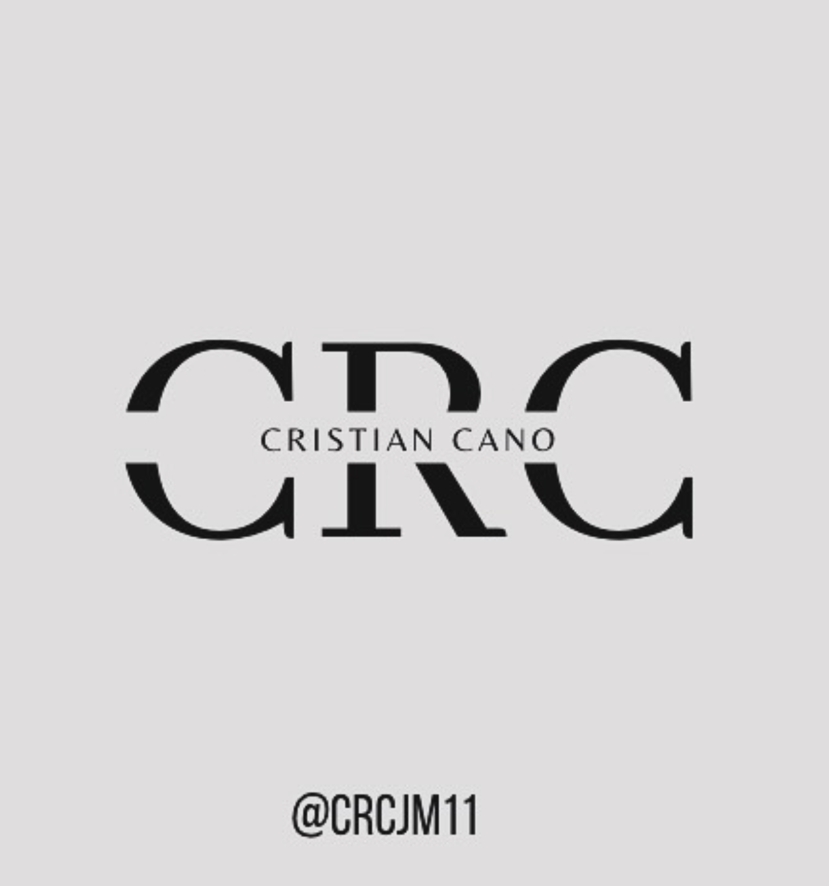

# Cristian´s Bookshelf

<figure><figcaption></figcaption></figure>



Hello and welcome to this exploration and learning space. I am Cristian J Cano, an industrial engineer with a master's in innovation management. Over my career, I have gained extensive experience in production environments, data management, and analysis, equipping me with deep insights into the challenges and opportunities in these dynamic and evolving sectors.

I invite you to delve into this space, specially designed to offer you a wide range of technical and specialized content. Here you can find detailed analytics, enriching case studies, and reflections on contemporary innovations that are shaping the future of the industry. Each page has been curated with the purpose of providing you valuable and insightful information, capable of illuminating and enriching your knowledge in different areas of interest.



This space isn't just about transmitting information; it's also about **inspiring continuous dialogue** on creative solutions and innovative ideas that can transform our approach to future challenges. We hope the content you find here will not only be highly useful for your current initiatives but also **spark your curiosity**, motivate you to **question the established**, and drive you to **develop new strategies** in your own professional field.




Thank you for taking the time to explore this space. I hope you find it as enriching as it is inspiring, and that you'll soon be able to apply some of these ideas and insights to your own professional experiences. Welcome to the journey!


I'll be waiting for you on my Instagram page to share information. You can follow me [Here](https://www.instagram.com/tu_usuario)

<figure><figcaption>
Msc Cristian J cano M
</figcaption></figure>

## Book shelf Content!

<table data-view="cards"><thead><tr><th></th><th data-type="content-ref"></th><th data-hidden data-card-cover data-type="image"></th><th data-hidden data-card-target data-type="content-ref"></th></tr></thead><tbody><tr><td>Technological solution Course</td><td></td><td><a href=".gitbook/assets/CRC_Simulacion.png">CRC_Simulacion.png</a></td><td><a href="applied-technology-management/">applied-technology-management</a></td></tr><tr><td>Logistic Course</td><td></td><td><a href=".gitbook/assets/file.excalidraw (1).svg">file.excalidraw (1).svg</a></td><td><a href="logistics/let-s-talk-about-logistics/">let-s-talk-about-logistics</a></td></tr><tr><td>Simulation Course</td><td></td><td><a href=".gitbook/assets/mm1_running.png">mm1_running.png</a></td><td><a href="discrete-event-simulation/discrete-event-simulation-for-industrial-engineering-a-practical-approach/">discrete-event-simulation-for-industrial-engineering-a-practical-approach</a></td></tr><tr><td>Technical Dispatch Operation Course</td><td><a href="logistics/technical-in-advanced-dispatch-operations/">technical-in-advanced-dispatch-operations</a></td><td><a href=".gitbook/assets/BA6E0094-238A-430A-848B-F7E195FD5D22.png">BA6E0094-238A-430A-848B-F7E195FD5D22.png</a></td><td></td></tr><tr><td>Book Store</td><td><a href="broken-reference">Broken link</a></td><td><a href=".gitbook/assets/en el pc1.png">en el pc1.png</a></td><td><a href="book-store/estanteria-de-libros.md">estanteria-de-libros.md</a></td></tr></tbody></table>
