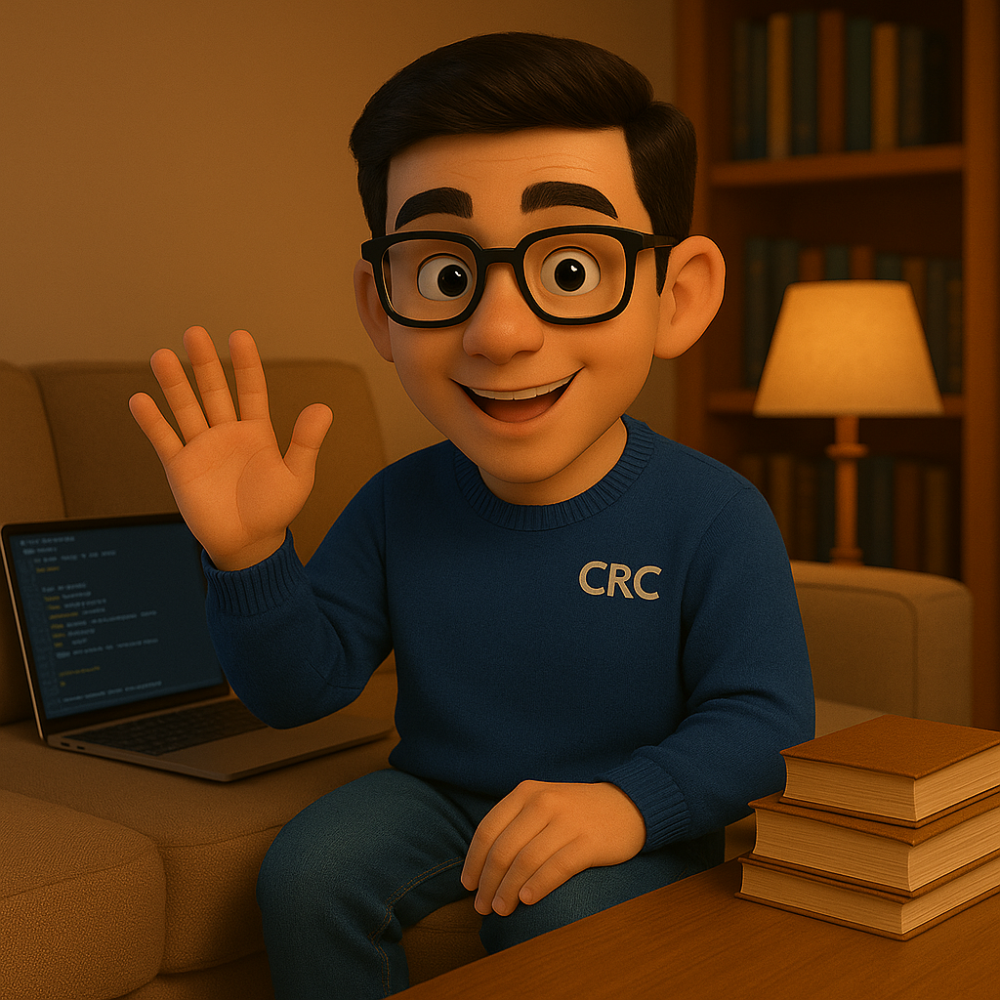

# Applied Technology Management

## Introduction

This program is designed not merely to impart theoretical knowledge but to foster a robust practical understanding of how technological innovation is conceptualized, developed, and integrated within the industrial landscape. As future industrial engineers, students are uniquely positioned to bridge the gap between technological advancements and operational efficiency.

Through team-based projects, students will engage with real-world companies, diagnose actual industrial challenges, and engineer viable technological solutions using cutting-edge tools such as block-based programming, Arduino, Anylogic simulation, and Python. The pedagogical framework integrates Project Management Institute (PMI) methodologies with the philosophies of Open Innovation and Innovation Management, ensuring that the proposed solutions are not only innovative but also practical, feasible, and sustainable. This collaborative journey will empower students to become proactive change agents, capable of driving technological transformation and contributing significantly to industrial competitiveness.

## General Course Content

The course will cover the following thematic modules, interlinking theory with practical application:

**Module 1: Fundamentals of Innovation and Technology Management**

* Key Concepts: Innovation (types, processes), Innovation Management, Open Innovation.
* Research and Development (R\&D): Concepts, stages, importance in industry.
* Technology Management: Strategies, tools, and models for managing technology in organizations.
* Innovation Culture: Promotion and development in the business environment.

**Module 2: Innovation Project Management (PMI Approach)**

* PMI Theoretical Framework: Process groups (Initiating, Planning, Executing, Monitoring & Controlling, Closing).
* PMI Knowledge Areas: Scope, Time, Cost, Quality, Resource, Communications, Risk, Procurement, and Stakeholder Management, applied to technology projects.
* Agile Methodologies: Introduction to Scrum/Kanban as a complement to PMI in innovation environments.

**Module 3: Technologies for Industrial Problem Solving**

* Block-based Programming: Fundamentals and applications in rapid prototyping (Scratch, Blockly, visual environment for control logic).
* Open Hardware Platforms: Introduction to Arduino (components, programming, interaction with the environment).
* Industrial Process Simulation: Introduction to Anylogic (discrete event modeling, flow simulation, optimization).
* Python Programming: Fundamentals, relevant libraries for data analysis, automation, hardware interaction (NumPy, Pandas, Matplotlib, PySerial for Arduino communication).
* Artificial Intelligence Concepts: Industrial applications (computer vision, basic machine learning).

**Module 4: Application and Evaluation of Technology Projects**

* Identification and Diagnosis of Industrial Problems: Methodologies for detecting needs and improvement opportunities.
* Solution Design and Prototyping: User-centered design methodologies, ideation, and prototype creation.
* Viability and Feasibility: Technical, economic, and operational analysis of proposed solutions.
* Intellectual Property Management: Legal and strategic aspects of patents, copyrights, and trade secrets.
* Project Presentation and Communication: Strategies for communicating the value of innovation.

## Methodological Guidelines

The course methodology will be based on **Project-Based Learning (PBL)** and Action Research, promoting collaborative work and the practical application of knowledge.

1. **Teamwork:** Students will organize into teams of 3-4 members. Each team must identify a real company (or a validated realistic case study) and a specific industrial problem that can be solved through the application of technology.
2. **Integrated Project Cycle:** Teams will follow a project cycle from problem identification to the design, prototyping, and evaluation of a technological solution. This cycle will be guided by the PMI phases.
3. **Open Innovation Philosophy:** Interaction with the real productive environment will be encouraged. This implies that teams must approach companies, understand their needs, and validate their proposals with external stakeholders (mentors, experts, company employees).
4. **Use of Technological Tools:** Throughout the course, students will actively apply the mentioned tools: block-based programming, Arduino, Anylogic, and Python, in constructing their solution.
5. **Theoretical-Practical Sessions:** Each weekly session will combine the explanation of theoretical concepts with practical workshops and guided work on team projects.
6. **SILOGÉ Research Group Integration:** Integration with the SILOGÉ research group will be sought through mentoring by advanced students from the group, participation in events, and the possibility for high-potential course projects to continue development within the group.
7. **Constant Feedback:** Regular sessions will be held for progress presentations and feedback between teams and with the instructor, promoting iterative learning.

## Student Guide

_Dear Industrial Engineering Student,_

Welcome to the Applied Technology Management course, designed to enhance your capabilities as a future leader in industry and to actively contribute to the innovation ecosystem. This course is intrinsically linked to the "SILOGÉ" research group, seeking to connect academic knowledge with the real needs of the productive sector.

**Course Purpose**

The main objective is for you not only to learn about technology and innovation management but also to be able to apply this knowledge to solve real industrial problems using innovative tools. You will work in a team, simulate a real project environment, and develop tangible technological solutions.

**How will we work?**

1. Team Formation: From the first week, you will organize into teams of 3-4 members.
2. Identification of Real Problems: Your team must find a real company (or a validated industrial scenario) and, through a diagnostic process, identify a specific problem that can be addressed with a technological solution. Originality and relevance will be key.
3. PMI Project Management: We will use the Project Management Institute (PMI) framework to structure your project, from initiation to closure. This will provide you with a comprehensive view of how projects are managed in the real world.
4. Open Innovation: Interaction with the external environment will be encouraged. This means you will need to seek feedback from the company or experts, which will enrich your proposal and align it with market needs.
5. Technological Tools: This course is practical. You will learn and apply tools such as:
   * Block-based Programming: For rapid prototyping and understanding logic.
   * Arduino: For creating hardware prototypes and system control.
   * Anylogic: For simulating and optimizing industrial processes.
   * Python: For data analysis, automation, and more advanced control. Your solution must be real, viable, and feasible.
6. SILOGÉ Project Fair: At the end of the course, you will present your solution at a fair, where you will have the opportunity to showcase your work and receive feedback from the academic community and potentially from the industrial sector.

<figure><figcaption></figcaption></figure>

## **Instructor Expectations**

* Commitment and Proactivity: This course requires a high degree of autonomy and problem-solving initiative.
* Effective Teamwork: Collaboration and communication within your team will be fundamental to success.
* Curiosity and Critical Thinking: Explore, question, and propose innovative solutions.
* Academic and Professional Rigor: Present your work with the quality and level of detail expected from an industrial engineer.

This course is a unique opportunity to integrate your industrial engineering knowledge with technological and innovation trends, preparing you for the challenges of the professional world. We are excited to accompany you on this journey!

Sincerely,

Msc Cristian Javier Cano Mogollón - Industrial Engineer

<figure><figcaption></figcaption></figure>
