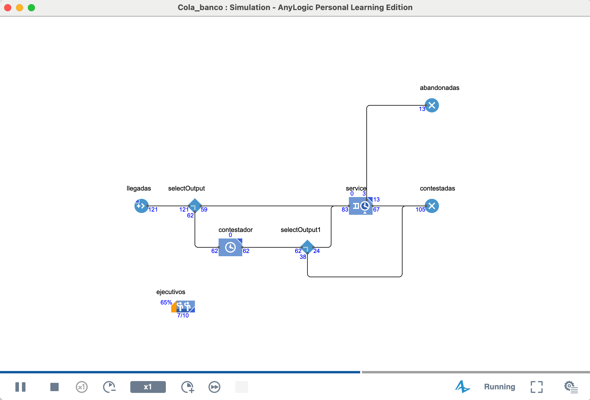

# Three Methods in Simulation modeling

we mean a general framework for mapping a real-world system to its model. A method suggests a type of language, or "terms and conditions" for model building. To date, there exist three methods:

1. System Dynamics
2. Discrete Event Modeling
3. Agent-Based Modeling

The choice of method should be based on the system being modeled and the purpose of the modeling – though often it is most heavily influenced by the background or available tool set of the modeler.

<figure><figcaption></figcaption></figure>

## **System Dynamics**

This Method was created at mid 1950´s by MIT professor Jay Forrester, whose original background was in science and enginnering, by encoraging the law of physics, particulary the electric circuits laws to investigate and explore the dynamis of economy enviroments, thes social.

### it suggest:


System dynamics is a method of studying dynamic systems. It suggests that you should:


1. Take an endogenous point of view. Model the system as a causally closed structure that itself defines its behavior.
2. Discover the feedback loops (circular causality) in the system. Feedback loops are the heart of system dynamics.
3. Identify stocks (accumulations) and the flows that affect them. Stocks are the memory of the system, and sources of disequilibrium.
4. See things from a certain perspective. Consider individual events and decisions as "surface phenomena that ride on an underlying tide of system structure and behavior.” Take a continuous view where events and decisions are blurred.

We will start with identifying the key variables in our model, and will iteratively draw causal loop diagrams. In a causal loop diagram, variables are connected by arrows showing the causal influences among them, with important feedback loops explicitly identified. Causal loop diagrams are good for quickly capturing your hypotheses about the causes of the dynamics in the system, and communicating it to others (Sterman, 2000).&#x20;

an example system like a selling company, one of the variables is obviously "sales"&#x20;

1. people per hour byuing the items
2. number of potencial clients
3. size of the market&#x20;
4. so on...

¿what does determinate a sales rate?, consumers are sensitive to some sort of motivation?

we can recognize variables thar are influenced or measured into the system, for example&#x20;

* B: mouth to mouth Word for sales. this gues in function of the "happy" clientes

&#x20;

<figure><figcaption></figcaption></figure>

Now We add some "Sales AD difussion" to our system in order to increase the sales rate:

<figure><figcaption></figcaption></figure>

Finally we can describe the system behavior acoording tho the dynamic of the influence of the enviroment that we are considering into the simulation system, so in this case our  Sytem dynamics model of sales of a product will be like.

<figure><figcaption></figcaption></figure>

now in this case we can provide new information, and also, mathematic notation to the simulation process, so we can start to measure the behavior and the relations betwen the system´s actors.

$$
Sales = \text{Sales From Adds} + \text{Sales From Mouth to mouth}
$$

$$
\text{Sales From Ad} = \text{Potential clients}\ .\ \text{ad Effectiveness}
$$

$$
ContactRate . \frac{PotentianClients}{Potencitial clients + Clients} . SalesFraction
$$

**Once we define the mathematical model and it behavior we are ready to simulate, but, if tye model need to be equalized, re parametrized or re-measure the model is always ready to be CALIBRATED**

<figure><figcaption></figcaption></figure>

#### **Abtraction level:**

System dynamics suggests a very high abstraction level and is positioned as a strategic modeling methodology. In the models of social dynamics, epidemics, or consumer choice, individual people never appear as well as individual product items, jobs, or houses – they are aggregated into stocks (compartments) and sometimes segmented into gender, education, income level, etc. (You have probably noticed non-integer values such as 10.674 people or 0.24 cars in system dynamics models during runtime.) Similarly, individual events like a purchase decision, leaving a job, or recovery from a disease, are not considered – they are aggregated in flows.

Although the language of system dynamics is very simple, if not primitive, compared to other methods, thinking in its terms and on its level of abstraction is a real art. System dynamics models are inevitably full of notions that do not have direct material or measurable equivalents in the real world – for example, morale, awareness, knowledge, and the impact of advertising. The choice of those notions, and drawing the corresponding feedback structures, is not, in many cases, as straightforward task as the design of a process flowchart or an agent behavior.

***

## **Discrete-event simulation (DES)**&#x20;

It is an approach used to model dynamic systems that evolve through a series of events occurring at discrete and irregular points in time.


Unlike a continuous process, changes in the system's state only occur at these specific moments when an event takes place, such as a customer's arrival or the completion of a service.


This type of simulation is particularly useful for analyzing systems where events are fundamental in determining their behavior, such as production lines, queueing systems, or any operation where the time between events is critical.

Discrete-event simulation models are often **stochastic**, meaning they include uncertainty or random variability. Events change based on random occurrences—these are called **discrete events**. For example, imagine a queueing system where the system's state is the number of customers in it. The events that impact this and change its state are **arrivals** or **departures** from the queue.

On the other hand, in **continuous simulations**, changes in the system's state occur **continuously over time**. For example, imagine an airplane in flight as the system under observation, with its state defined by its position. This position varies along the trajectory throughout the entire observation period. Another example would be chemical processes or reactions where measurements like pressure or other variables must be continuously observed due to their change over time.


almost as old as system dynamics. In October 1961, IBM engineer Geoffrey Gordon introduced the first version of GPSS (General Purpose Simulation System, originally Gordon's Programmable Simulation System), which is considered to be the first method of software implementation of discrete event modeling. These days, discrete event modeling is supported by a large number of software tools, including modern versions of GPSS itself.


The operations include _delays_, _service_ by various _resources_, choosing the process branch, splitting, combining, and some others. Since _entities_ compete for resources and can be delayed, _queues_ are present in virtually any discrete event model.&#x20;

The model is specified graphically as a process flowchart, where blocks represent operations (there are textual languages as well, but they are in the minority). The flowchart usually begins with "source" blocks that generate entities and inject them into the process, and ends with "sink" blocks that remove entities from the model.

<figure><figcaption></figcaption></figure>

in **Anylogic the item that reffer to the system specify the behavior of the model,** the _entitites_ that are flowing  through the process flowchart are called. "Agents", and  some cases this ones have it´s own behavior.

<details>

<summary>Agents:</summary>

Represent Clients, patients, phone calls, documents, parts, products, pallets, computer transactions, vehicles, tasks, projects, ideas etc.

</details>

<details>

<summary>Resources:</summary>

Represent various Staff, doctors, operators, Workers, servers, CPU´s, Computer memory, equipment, and transport.

service time, arrivals agent times, mostly are stochastic drawn from a probabilistic distribution, it meas that a model needs to be RUN for a certain time and number of replicas, in order to have a maningfull output.

</details>

<details>

<summary>Output expected mostly:</summary>

1. utilization of resources
2. Time spent in the system
3. waiting times
4. Queue lengths
5. System throughput
6. Bottlenecks
7. Cost of the agent procesing and structure

</details>

### Example modeling Bank Behavior

The basic model is built using the Process-Centric Modeling (DCM) methodology, which uses a block flow diagram. The flow of customers (entities/agents) through the bank is typically represented by a sequence of Process Modeling Library (PML) blocks.

### Model Info:

1. On average, 45 clients per hour enter the bank.
2. Having entered the bank, half of the clients go to the ATM, and the other half go straight to the cashiers.
3. Usage of the ATM has a minimum duration of 1 minute, a maximum of 4 minutes, and a most likely duration of 2 minutes.
4.  Service with a cashier takes a minimum of 3 minutes and a maximum of 20

    minutes, with a most likely duration of 5 minutes.
5.  After using the ATM, 30% of the clients go to the cashiers. The others exit the

    bank.
6.  There are 5 cashiers in the bank, and there is a single shared queue for all the

    cashiers.
7. After being served by a cashier, clients exit the bank.

#### We need to find out the:

1. Utilization of cashiers,
2. Average queue lengths, both to the ATM and to the cashiers, and the
3. Distribution of time spent by a customer in the bank.

#### Steps to solve:

1. describe the system and draw it in a sheet of paper.
2. recreates the layout
3. generate the basic math model of the system.

<figure><figcaption></figcaption></figure>

<figure><figcaption></figcaption></figure>


The _mathematics behind_ discrete event simulation are based on discrete time. The model clock is advanced only when something significant happens in the model - namely, when an agent starts or finishes an operation. Any change in the model is associated with those events; continuous changes are approximated by instantaneous ones.


***

### Exercise Number One: The Miami Casino Game (DES)

Imagine you've won a competition: an all-expenses-paid trip to a five-star hotel in Miami, Florida, United States. At this hotel, there's a casino where you decide to gamble, but you're not interested in traditional games. So, you opt for a new one with the following rules:

* In each round, an **unbiased coin** is tossed repeatedly until the **difference between the number of heads and tails** that appears reaches **three**.
* If you decide to participate, you must **pay one dollar for each coin toss**. You **cannot abandon the game** until it finishes, or you will incur a penalty.
* You **receive eight dollars at the end of the game**.

This means you win money if the number of tosses is less than eight, but you lose money if the coin is tossed more than eight times.

Let's follow these examples where C **is Heads** and S **is Tails**.

| Resultados  | Lanzamientos | Ganancias   |
| ----------- | ------------ | ----------- |
| CCC         | 3            | Se gana 5   |
| CSCCC       | 5            | Se gana 3   |
| SCCSCSCSSSS | 11           | Se pierde 3 |

Now try to play this game, but first lets make a simualtion in Python in order to know what woukd happen.

```python
import random
# define las variables del codigo.
def simular_juego():
    caras = 0
    sellos = 0
    lanzamientos = 0

    while abs(caras - sellos) < 3:
        lanzamiento = random.choice(['C', 'S'])
        if lanzamiento == 'C':
            caras += 1
        else:
            sellos += 1
        lanzamientos += 1

    # Calcula el resultado financiero
    ganancia = 8 - lanzamientos
    return lanzamientos, ganancia

def simular_varios_juegos(n):
    resultados = [simular_juego() for _ in range(n)]
    for i, (lanzamientos, ganancia) in enumerate(resultados):
        print(f"Juego {i+1}: {lanzamientos} lanzamientos, {'ganó' if ganancia > 0 else 'perdió'} {abs(ganancia)} dólares")

# Simula N juegos, selecciona la cantidad de juegos que deseas evaluar
simular_varios_juegos(10)

```


Game 1: 3 tosses, won $5\
Game 2: 3 tosses, won $5\
Game 3: 15 tosses, lost $7\
Game 4: 7 tosses, won $1\
Game 5: 7 tosses, won $1\
Game 6: 3 tosses, won $5\
Game 7: 7 tosses, won $1\
Game 8: 3 tosses, won $5\
Game 9: 5 tosses, won $3\
Game 10: 5 tosses, won $3

-¿are you in?


### Now let's try to perform this small Simulation in EXCEL.

We need to generate a sequence of random observations from a **uniform distribution between 0 and 1**. To refer to random observations from a uniform distribution, we will use the **"RAND()"** function.

Where: The probability of getting Heads is ½ and the probability of getting Tails is ½.

$$
P(Caras) = \frac{1}{2} ; P(sellos) = \frac{1}{2}
$$

| Lower bound | Uper bound |   |
| ----------- | ---------- | - |
| 0,0000      | 0,4999     | C |
| 0,5000      | 0,99999    | S |

_We use the formula_

$$= IF(RANDOM \lt 0,5, "Cara", "Sello").$$

You can use other cells where you have the "countif" functions to count the "heads" and "tails," calculating the difference to know when to stop.


From the book . Hillier, F. S., & Lieberman, G. J. (2010). IO1 Introduction (9th ed.). McGraw-Hill


### Queueing Theory in Simulation: An Illustrative Approach

Let´s consider the  M/M/1 with the fowolling parameters

* Poisson arrivals, exponential service time, and a single server. Where the arrival rate... $$\lambda = 3u/hr \ y \ \mu= 5u/hr$$

The system is straightforward: arriving customers join a queue, are served, and then leave the system. We start the simulation clock at 0, i.e., t=0. We will have a one-hour simulation run, where the current state of the system is:

$$
N(t) = Qty\ of\ Client\ in\ time\ t
$$

The events, as we previously stated in the explanation, that change the system's state are the **arrival** and **departure** of customers from the system.

The state transition formula is:

$$
Reestablecer\ N(t) = \left\{ \begin{aligned}N(t) +1 \text{ arrive in time t } \\ N(t) - 1 \ \text{service completed in time t}\end{aligned} \right\}
$$

### Behavior and Steps to Solve a Problem M/M/1

An M/M/1 system is a basic queuing theory model used to represent a system with arrivals, one service, and a single queue. The system's behavior and the steps required to solve related problems are detailed below:

1. System Definition:
   * Arrivals: Customers arrive following a Poisson process with an arrival rate $$(\lambda)$$, which means that the time between successive arrivals is random and follows an exponential distribution.
   * Service: Service times are also random and follow an exponential distribution with a service rate $$(\mu)$$. There is only one server available to serve customers.
   * Single Queue: The system has a single queue where customers wait their turn to be served. Once served, customers exit the system.

This model refers to the "birth and death" models of queuing theory, generally explained by the M/M/s model. This assumes that arrival times are independent and distributed according to an exponential distribution, a Poisson input process. It is known as the birth and death model when the average arrival rate and the average service rate are constant and independent of the system state. In our case, we have a single server. s = 1, which is easy to express, which would not be the case if s > 1.

the system service rate $$\mu_n$$ It represents the average rate of completed services of the entire queuing system when there are n clients in it; different case when we have multiple servers (s > 1) then $$\mu_n$$ It is not the same as $$\mu$$,&#x20;

$$\mu = n\mu\ \text{when n is} \le s,$$ &#x20;

&#x20;$$\mu = s\mu\ \text{when n is} \ge s,$$

Using these formulas we proceed to calculate the factors $$C_n$$ of the process of birth and death

$$
C_n = \left(\frac{\lambda}{\mu}\right)^n =\rho^n, \ \text{para}\  n=0,1,2,...
$$

therefore,

$$
P_n = \rho^nP_0, \ para\ n=0,1,2,...
$$

Where,

$$
P_0 = \left( \sum_{n=0}^{\infty} \rho^n \right)^{-1}
$$

$$
=1 - \rho.
$$

$$
P_n = (1 - \rho) \rho^n \quad \forall n \in \{0, 1, 2, \ldots\}
$$

### Let's look at an example of this system.

Consider a small bank branch with a single teller. Customers arrive at this branch to be served by the teller. It is assumed that this system can be modeled as an [M/M/1,](https://en.wikipedia.org/wiki/M/M/1_queue) queue

Arrivals (M): Customer arrivals follow a Poisson process with an average rate of λ customers per unit time. This means that the times between successive arrivals are independent and identically distributed (i.i.d.) random variables according to an exponential distribution with mean $$\frac{1}{\lambda}$$

Service (M): Cashier service times follow an exponential distribution with an average service rate of μ customers per unit of time (if the cashier is busy). This means that service duration is a random variable with mean 1/μ.

Server (1): There is only one server (the cashier).

System capacity: Infinite queue capacity is assumed (customers always wait if the cashier is busy).

Queue discipline: Customers are served in order of arrival (FCFS - First Come, First Served).

For this example, we will use the following parameters:\
Average customer arrival rate (λ): 20 customers per hour.\
Average cashier service rate (μ): 25 customers per hour.


It is essential that λ<μ for the system to be stable and not grow indefinitely. In this case, 20<25, so the system is stable.


Solving, The main performance measures for a steady-state M/M/1 system are calculated with the following formulas (Gross, Shortle, Thompson, & Harris, 2008)

Server utilization factor (ρ): It is the proportion of time that the server is busy.

$$
ρ=\frac{μ}{λ}
$$

Probability that the system is empty (P0​): Probability that there are no customers in the system (the ATM is idle).

$$
P_0​=(1−ρ)
$$

Probability that there are n customers in the system (Pn​):

$$
P_n=(1−ρ)ρ^n=P_0ρ^n
$$

Average number of customers in the system (L): Includes those in queue and those being served.

$$
L = \frac{ρ}{1−ρ} = \frac{λ}{μ−λ}
$$

Average number of customers in the queue (Lq​):

$$
L = \frac{ρ^2}{1−ρ} = \frac{λ^2}{μ(μ−λ)}
$$

Average time a customer spends in the system (W): Total time from arrival to departure (waiting + service).

$$
W = \frac{L}{\lambda} = \frac{1}{\mu - \lambda}
$$

Average time a customer spends waiting in line (Wq​):

$$
W_q= \frac{\lambda}{\mu(\mu - \lambda)}
$$

It can also be calculated as $$W_q = W - \frac{1}{\mu}$$


MINI TASK: Calculate each of the indices and draw your conclusions, also perform a Monte Carlo simulation and these metrics will become your indicators


***

## Agent-based modeling (ABM)

is a more recent modeling method than system dynamics or discrete event modeling. Until the early 2000s, agent-based modeling was pretty much an academic topic. The adoption of agent-based modeling by simulation practitioners started in 2002-2003.&#x20;

It was triggered by:

1. Desire to get a deeper insight into systems that are not well-captured by traditional modeling approaches;
2. Advances in modeling technology coming from computer science, namely object-oriented modeling, UML, and statecharts.
3. Rapid growth of the availability of CPU power and memory (agent-based models are more demanding of both, compared to system dynamics and discrete event models).

***

> You may not know how the system as a whole behaves, what are the key variables and dependencies between them, or simply don’t see that there is a process flow, but you may have some insight into how the objects in the system behave individually. Therefore, you can start building the model from the bottom up by identifying those objects (agents) and defining their behaviors.

> Sometimes, you can connect the agents to each other and let them interact; other times, you can put them in an environment, which may have its own dynamics. The global behavior of the system then emerges out of many (tens, hundreds, thousands, even millions) concurrent individual behaviors.

_**There are no standard languages for agent-based modeling.**_ The structure of an agent-based model is created using graphical editors or scripts, depending on the software. The behavior of agents is specified in many different ways. Frequently, the agent has a notion of state, and its actions and reactions depend on its state. In such cases, behavior is best defined with statecharts. Sometimes, behavior is defined in the form of rules executed upon special events.

The simulation based on agents, known as Agent-Based Modeling (ABM), is the most recent major simulation method among the widely recognized simulation paradigms


This methodology studies the impact of active entities or subsystems, known as agents, within a system. ABM utilizes a bottom-up approach, meaning the model is built by first identifying these individual objects and defining their individual behaviors


**What an Agent Represents:**&#x20;

An agent can be any object in the real system important for solving the problem, agents can represent:   &#x20;

1. Human entities: a human, a group of people, animals, households, consumers, patients, or employees.   &#x20;
2. Physical/Non-physical objects: vehicles, equipment, parts, products, projects, organizations, investment, or ideas.   &#x20;
3. In the context of Discrete Event simulation (AnyLogic), the traditional _entities_ (or transactions) that flow through a process flowchart are actually considered agents.

**Agent Behavior and Encapsulation:**&#x20;

ABM is based on object-oriented modeling, allowing agents to encapsulate their attributes and behaviors within self-contained sub-models. Since there is no single place where the global behavior is defined, the focus is on defining the individual agent's dynamics

1. Statecharts: Behavior is frequently defined with statecharts, which are visual constructs defining the internal states, reactions to external events, and corresponding state transitions of a particular agent
2. Internal Dynamics: The internal workings of an agent can be modeled using other simulation methods, such as System Dynamics (stock and flow diagrams) or Discrete Event Modeling (process flowcharts)
3. Communication: Agents can communicate with each other. They may react to external events by handling messages or function calls
4. Coding: Agents often involve Java code, which is used to implement complex logic, inter-agent and agent-to-environment communication, or to coordinate different activities within the agent

**Space and Connection:**&#x20;

Agents may be connected to each other to establish relationships. They can live in an environment or space, or they may exist without one. When space is used, it is often continuous space, a geographical map (GIS space), or a facility floor plan

### Agent-based epidemic Zombie model Example

Here is the problem statement:

1. Consider a population of 10,000 people. They live in an area of 10 by 10kilometers and are evenly spread throughout the area.
2. A person in the area knows everybody who lives within 1 kilometer of himand does not know anybody else.
3. 10 random people are initially infected, and everybody else is susceptible(none are immune).
4. If an infectious person contacts a susceptible person, the latter gets infectedwith probability 0.1.
5.  Having been infected, a person does not immediately become infectious.

    There is a latent phase that lasts from 3 to 6 days. We will name people in the

    latent phase exposed.
6.  The illness duration after the latent phase (i.e. the duration of the infectious

    phase) is uniformly distributed between 7 and 15 days.
7.  During the infectious phase, a person on average contacts 5 people he knows

    per day.
8.  When the person recovers, he becomes immune to the disease, but not

    forever. Immunity lasts from 30 to 70 days.

<figure><figcaption></figcaption></figure>

<figure><figcaption></figcaption></figure>

