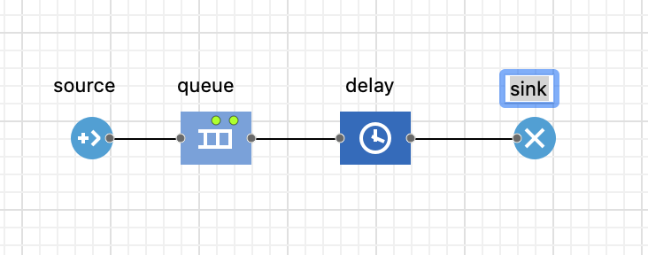

# AnyLogic explained

Learning to use AnyLogic involves understanding both the theoretical foundations of simulation and the practical application of its modeling libraries. AnyLogic is a multi-method simulation software that enables engineers and researchers to create complex dynamic models of a wide variety of systems. Developed by The AnyLogic Company, co-founded by Andrei Borshchev, it has established itself as a leading tool for its ability to combine different simulation paradigms in a single environment (Borshchev, 2013).

This document will serve as a structured introduction to using AnyLogic, starting with fundamental modeling concepts, describing the main simulation methods it offers, and concluding with a practical guide to building a first model, based on the text provided.

#### **Modeling Paradigms in AnyLogic**

AnyLogic's main strength is its ability to integrate three fundamental simulation methods. The choice of method depends on the nature of the system and the level of abstraction required (Borshchev, 2013, p. 1).

1. **System Dynamics (SD):** This method, developed by Jay Forrester, operates at a high level of abstraction. It focuses on modeling causal relationships and feedback loops between aggregated variables over time. It is ideal for strategic analysis of complex systems such as markets, ecosystems, or social dynamics (Borshchev, 2013, pp. 2-3). Mathematically, it is based on systems of differential equations (Mahdavi, n.d., p. 8).
2. Discrete Event Modeling (DEM): Also known as process-centric modeling, this approach views the system as a flow of entities (e.g., customers, products) that traverse a sequence of operations or processes (e.g., queues, services, delays). It is the most widely used method in industry for modeling service, manufacturing, and logistics systems. The key components are the entities, the resources that serve them, and the flowchart that defines the process (Borshchev, 2013, pp. 9-10).
3. Agent-Based Modeling (ABM): This is a bottom-up approach where the overall behavior of the system emerges from the interactions of a large number of autonomous, individual agents. Each agent has its own characteristics and rules of behavior. It is especially useful for modeling systems with heterogeneous components that interact in a shared space, such as crowd behavior, epidemics, or consumer networks (Mahdavi, n.d., p. 9).

***

### **Fundamental Building Blocks (PML)**

Based on Mahdavi (n.d., pp. 138-139), the essential blocks are:

* **Source**: Generates entities (agents) and introduces them into the process at a defined arrival rate.
* **Queue**: Stores entities that cannot move forward, typically because they are waiting for a resource.
* **Delay**: Delays an entity for a specified amount of time, representing the duration of an operation.
* **Service**: A composite block that encapsulates the logic of `Seize` (taking a resource), `Delay` (serving time), and `Release` (releasing the resource).
* **ResourcePool**: Defines a set of resources (e.g., personnel, machinery) that can be used by entities.
* **Sink**: Removes entities from the model once they have completed the process.

  
<figure><figcaption></figcaption></figure>

***

### **Building a Simple Queue Model**

Following the methodology presented in Mahdavi (n.d., pp. 39-45), a basic model of a queuing system (e.g., a ticket office) can be built.

1. **Create a new model**: In AnyLogic, start a new project, defining the time units (e.g., seconds).
2. **Build the flowchart**:
* Drag a **Source** block into the graphical editor. In its properties, define the `Arrival rate` (for example, 2 per second).
* Drag a **Queue** block. AnyLogic will automatically connect it to the output port of the `Source` block. You can leave its capacity as infinite (`Maximum capacity`).
* Drag a **Delay** block after the `Queue` block. In its properties, define the `Delay time`. This can be a constant value or a probability distribution, such as `triangular(0.5, 1, 1.5)` seconds. The `Delay` capacity (default 1) represents the number of servers.
* Finally, drag a **Sink** block to end the flow.
3. **Configure the experiment**:
* In the experiment properties (`Simulation`), set a `Stop time`, for example, 3600 seconds (1 hour).
* To ensure that each run produces different results (due to randomness), set the random number generator to `Random seed`.
4. **Run and analyze**:
* When running the model, you can observe the number of entities entering (`in`) and exiting (`out`) each block.
* The `Queue` block will display the current length and average length (`Length (av)`) of the queue, allowing for an initial analysis of system performance.

***

>
>
> #### **References**
>
> * Borshchev, A. (2013). _The Big Book of Simulation Modeling: Multimethod Modeling with AnyLogic 8_. AnyLogic North America.
> * Mahdavi, A. (s.f.). _The Art of Process-Centric Modeling with AnyLogic_. Unpublished manuscript.

***

### Reference links:

Tool list:

The list of Anylogic tools is online at the following link (https://anylogic.help/library-reference-guides/process-modeling-library/pml-blocks.html)

Anylogic Cloud Toolbar: 

List of Anylogic tools online ---> [Here] (https://anylogic.help/cloud/toolbar.html)

