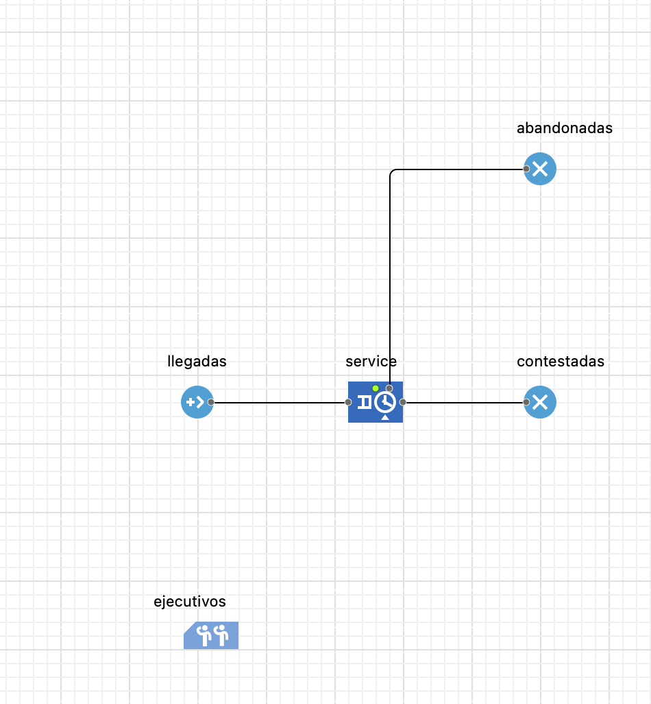
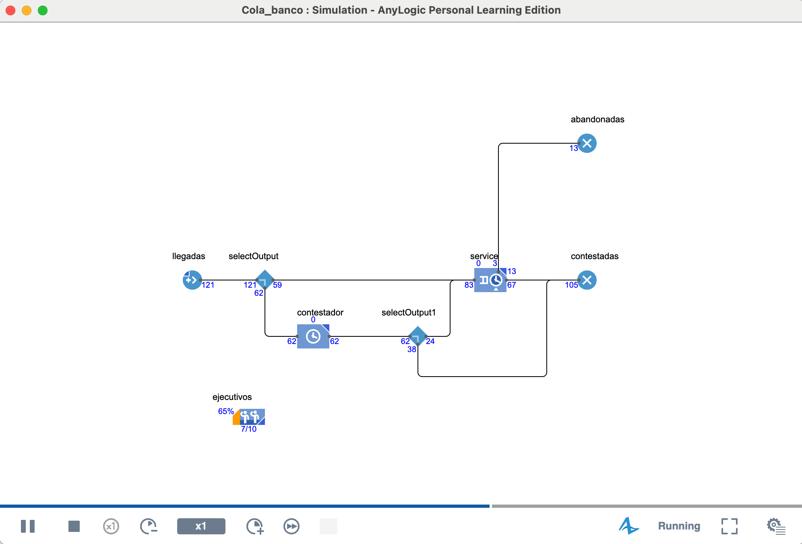

# Call center

#### **Step 1: Initial Model Configuration**

1. **Create a New Model**: Launch AnyLogic and create a new model. In the wizard, give the model a name, for example, `CallCenterModel`. Set the model's **time units** to `minutes`, as call durations and wait times are commonly measured in this unit.
2. **Define Resources (Agents)**: Call center operators are the system resources.
* From the **Process Modeling Library** palette, drag a **ResourcePool** block into the graphical editor.
* In the block's properties, change its name to `Agents`.
* In the `Capacity` field, define the number of agents available in the call center, for example, `10`.

#### **Step 2: Model the Process Flow**

The process flow describes the lifecycle of a call from arrival to termination.

1. **Generate Call Arrivals**:
* Drag a **Source** block into the editor to act as the incoming call generator. Name it `CallArrivals`.
* Call volume typically varies throughout the day. To model this, a **Schedule** is used. Drag a **Schedule** object from the **Agent** palette into the editor.
* Configure the `Schedule`:
* **Type**: Select `Rate`.
* **Schedule defines**: `Intervals (Start, End)`.
* Define the time intervals and corresponding arrival rates. For example, for an 8-hour (480-minute) shift, the configuration might be similar to Table 3-7 in the pizza restaurant example, but with call rates per minute.
* In the properties of the `CallArrivals` (`Source`) block, set `Arrivals defined by` to **Rate Schedule** and select the `Schedule` you just created.
2. **Model the Queue and Service**:
* Use a **Service** block to represent an agent's call handling. This block encapsulates the queue, the resource seize, and the service time (`Delay`).
* Name it `CallHandling`.
* In its properties, link this block to the `ResourcePool` created earlier by selecting `Agents` from the `Resource sets` drop-down list.
* Define the `Service time`. To reflect variability in call duration, it is recommended to use a probability distribution, for example, `triangular(2, 5, 10)` minutes.
3. **Model Call Abandonment (Renege)**: A crucial metric in call centers is the abandonment rate. This occurs when a customer hangs up after waiting too long.
* In the `CallHandling` (`Service`) block properties, expand the **Advanced** section.
* Check the `Enable exit on timeout` box. This will activate an additional exit port (`outTimeout`) in the block.
* In the `Timeout` field, specify the maximum time a customer is willing to wait, for example, `uniform(1, 3)` minutes.
4. **End the Flow**:
* Drag a **Sink** block and connect it to the main exit port of the `CallHandling` block. Name it `CompletedCalls`. Handled calls will end here.
* Drag a second **Sink** block and connect it to the `CallHandling` block's `outTimeout` port. Name it `AbandonedCalls`. Abandoned calls will end at this point.

The resulting flowchart should look similar to Figure 1 (adapted), showing the call flow, the service, and the two possible outputs.

<figure><figcaption>
Figura 001
</figcaption></figure>

#### **Step 3: Measuring and Collecting Statistics**

To evaluate system performance, you need to define and collect key metrics (KPIs).

1. **Agent Utilization**:
* From the **Analysis** palette, drag an **Output** object. Name it `AgentUtilization`.
* In the `Value` field, enter the expression `Agents.utilization()`. This value will be updated dynamically. To obtain a final value, you can configure it to be recorded at the end of the simulation.
2. **Abandon Rate**:
* Add another **Output** object called `AbandonedRate`.
* In the `Value` field, enter the expression `AbandonedCalls.count() / (double)CallArrivals.count()` to calculate the percentage of abandoned calls. The conversion to `double` is to ensure floating-point division.
3. **Average Wait Time (AWT)**:
* To measure the time a call spends in the queue, use the `TimeMeasureStart` and `TimeMeasureEnd` blocks.
* Insert a **TimeMeasureStart** block just after the `Source` block and before the `Service` block.
* Insert a **TimeMeasureEnd** block just after the main output port of the `Service` block (before the `Sink` for completed calls).
* Link the `TimeMeasureEnd` to the `TimeMeasureStart` in its properties.
* Add an **Output** object named `AverageWaitTime` and enter `<TimeMeasureEnd_name>.dataset.mean()` in its `Value` field. This will calculate the average of all recorded cycle times.

#### **Step 4: Run the Model and Analyze Results**

1. **Configure the Experiment**: In the experiment settings (Simulation), set an end time in the Stop Time field, for example, 480 minutes to simulate an 8-hour shift.
2. **Run**: Start the simulation. You can run it in virtual mode (as fast as possible) to obtain results quickly.
3. **Analyze**: Observe the values ​​in the Output objects. These will give you a snapshot of the call center's performance under the defined conditions. You can run the model multiple times to observe the variability in the results due to the stochastic nature of the system.

#### **Next Steps and Improvements**

Once this base model is functional, it can be expanded to include additional complexities, such as:

* **Different Call Types and Priorities**: Use `SelectOutput` blocks to route different types of calls to different queues or service blocks with different task priorities, as described in Technique 4 by Mahdavi (n.d., p. 179).
* **Skills-based Routing**: Model agents with different skill sets (e.g., sales, technical support) using alternative resource sets in the `Seize` block, similar to how the cooks in the pizzeria example could help take orders.
* **Optimization**: Create an **Optimization** experiment to determine the optimal number of agents needed to meet a service level (e.g., minimize the abandonment rate) at the lowest possible cost, following the methodology from the clinic example.

***

### Let's Add an Answering Machine

1. We must use a decision, a blue diamond, the `select output` decision icon.

1. Here we will decide whether the customer wants to be served by a human or an answering machine.

These decisions are implemented in the model flow using the `SelectOutput` decision block. Here, the customer's preference is evaluated, and the call is routed to either the human agent or the answering machine, depending on the choice. This approach is similar to how priority-based or skill-based routes are established in other sections of the model. (See Figure 002)

<figure><figcaption>
Figura 002
</figcaption></figure>

In this decision there will be a chance that the customer can be served by an answering machine, with a 50% chance (this can be adjusted) from there this person will have to go to a service that will be called `answering machine` where in the same way there will be a chance that he decides to be served by a human and return to the initial queue, or failing that, leave the system, this process for academic purposes we will represent it with a 50% chance. and it will be represented as shown in figure 003

<figure><figcaption>
Figura 003
</figcaption></figure>

Once parameterized, we proceed to `compile for error checking` and run it.

At the end, the process would look like this:

<figure><figcaption>
Figura 004
</figcaption></figure>

Now let's graph the system data:

1. We'll use a piechart.
1.1 In the properties, we'll specify that it collects data from the sinks called "abandoned" and "answered" or "attended."
1.2 Once the measurement logic is clear, we proceed to write the data collection in the value box of the piechart's data menu as follows:
  "abandoned.count()" ---> for data number one in the piechart
  "answered.count()" ---> for data number two in the piechart
2. You can modify and adjust the piechart to your liking; feel free to do so.

***

### Time Measurements

We will use the elements of the main processing panel, which is shaped like a stopwatch, to tell the software where we want to measure from.

1. Time Measure Start - Time Measure Ends

1. We must parameterize or link the two meters for this. Go to the TME (time measure ends) menu and select TMS (time measure start).
2. From there, you will be able to learn and verify firsthand the concept of "cycle time."

    <figure><figcaption>
Figura 005
</figcaption></figure>

    Now test by adding another indicator to the system.

### Indicators of a Customer Service System

#### **Key Performance Indicators (KPIs) for the System**

#### **1. Flow and Volume Indicators**

These indicators quantify the number of entities (customers) moving through the different routes in the system.

* **Customers Served (Throughput)**
* **What It Measures**: The total number of customers who successfully complete service, either by an agent or by the computer system.
* **How ​​It's Calculated in AnyLogic**:
1. Ensure that routes that end with successful service end in **Sink** blocks. There must be one `Sink` for those served by the computer and another for those served by agents.
2. The calculation is a direct count of the entities entering these blocks. The `.count()` function is used on each `Sink` block.
3. **Served by Agents**: `[AgentSinkName].count()`
4. **Served by Computer**: `[ComputerSinkName].count()`
* **Abandonment Rate**
* **What It Measures**: The percentage of customers who enter the system but leave before being served, due to long wait times.
* **How ​​It's Calculated in AnyLogic**:
1. The model must already have an abandonment route. This route originates from the `outTimeout` port of the **Service** (or **Queue**) block and must end in its own **Sink** block, for example, `AbandonedCalls_Sink`.
2. The entities that abandoned are counted and divided by the total number of entities that entered the system (generated by the **Source** block).
3. The formula would be: `(double)AbandonedCalls_Sink.count() / (double)CallArrivals_Source.count()` _The conversion to `(double)` is to ensure that the result is a decimal and not an integer._

#### **2. Time Metrics**

These metrics measure process efficiency and customer experience in terms of duration. The standard implementation in AnyLogic uses the `TimeMeasureStart` and `TimeMeasureEnd` blocks.

* **Average Wait Time (AWT)**
* **What It Measures**: The average time a customer spends in queue before being served by a human agent.
* **How ​​It's Calculated in AnyLogic**:
1. Place a **TimeMeasureStart** block just before the `Queue` or `Service` block where customers wait for an agent. Name it, for example, `WaitTime_Start`.
2. Place a **TimeMeasureEnd** block just after the customer is picked up by the resource (i.e., at the exit of the `Seize` or `Service`). Name it `WaitTime_End` and link it to `WaitTime_Start` in its properties.
3. The `WaitTime_End` block internally stores each measurement. The average is obtained with the `.dataset.mean()` function.
4. To visualize it, you can use an **Output** object with the value: `WaitTime_End.dataset.mean()`
* **Average Total Time in System (Average System Time)**
* **What It Measures**: The average total time a customer spends in the system, from the moment they enter until they are successfully served.
* **How ​​to Calculate in AnyLogic**:
1. The method is identical to the previous one, but the blocks are placed at different points.
2. Place a **TimeMeasureStart** just after the initial `Source` block.
3. Place **TimeMeasureEnd** blocks just before the `Sink` blocks representing the customers served (both by agents and by computer). All of these `TimeMeasureEnd` blocks must be linked to the same `TimeMeasureStart` block.
4. The average can be calculated similarly, using the `.dataset.mean()` function of the corresponding `TimeMeasureEnd` block.

   
#### **3. Utilization and Load Indicators**

These indicators assess how busy resources are and how loaded the system is.

* **Agent Utilization**
* **What It Measures**: The percentage of time human agents are busy serving customers, as opposed to being idle.
* **How ​​It's Calculated in AnyLogic**:
1. All 10 agents must be defined in a **ResourcePool** block. Name it `HumanAgents` and set its capacity to 10.
2. Utilization is a built-in statistic for the `ResourcePool`. No complex additional configuration is required.
3. It can be displayed in a graph or in an **Output** object by calling the `.utilization()` function. For example: `HumanAgents.utilization()`. The result is a value between 0 and 1 (0% to 100%).
* **Average Queue Length**
* **What It Measures**: The average number of customers waiting in the human agent queue at any given time.
* **How ​​It's Calculated in AnyLogic**: This is a time-weighted average. The most accurate way to calculate it is by using a **Statistics** object.
1. Create an **variable** of type `queueSize`, with an initial value of 0.
2. Drag a **Statistics** object from the **Analysis** palette. Name it `statsQueue` and select the **Continuous** type in its properties.
3. In the **Queue** (or **Service**) block, go to the **Actions** section.
* In the `On enter` field, type: `queueSize++; statsQueue.add(queueSize);`
* In the `On exit` field, type: `queueSize--; statsQueue.add(queueSize);`
4. The metric value is obtained using the `.mean()` function. To display it, use an **Output** object with the value `statsQueue.mean()`. This method is detailed in "Technique 3" of Mahdavi's text.
