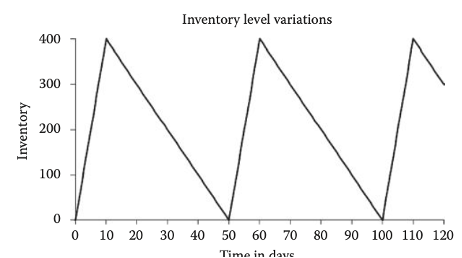

# EPQ Model -  Economic lot size

The economic production quantity (EPQ) model (also known as the economic lot size (ELS) model) is used in manufacturing situations where inventory increases at a finite rate and depends on the production rate and the usage rate of the item under consideration.&#x20;

In addition to the variables (_D_, _S_, _H_, _Q_, and _C_) defined earlier, we define two more variables:&#x20;

* _p_ = production rate per day (daily production rate) &#x20;
* _d_ = demand rate per day (daily demand rate).&#x20;

The values of _p_ and _d_ must be in the same time unit.&#x20;

For example, these values could be weekly rates instead of daily rates. However, daily rates are most common.&#x20;

_Q_ in this case is the production quantity (rather than order quantity) to be made in one lot and _S_ is the cost of setting up the machine to produce that one lot.&#x20;

Therefore, _S_ is called the setup cost per set up (rather than order cost per order).

Let us first study a numerical problem before deriving the equation for EPQ.&#x20;

Suppose,&#x20;

* _p_ = 50 units/day&#x20;
* _d_ = 10 units/day&#x20;
* _Q_ = 500 (production quantity).&#x20;

The optimal value of _Q_ is called the EPQ. The time to produce 500 units, _tp_ is 10 days&#x20;

$$
\frac{500}{50},\ \text{that is,} \ tp = \frac{Q}{p}.
$$

During these 10 days, 50 units are produced per day and at the same time 10 units (_d_) are used per day.&#x20;

Therefore, the inventory level is increasing at the finite rate of 40 = 50 − 10 (_p_− _d_) units per day. At the end of 10 days, the total number of units in inventory will be 400 = 10 \* 40. This is the maximum inventory level, $$I_{max}$$

At the end of the 10th day, we stop producing this item and then continue to meet the demand from the inventory of 400 units. The inventory will last for 40 days (400/10) because we have 400 units in stock and the demand rate is 10 units/day.

The production cycle thus consists of 50 days. For the first 10 days, we produce and use the item.&#x20;

For the next 40 days, there is no production and there is only the usage of the item.

After 50 days, the next batch consisting of EPQ units is scheduled for production. This is how the cycles continue.

<figure><figcaption></figcaption></figure>

The maximum inventory level as explained earlier, $$I_{max}$$ = 400.

$$
I_{max} = Q * \left(1-\frac{d}{p}\right)
$$

Average Inventory: $$\frac{I_{max}} { 2}$$

Anual Set Up Cost: $$\left(\frac{D}{Q} \right)* s$$

Anual Holdig cost = Average Inventory \* H

$$
\left(\frac{I_{max}}{2}\right) * H
$$

$$
H * \frac{Q}{2} * \left(1- \frac{d}{p}\right)
$$

TVC = Total VAlue Cost

$$
TVC = \left(\frac{D}{Q} s \right) + H \frac{Q}{2}  \left(1- \frac{d}{p}\right)
$$

then usign the EOQ equiation in this case would be:

$$
Q_{epq} = \sqrt{\frac{2DS}{H(1-\frac{d}{p})}}
$$

***

Example:

Find the EPQ for the following problem and also identify the storage capacity required.

* Annual demand = 50,000 units;&#x20;
* setup cost = $25.00;
* inventory holding cost = $5.00 per unit per year.
* Production rate = 500 units per day
* number of working days = 250.
* Demand per day for this question will be 50,000/250 = 200.

It is assumed that demand occurs only during the _working days_, that is, 250 days in this case.\

$$
Q_{epq}= \sqrt{\frac{2*50.000*25.00}{5.00 * (1- 200/250)}} =912.87
$$

$$
I_{Max} =  912.87 * (1-(200/500)) = 547.72
$$

* Using the EPQ formula: $$Q_{epq}$$ = 912.87.\
  Imax for this problem will be 548. Therefore, the storage capacity is 548.

***

An example of the Economic Production Quantity (EPQ) can be illustrated with a company that manufactures gadgets. Assume the following:

* Annual demand for gadgets: 50,000 units
* Production setup cost per batch: $25.00
* Holding cost per unit per year: $5.00
* Daily production rate: 500 units
* Daily demand rate: 200 units

To calculate the EPQ:

$$
Q_{epq} = \sqrt{\frac{2 \times 50,000 \times 25.00}{5.00 \times (1 - \frac{200}{500})}} = 912.87 \approx 913 \text{ units}
$$

This means the optimal production batch size is approximately 913 units, given the constraints of demand and production rates. This helps in minimizing the total production and inventory costs.
