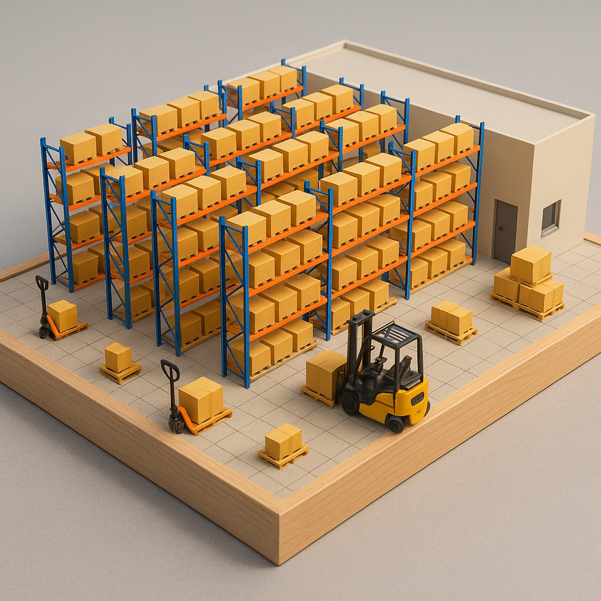

# Session 3: Warehouse Operations - Picking and Packing.

## Competency 5: Inventory and Warehouse Layout

A warehouse's physical configuration and the logic governing inventory placement are fundamental drivers of its efficiency. This competency examines the strategic design of warehouse spaces and systems for locating inventory to support fluid operational flow.

### **The Modern Warehouse: Zones & Material Flow**

A warehouse is not a monolithic storage space but a system of interconnected zones, each with a specific function. The layout dictates the flow of goods and people, and an optimized design minimizes travel and congestion.

#### Primary Zones:

* Receiving: Where inbound goods are unloaded, inspected for quality and quantity, and identified.
* Storage: The area for holding inventory. This is often subdivided into Bulk Storage (for palletized reserve inventory) and a Forward-Pick Area (for active, ready-to-pick inventory, often in smaller units like cases or eaches).
* Picking: The zone where order fulfillment occurs. This is where the majority of labor activity is concentrated.
* Packing & Consolidation: Where items for an order are grouped, checked for accuracy, packed into shipping cartons, and labeled.
* Staging & Shipping: Where completed orders are accumulated (staged) by destination or carrier and loaded onto outbound vehicles.
* Material Flow: The path goods follow through these zones should be logical and unidirectional to the greatest extent possible, commonly in a "U-shape" or "I-shape" (straight-through) flow path to prevent backtracking and bottlenecks.

<figure><figcaption></figcaption></figure>


The design of a warehouse layout is a classic problem in facility planning. The objective is to arrange departments or zones to minimize the total material handling cost, which is often a function of the distance traveled and the frequency of trips between zones (Tompkins et al., 2010). Poor flow can dramatically reduce the overall throughput capacity of the entire system.


<figure><figcaption></figcaption></figure>

***

### **Inventory Location Systems**

The method used to assign inventory to storage locations has significant implications for space utilization and picking efficiency.

* Fixed (or Dedicated) Location Storage: Each Stock Keeping Unit (SKU) is assigned a permanent, fixed storage location.
* Pros: Simple to manage, pickers quickly learn locations, and no sophisticated system is needed to locate stock.
* Cons: Highly inefficient use of space. The location must be sized to hold the maximum anticipated inventory of its SKU, leading to significant empty space (low cube utilization) when inventory levels are average or low.
* Random (or Chaotic) Location Storage: Incoming SKUs are stored in any available location of the appropriate size.
* Pros: Extremely high space utilization (often >90%) as it eliminates the reserved empty space of fixed systems.
* Cons: It is entirely dependent on a robust Warehouse Management System (WMS) to track the location of every item. Losing the WMS means losing the inventory.


Most modern operations use a hybrid approach. Fast-moving items (A-items) may be given dedicated locations in a forward-pick area for efficiency, while slower-moving items (B and C-items) are stored randomly in a bulk area to maximize space utilization.\



***

### **Theoretical Model: ABC Analysis**

ABC analysis is a method of inventory categorization that applies the Pareto principle to segment items based on their significance. The principle suggests that a small percentage of items typically account for a large percentage of overall value or activity.

**Classification:**

* A-Items: The most significant items, typically representing the top 70-80% of annual consumption value or pick frequency, but only constituting 10-20% of total SKUs.
* B-Items: Items of moderate significance, representing the next 15-25% of value/frequency from 30% of SKUs.
* C-Items: The least significant items, representing the final 5% of value/frequency but making up 50% or more of total SKUs.
* Mathematical Foundation: The analysis is performed by calculating the annual consumption value for each SKU (Annual Demand × Item Cost). The SKUs are then ranked in descending order by this value. The cumulative percentage of total SKUs and total value is calculated to determine the A, B, and C cutoff points.


_While classic ABC analysis uses consumption value,_ in a fulfillment context, it is often more powerful to classify items based on pick frequency or sales velocity. This directly aligns the classification with the labor-intensive picking process, ensuring that the most frequently touched items receive preferential treatment in slotting.


***

### **Slotting Strategy: The Application of ABC**

Slotting is the strategic placement of inventory within the picking area to minimize handling costs, primarily by reducing picker travel distance. It is the direct physical application of the ABC classification.

* _**Golden Zone Slotting:**_ A-items (the most frequently picked) should be slotted in the most accessible and ergonomically favorable locations—typically between a picker's waist and shoulders (the "golden zone")—and closest to the start of the pick path or nearest to the packing area.
* _**C-Item Placement:**_ C-items (the slowest movers) can be placed in less convenient locations, such as on the bottom or top shelves, or in aisles further away from the shipping dock.

**Other Slotting Considerations:**

* _**Product Correlation**_: Items that are frequently ordered together should be slotted near each other to enable more efficient multi-item picks.
* _**Physical Characteristics:**_ Heavy or bulky items should be placed on lower shelves to reduce picking effort and risk of injury. Small items should be stored in high-density bins to conserve space.

***

## Competency 6: Picking Strategies and Optimization

Order picking is the process of retrieving items from storage locations to fulfill customer orders. This competency analyzes the primary picking methodologies and the theoretical models used to optimize this critical function.

**Analysis of Order Picking Methods**

The choice of picking method is a strategic decision based on order profiles, facility layout, and available technology.

* **Discrete Order Picking:** The most basic method where one picker fulfills one complete order at a time, traveling throughout the warehouse as needed.
  * Pros: Simple, easy to manage, high accountability for order accuracy.
  * Cons: Extremely high travel time per order line, making it inefficient for multi-line orders.
* **Batch Picking** (or Cluster Picking): A single picker retrieves items for multiple orders simultaneously during one travel tour.
  * Pros: Significantly reduces travel time per order line.
  * Cons: Requires a consolidation and sorting step after picking; requires a WMS to generate batches.
* **Zone Picking:** The warehouse is divided into several picking zones. Pickers are assigned to a specific zone and only pick the SKUs located there. Orders are passed between zones until they are complete (a method known as "pick and pass").
  * Pros: Reduces travel distance as pickers remain in a compact area; enables specialization.
  * Cons: Can lead to bottlenecks and congestion at zone hand-offs; balancing workload between zones is a complex challenge.
* **Wave Picking:** A hybrid method where all orders for a specific time window (a "wave") are released to the floor at once. These orders are typically batched and picked by zone simultaneously. Completed items are then consolidated for each order.
  * Pros: Enables high-throughput picking for a large volume of orders; coordinates picking with shipping schedules.
  * Cons: The most complex method, requiring a sophisticated WMS for planning and control.

**Theoretical Model: The Traveling Salesperson Problem (TSP)**

Optimizing the pick path for a discrete or batch pick is a classic problem in operations research known as the Traveling Salesperson Problem (TSP).

* The Problem given a set of "cities" (item locations) and the "distance" (travel time) between each pair, the TSP seeks to find the shortest possible route that visits each location exactly once and returns to the origin (the packing station).
* Mathematical Formulation: Let C\_ij​ be the cost (distance) of traveling from location i to location j. Let xij​ be a binary variable that is 1 if the path from i to j is taken, and 0 otherwise. The objective is to:\

$$
Z_{min}= ∑C_{ij}​x_{ij}
$$

​\
Subject to constraints ensuring each location is entered and exited exactly once, and preventing sub-tours.

_Practical Application:_ The TSP is NP-hard, meaning that finding a guaranteed optimal solution becomes computationally intractable for even a moderate number of picks. Therefore, WMS systems do not solve the TSP exactly. Instead, they use heuristics—efficient algorithms that find very good, near-optimal solutions quickly. Common heuristics include the S-shape (or Serpentine) heuristic, where the picker travels up and down every aisle that contains a pick, and the Nearest Neighbor heuristic.

**Technology in the Picking Process**

Technology plays a vital role in executing picking strategies accurately and efficiently by reducing human error and improving productivity. 🤖

* Pick-to-Light: Alphanumeric displays and buttons are installed at each pick location. The WMS illuminates the light at the correct location and displays the quantity to pick, guiding the operator directly.
* Voice Picking: The WMS sends instructions to the picker through a headset. The picker confirms tasks (e.g., by reading a check digit) verbally, keeping their hands and eyes free to focus on the pick.
* RF Scanning: Handheld radio-frequency devices guide pickers through a list of tasks and are used to scan location barcodes and item barcodes to confirm that the correct item and quantity are being picked.


These technologies are prime examples of applying human factors engineering. They reduce the picker's cognitive load (e.g., no need to read and interpret a paper list), which in turn reduces error rates and improves picking speed. The choice of technology should align with the chosen picking strategy and prod


#### TSP in Warehousing

In the context of warehousing, the Traveling Salesman Problem (TSP) is applied to optimize the route of a picker who needs to retrieve items from various locations within a warehouse. The goal is to minimize the distance traveled, which directly impacts the time taken and the efficiency of the picking process.&#x20;

Given that solving TSP exactly is computationally challenging for large sets of locations, heuristics are indispensable in warehouse management systems to generate practical solutions efficiently.

#### Example of TSP in Warehousing

Consider a warehouse with a picker assigned to collect items for an order from ten different locations. The TSP challenge here is to determine the shortest possible route that the picker should take to visit each of these ten locations and return to the starting point. By solving this problem, the warehouse can minimize the distance traveled, reduce picking time, and increase overall efficiency. Using heuristic algorithms, like nearest neighbor or genetic algorithms, can provide near-optimal solutions quickly, which is crucial for large warehouses with extensive item locations.

#### TSP Solver in Excel

To solve the TSP using Excel, you can leverage the Solver add-in, a powerful optimization tool. Here’s a brief guide to set it up:

1. **Setup the Distance Matrix**: Create a matrix representing the distances between each pair of locations in your warehouse.

This method allows warehouse managers to utilize existing tools for route optimization without requiring specialized software, making it accessible and cost-effective.
