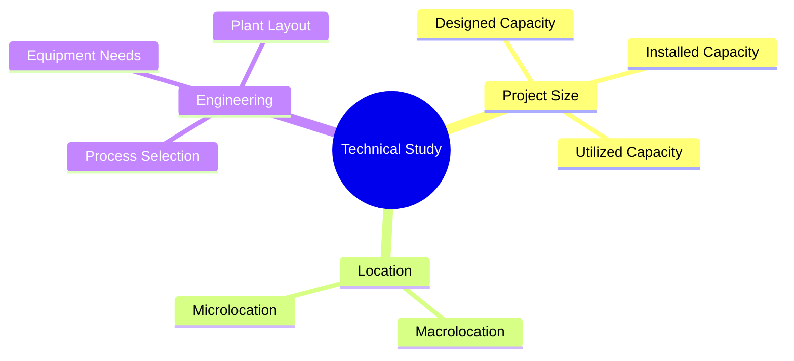
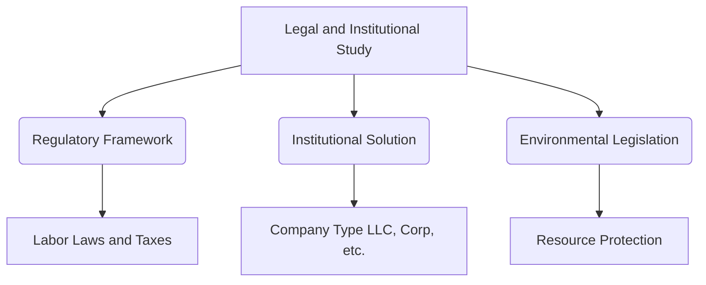
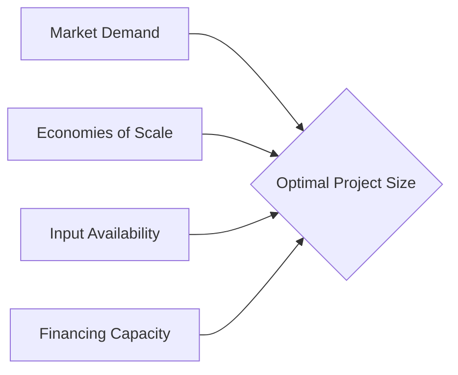

# Module 4: Technical, Administrative, and Legal Studies


**Learning Objective:** Understand the components that define the technical viability of a project, the organizational structure required to execute it, and the legal framework that regulates it.


## Technical Study

The technical study aims to define the technical feasibility of the project and determine the investments, costs, and revenues that support its profitability. It consists of three fundamental elements:



### Project Size

Refers to the production capacity of a good or the provision of a service during the project's lifespan, usually measured in units per period of time (e.g., meters per month, available beds, daily transactions).

* Three capacity levels must be considered: designed (maximum possible level), installed (permanently available), and utilized (the fraction actually being used).
* The size is conditioned by factors such as demand dimension, market size, availability of inputs, technology, location, and the financial capacity of the promoters.



### Location

Aimed at analyzing variables to determine the definitive place where the project will be located, seeking to minimize costs or maximize utility.

* Includes progressive levels: **Macrolocation** (integration into the national or regional environment) and **Microlocation** (choosing the exact site within the locality).
* The decision is made by weighting "locational forces" such as transport costs, availability of raw materials and labor, public services infrastructure, climatic factors, and regional development policies.



### Project Engineering

Seeks to identify a production function that optimizes the use of available resources (labor, equipment, inputs, and methods).

* Includes technical description of the product, selection of the transformation process, list of required equipment, and detailed description of inputs.
* Also covers spatial and internal distribution (Layout), arranging equipment, materials, and personnel harmoniously to ensure spatial and time economy.




**Practical Example (Technical Study):** Imagine you are opening a craft brewery.

* **Size:** Your fermentation tanks define your **installed capacity** (e.g., 10,000 liters/month). Even if the market demands 15,000 liters, your current size is capped at 10,000.
* **Location:** You place the brewery near an excellent water source (raw material proximity) and a major highway (logistics) to reduce transport costs.
* **Engineering (Layout):** You organize the factory so the milling station is right next to the boiling tanks, preventing workers from walking back and forth with heavy sacks of grain.


## Administrative and Organizational Study

The administrative design guarantees the achievement of the project's objectives through functional organizational structures. A bad administrative decision can completely distort the purposes of the project.

* **Organizational Structure:** Its design starts by identifying all necessary activities, grouping tasks with common purposes (production, finance, human resources, marketing), determining personnel requirements for each function, and finally building the **organizational chart**. It can be project-oriented or operations-oriented (functional and pyramidal).
* **Strategic Platform and Process Characterization:** The organizational design must direct the company towards external customer satisfaction and internal sustainability. This requires defining the future of the business by establishing the mission, vision, objectives, critical success factors, values, and paradigms. Subsequently, an operational model must be built by characterizing processes, identifying responsibilities, and defining required job profiles.

## Legal and Institutional Study

* **Regulatory Framework:** Every organization intervenes in a legal and institutional framework (Constitution, laws, decrees, regulations) that prohibits or permits relations between its members and its environment. It is essential to identify current regulations affecting each project phase: market regulations (price controls), customs laws, labor regulations, and tax legislation.
* **Institutional Solution:** The legal study defines the type of legal entity or company (anonymous, limited, mixed, cooperative) to be created to represent investor interests.
* **Environmental Legislation:** Strictly complying with environmental restrictions to prevent and treat ecological impacts is a critical modern legal factor.

## How are Project Size and Location Calculated?

### Calculating and Determining Project Size

The size calculation does not rely on a single mathematical formula but results from balancing several conditioning factors:



### The Market (Demand)

This is the main factor. Size must be estimated based on current and projected unsatisfied demand. If demand is uncertain, "modular" growth can be planned.



### Costs and Technology (Economies of Scale)

Economically, the goal is the production level that minimizes unit costs and maximizes profit (economies of scale).



### Input Availability

The maximum size is strictly limited by the guaranteed amount of raw materials, water, energy, and qualified labor.



### Financing

The chosen scale must fit the investors' financial capacity.



### Calculating and Determining Location

Location aims to find the place that minimizes costs or maximizes project utility, using specific methods to evaluate "locational forces":



### Qualitative Point Method (Scoring System)

One of the most common methods. Define a list of relevant factors, assign each a "weight" (percentage of importance), score each location alternative (e.g., 1 to 10), and multiply the score by the weight. The highest total score is the optimal location.



### Minimum Transport Cost Approach

Mathematically calculating the geographic point representing the lowest transfer cost (bringing raw materials to the plant + taking the final product to the market).



Critical factors evaluated for location:

* Proximity to market vs. raw materials: If raw materials lose weight/volume during production (e.g., mining), place the plant near the source. If the product is fragile or gains weight, locate near the consumer market.
* Services and infrastructure: Energy, water, roads, ports.
* Other determinants: Climate, labor cost, land price, taxes.


**Practical Example (Location Calculation):** A timber company extracts wood (heavy, raw material) and turns it into paper (lighter). It is much cheaper to place the factory **near the forest** to avoid paying transport costs for heavy logs that will lose mass anyway.

