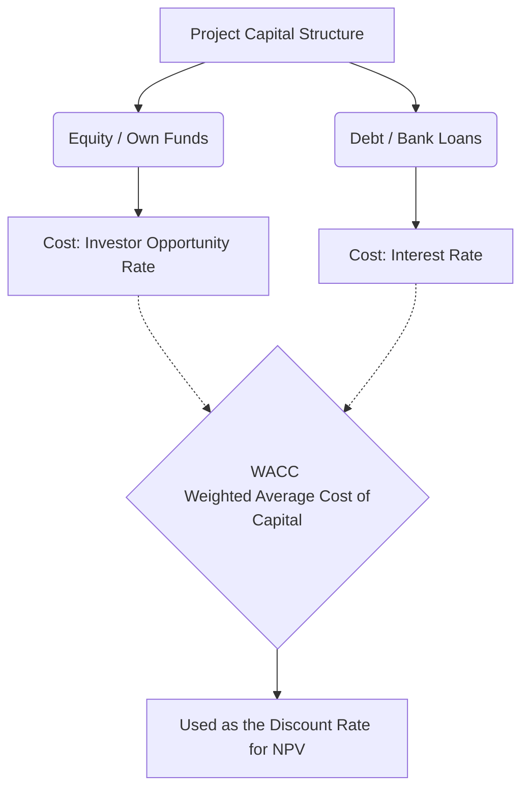
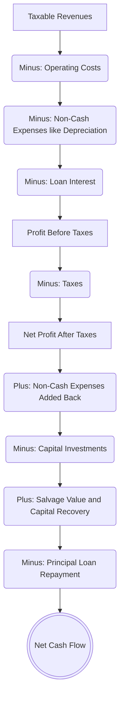
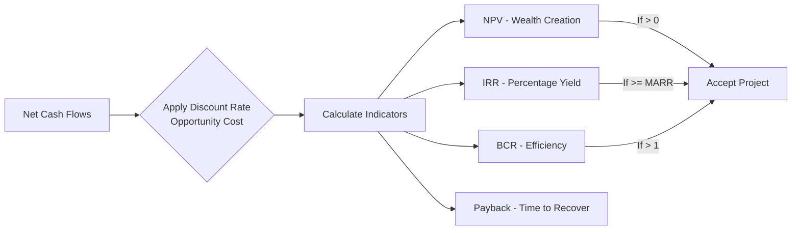

# Module 5: Financial Study and Cash Flows


**Learning Objective:** To understand the financial study as a fundamental phase in project formulation and evaluation. It translates information from previous studies (market, technical, organizational) into monetary figures, structuring financing sources and cash flows to apply financial indicators such as NPV (Net Present Value), IRR (Internal Rate of Return), and BCR (Benefit-Cost Ratio).


***

## 1. Financing Sources and Capital Structure

Financing sources define where the necessary resources will come from to cover the initial investment (CAPEX) and working capital (OPEX) of the project. Capital structure is the exact mix of internal and external funds used.

* **Own Resources (Internal Sources / Equity):** The investor or partners contribute capital directly, without needing third parties. This includes reinvesting retained earnings, using depreciation funds, and selling assets. It carries an implicit cost: the investor's opportunity cost.
* **External Sources (Debt):** Third-party capital is used, implying a level of debt (liabilities). These can come from issuing shares or bonds, or from various short, medium, and long-term credit modalities (bank loans, development credits, leasing, factoring, etc.). It carries an explicit cost: the interest rate.
* **Mixed Financing:** This is the most common form, where the investor contributes a portion of their own resources, and the rest is obtained through external debt.

### Determining the Cost of Capital (WACC)

When a project uses mixed financing, it is crucial to calculate the **Weighted Average Cost of Capital (WACC)**. This percentage represents the minimum acceptable return the project must generate to satisfy both the creditors (who charge interest) and the partners (who demand profitability).


**WACC Formula Concept:** It weights the proportion of debt multiplied by the interest rate (adjusted for taxes), plus the proportion of equity multiplied by the investor's opportunity cost.


***

## 2. Building Cash Flows

The cash flow is a scheme that presents in an organized and chronological manner the projected liquid cash outflows (expenses) and inflows (revenues) during the project's evaluation horizon.

To build it, three main magnitudes are consolidated:

* **Investment Outflows (CAPEX & Working Capital):** Fixed investments (land, buildings, machinery), deferred investments or nominal assets (studies, organizational expenses, patents), and working capital are recorded, generally in period zero.
* **Operating Inflows:** Cash generated by the sale of products or services, the sale of assets due to replacement, and the salvage value at the end of the project.
* **Operating Costs (OPEX):** Disbursements required in the operation phase, such as production costs (fixed and variable), operation, maintenance, and administrative costs.

### Pure Project vs. Investor Cash Flow



### Pure Project Cash Flow (Unfinanced)

Evaluates the profitability of the total investment assuming all resources are proprietary. It **does not** include interest payments or credit amortization. Its operational structure does not contemplate loan inflows or deductions for debt service.



### Investor's Cash Flow (Financed)

Reflects the profitability of the contributed equity. It incorporates the loan as an inflow in period zero, and subtracts the credit installment payments (principal amortization and interest) as outflows in the operating periods. Furthermore, it deducts the interest paid on the loan _before_ calculating taxes, which acts as a "tax shield" influencing the adjusted net profit.



***

## 3. Detailed Step-by-Step Cash Flow Construction

The construction of the cash flow organizes projected liquid cash inflows and outflows chronologically over the evaluation horizon (Installation, Operation, and Liquidation).


**Key Principles:**

* **Liquidity Principle:** Only real, liquid cash flows must be included (not just accounting entries).
* **Sunk Costs:** Past, unrecoverable costs (like already-paid preliminary market studies) are ignored. They do not affect future decisions.
* **Incremental Flows:** Evaluations must focus on the difference between the "with project" and "without project" scenarios.




### Taxable Revenues

All income generated by normal operations (sales, service provision) and asset sales during useful life.



### Tax-Deductible Expenses (Operating Costs)

Subtract necessary operational disbursements: manufacturing costs (raw materials, direct labor), indirect expenses (maintenance, services, insurance), and administrative/sales expenses.



### Non-Cash Expenses (Tax Shield)

Subtract concepts that are legally deductible to lower the tax base but are not real cash outflows. This includes **Depreciation** of fixed assets, **Amortization** of deferred assets, and the **Book Value** of sold assets.



### Credit Interest (Investor Flow Only)

Subtract interest paid for using third-party capital in each operating period.



### Calculations of Profits and Taxes

* Profit Before Taxes = (Taxable Revenues) - (Operating Costs) - (Non-Cash Expenses) - (Loan Interest)
* Taxes = Apply the corresponding corporate tax rate (e.g., 30%).
* Net Profit (After Taxes) = Profit Before Taxes - Taxes.



### Adjustment for Non-Cash Expenses

Since depreciation, amortization, and book value were subtracted in the tax calculation step but cash never actually left the business, these must be **added back** to the Net Profit.



### Non-Tax-Deductible Outflows (Investments)

Subtract real capital disbursements not deductible when they occur (usually in Period 0). This includes fixed assets, deferred assets, and initial working capital.



### Non-Taxable Benefits (Recovery Values)

Add cash inflows occurring at the end of the project's life (Liquidation stage), such as the **Salvage Value** of fixed assets and the total recovery of **Working Capital**.



### Principal Amortization (Investor Flow Only)

Record credit funds as inflows (Period 0) and subtract the principal payment installments (without interest) in operating periods.



### Net Cash Flow (FCF)

The final result of all these additions and subtractions period by period.



***

## 4. Financial Modeling and Profitability Indicators

Once the Net Cash Flow is projected, dynamic methods that account for the time value of money are applied using a discount rate to decide whether to accept or reject the project.

### How does the Opportunity Cost affect the calculation?

The opportunity cost represents the return an investor sacrifices by choosing to invest in this specific project instead of the best alternative available in the market at a similar risk level.

* **Discounting flows:** Because money loses purchasing power over time (due to inflation and risk), future income cannot be simply summed with present investment. The opportunity cost is used to discount (bring to present value) future flows.
* **Inverse mathematical relationship:** As the opportunity cost or risk (required rate) increases, the Present Value result decreases, and vice versa.

### Key Financial Indicators Explained

#### Net Present Value (NPV)

Defined as the difference between the updated (present) value of all future cash inflows and outflows, minus the initial investment. It represents the absolute wealth created by the project in today's dollars.

* Formula: $NPV = \sum \frac{CF\_t}{(1+r)^t} - I\_0$ (where CF is Cash Flow, r is discount rate, t is time period, $I\_0$ is initial investment).
* Decision Criteria:
  * If **NPV > 0**: Accept. The project generates wealth beyond the investor's minimum expectations.
  * If **NPV < 0**: Reject. The project destroys value.
  * If **NPV = 0**: Indifferent. It earns exactly the opportunity cost.

#### Internal Rate of Return (IRR)

It is the exact interest or discount rate that makes the project's NPV exactly equal to zero. In simple terms, it is the actual percentage yield the project generates internally over its lifespan.

* Decision Criteria:
  * Accept if **IRR ≥ MARR** (Minimum Acceptable Rate of Return) or the WACC.
  * Reject if the IRR is lower than what the bank or the market offers for a similar investment.
* Caveat: IRR assumes that all intermediate cash flows are reinvested at the same IRR rate, which is often unrealistic. For complex projects, the Modified IRR (MIRR) is preferred.

#### Benefit-Cost Ratio (BCR)

An indicator comparing the present value of benefits (revenues) against the present value of costs (including investment) through division. It shows how many dollars of benefit are generated for every dollar invested.

* Decision Criteria:
  * Accept if the result is **> 1**. (e.g., A BCR of 1.25 means that for every $1 invested, the project returns $1.25 in present value).

#### Payback Period (PRI)

The exact amount of time (usually measured in years and months) it takes for the project's accumulated cash flows to recover the initial investment.

* Limitation: Traditional payback ignores the time value of money and cash flows occurring after the payback point. It is mostly used as an indicator of liquidity and risk, rather than pure profitability.

