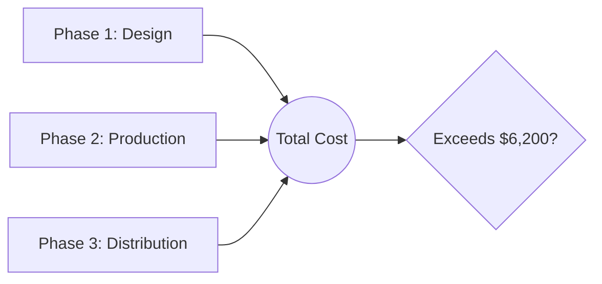
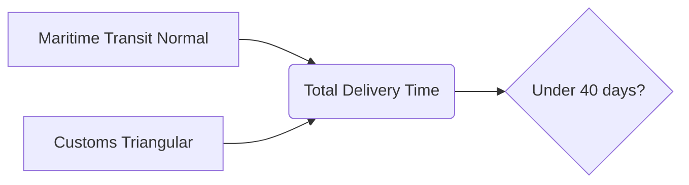
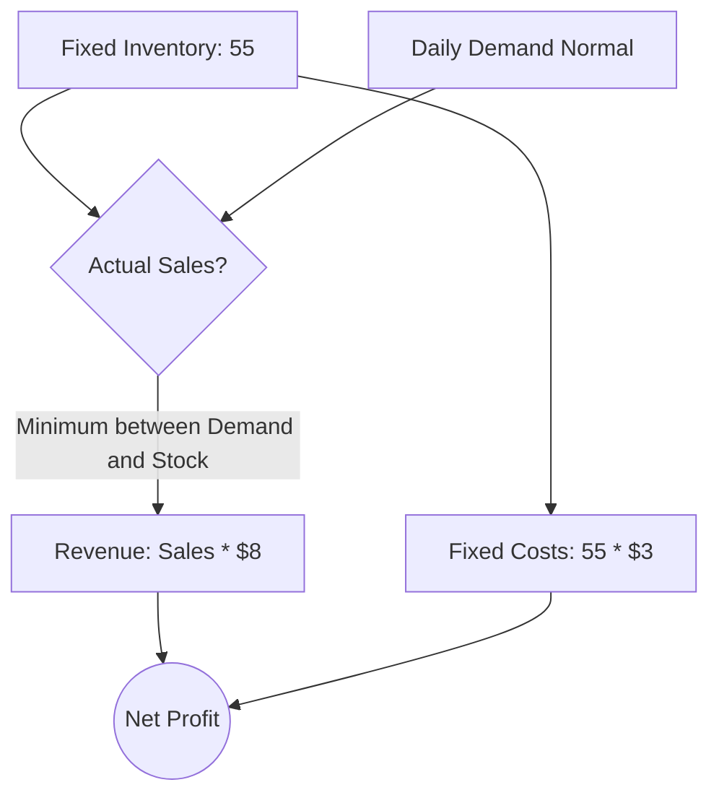

# Montecarlo Exercises


**Class Objective:** Learn how to use Monte Carlo simulation through Python code (`numpy` and `matplotlib`) to model uncertainty in real-world business, project management, and inventory problems.


***

### Environment Setup

Before starting the exercises, ensure that all students have the necessary libraries installed. In the terminal or command prompt, run:

```bash
pip install numpy matplotlib
```

***

### 🟢 Exercise 1: Project Cost Estimation (Basic Level)

**Context:** A marketing agency is going to launch an advertising campaign consisting of three phases. Due to the variability of suppliers, the costs of each phase are not exact, but experts have provided estimates using **triangular distributions** (Minimum, Most Likely, Maximum).

* **Phase 1 (Design):** Between $1,000, $1,200 (most likely), and $1,500.
* **Phase 2 (Production):** Between $3,000, $3,500 (most likely), and $4,500.
* **Phase 3 (Distribution):** Between $500, $600 (most likely), and $1,000.

**The Challenge:** What is the probability that the **total** cost of the project will exceed the maximum authorized budget of $6,200?



#### Python Solution Code:


```python
import numpy as np
import matplotlib.pyplot as plt

iterations = 10000

# Simulate costs for each phase
cost_phase1 = np.random.triangular(1000, 1200, 1500, iterations)
cost_phase2 = np.random.triangular(3000, 3500, 4500, iterations)
cost_phase3 = np.random.triangular(500, 600, 1000, iterations)

# Summed total cost
total_cost = cost_phase1 + cost_phase2 + cost_phase3

# Statistical calculations
average_cost = np.mean(total_cost)

# Count how many scenarios exceeded the budget
exceeded_cases = np.sum(total_cost > 6200)
probability_excess = (exceeded_cases / iterations) * 100

print(f"Average Total Cost: ${average_cost:,.2f}")
print(f"Probability of exceeding the budget ($6,200): {probability_excess:.2f}%")

# Plotting
plt.hist(total_cost, bins=50, color='lightgreen', edgecolor='black')
plt.axvline(6200, color='red', linestyle='dashed', linewidth=2, label='Max Budget ($6,200)')
plt.title('Project Cost Simulation')
plt.xlabel('Total Cost ($)')
plt.ylabel('Frequency')
plt.legend()
plt.show()
```


***

### 🟡 Exercise 2: Supply Chain Delay Risk (Intermediate Level)

**Context:** A bicycle assembly company imports parts from Asia. The time it takes for a container to arrive depends on two independent variables:

1. **Maritime transit time:** Follows a normal distribution. It takes an average of 30 days, with a standard deviation of 4 days.
2. **Customs clearance time:** It is uncertain. It can be a minimum of 2 days, typically takes 5 days, but if there is an inspection, it can take up to 15 days (Triangular).

**The Challenge:** The main client demands that the merchandise be at the factory in **under 40 days**. If it takes longer, a penalty is paid. With what probability will the company meet this deadline?



#### Python Solution Code:


```python
import numpy as np
import matplotlib.pyplot as plt

iterations = 10000

# Simulate times
maritime_time = np.random.normal(loc=30, scale=4, size=iterations)
customs_time = np.random.triangular(left=2, mode=5, right=15, size=iterations)

# Total transit time
total_time = maritime_time + customs_time

# Statistical calculations
average_days = np.mean(total_time)
success_cases = np.sum(total_time <= 40)
probability_success = (success_cases / iterations) * 100

print(f"Average arrival time: {average_days:.1f} days")
print(f"Probability of meeting the 40-day deadline: {probability_success:.1f}%")

# Plotting
plt.hist(total_time, bins=50, color='coral', edgecolor='black')
plt.axvline(40, color='red', linestyle='dashed', linewidth=2, label='Client Deadline (40 days)')
plt.title('Supply Chain Delays')
plt.xlabel('Total Days')
plt.ylabel('Frequency')
plt.legend()
plt.show()
```


***

### 🔴 Exercise 3: Perishable Inventory Optimization (Advanced Level)

**Context:** A coffee shop sells special desserts that expire at the end of the day.

* Cost of purchasing the dessert from the supplier: **$3**
* Selling price to the customer: **$8**
* If the dessert is not sold that day, it is thrown away (Total loss of cost).
* The daily demand for desserts is uncertain, but historically follows a **normal distribution** with a mean of 50 requested desserts and a standard deviation of 10.

**The Challenge:** The coffee shop decides to buy **55 desserts daily** from its supplier. What will be its average daily net profit? Is there a risk of having negative profits (losing money)?


**Hint for students:** The quantity that customers buy cannot exceed the inventory you have (55). If 70 are requested, you can only sell 55. Use `np.minimum()` to limit simulated sales to the stock available.




#### Python Solution Code:


```python
import numpy as np
import matplotlib.pyplot as plt

iterations = 10000

selling_price = 8
unit_cost = 3
daily_stock = 55

# The daily fixed cost will always be the stock purchased * unit cost
fixed_daily_cost = daily_stock * unit_cost

# 1. Simulate Demand (Rounded to integers because half desserts are not sold)
simulated_demand = np.round(np.random.normal(loc=50, scale=10, size=iterations))

# 2. Calculate Actual Sales (You cannot sell more than you have in stock)
# If 60 are requested, you sell 55. If 40 are requested, you sell 40.
actual_sales = np.minimum(simulated_demand, daily_stock)

# 3. Calculate profit for all scenarios
revenue = actual_sales * selling_price
net_profit = revenue - fixed_daily_cost

# 4. Statistics
average_profit = np.mean(net_profit)
probability_loss = np.sum(net_profit < 0) / iterations * 100

print(f"Average Daily Net Profit: ${average_profit:,.2f}")
print(f"Probability of losing money on a given day: {probability_loss:.2f}%")

# Plotting
plt.hist(net_profit, bins=30, color='gold', edgecolor='black')
plt.axvline(average_profit, color='green', linestyle='dashed', linewidth=2, label='Average Profit')
plt.axvline(0, color='red', linestyle='solid', linewidth=2, label='Break-even Point ($0)')
plt.title('Coffee Shop Daily Profits')
plt.xlabel('Net Profit ($)')
plt.ylabel('Frequency (Simulated Days)')
plt.legend()
plt.show()
```

