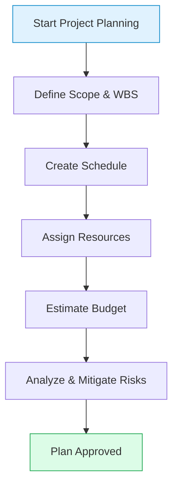
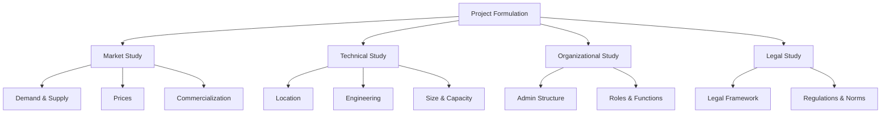
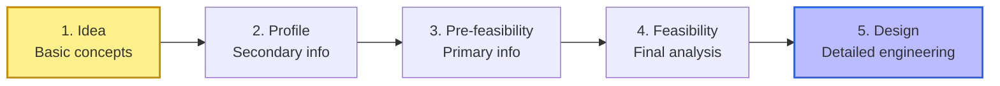
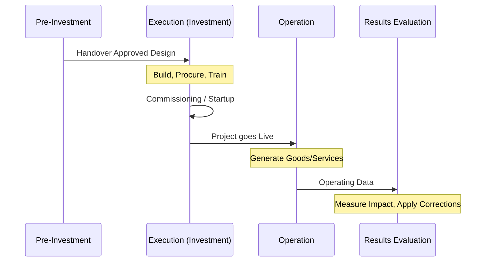

# step by step in PM

Good project planning must answer five key questions: **What needs to be done?** **How will it be done?** **Who will do it?** **When?** and **How much will it cost?**

## 1. Project Planning Basics

To achieve successful planning, the main steps are:



### Define the Scope

Clearly establish the problem to be solved and use a Work Breakdown Structure (WBS) to divide the project into smaller, more manageable tasks.



### Create the Schedule

Define the activities, order them in a logical sequence, and estimate how much time each will take.



### Assign Resources

Determine the personnel, equipment, and materials needed to execute the tasks.



### Estimate the Budget

Calculate the costs associated with each activity and define the total budget.



### Analyze Risks

Identify potential issues that could occur during the project and develop a contingency plan ("Plan B") to mitigate them.



### Planning Process Diagram

## 2. Project Formulation Studies

Formulation is the set of activities used to gather and process information. It is specifically composed of four fundamental studies:



### Market Study

Analysis of demand, supply, prices, and commercialization to ensure the project has a real space in the market.



### Technical Study

Answers how much, where, how, and with what the product or service will be produced (includes size, location, and project engineering).



### Organizational Study

Defines the administrative structure, roles, and functions necessary to execute and operate the project.



### Legal Study

Establishes the legal framework and regulations that will govern the project across all its stages.



### Formulation Studies Diagram

## 3. The Pre-Investment Phase

These stages make up the pre-investment phase of a project and function as a process of "buying certainty", where each step deepens the level of detail to reduce risk before spending money:



### Idea

The problem or need is identified, and basic solution alternatives are proposed. Cost and revenue calculations are global and based on experience and existing information.



### Profile

A preliminary analysis using secondary information (no field research is done). It serves to discard clearly unviable alternatives.



### Pre-feasibility (Preliminary Project)

Deepens the study of the market, technology, and profitability using primary (dynamic) information. Compares viable options and selects the best alternative.



### Feasibility

The definitive analysis of the selected option. It deals with finer details, such as written quotes, established contracts, and architectural plans to make the final investment decision.



### Design

Once the project is approved, the definitive design (such as detailed engineering) is elaborated to begin material execution.



### Pre-Investment Funnel

## 4. Project Life Cycle: Execution to Evaluation

After pre-investment and design, the project moves into its active phases:



### Investment or Execution

In this stage, the project materializes. It involves activities like buying land, building facilities, acquiring machinery, and recruiting and training personnel. This phase concludes with "commissioning" (startup), where installed capacity is tested to ensure the project is fully operational.



### Operation

Once installed, the project officially starts. The generation of the good or service intended to solve the original problem or need begins.



### Evaluation of Results

After a reasonable time of operation, it is verified whether the project effectively solved the initial problem. This serves to evaluate the real impact (such as job creation or social benefits) and apply corrective measures if things did not go as expected.



### Execution and Operation Flow

