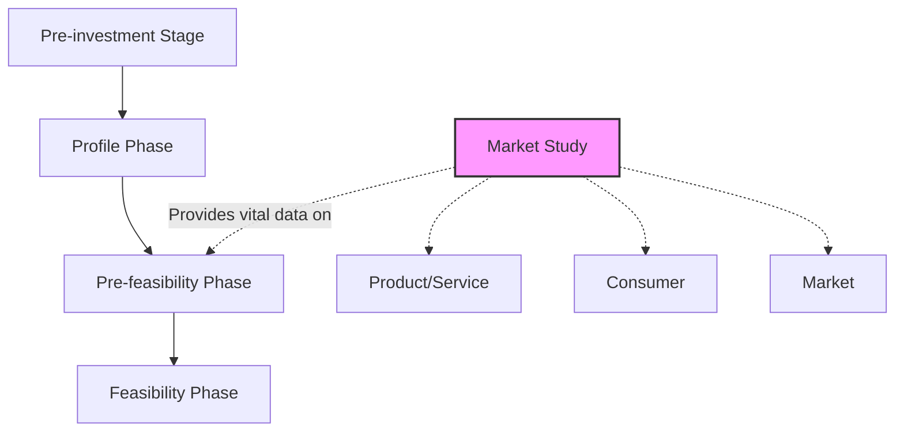
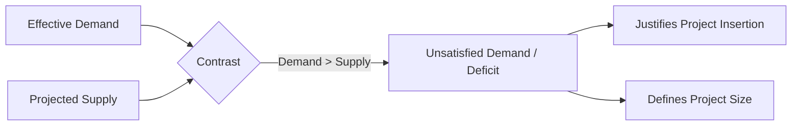
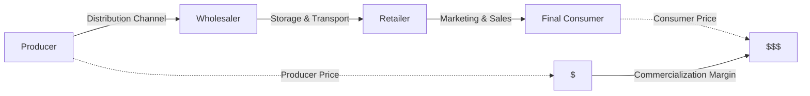
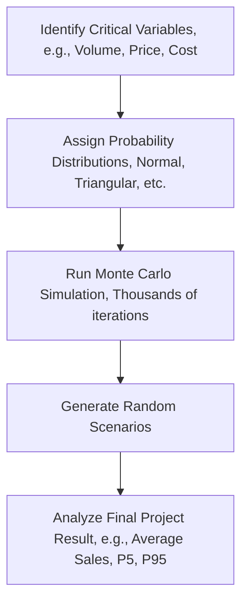
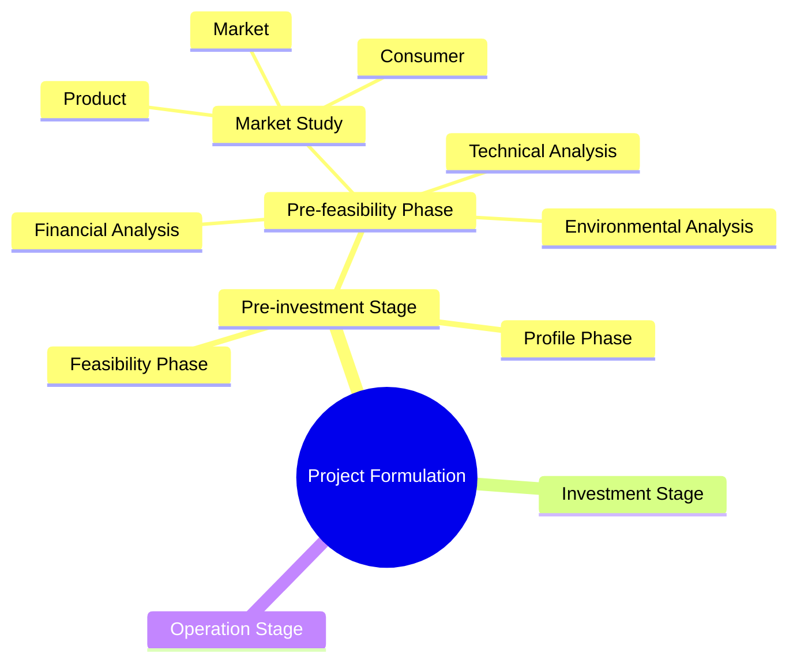
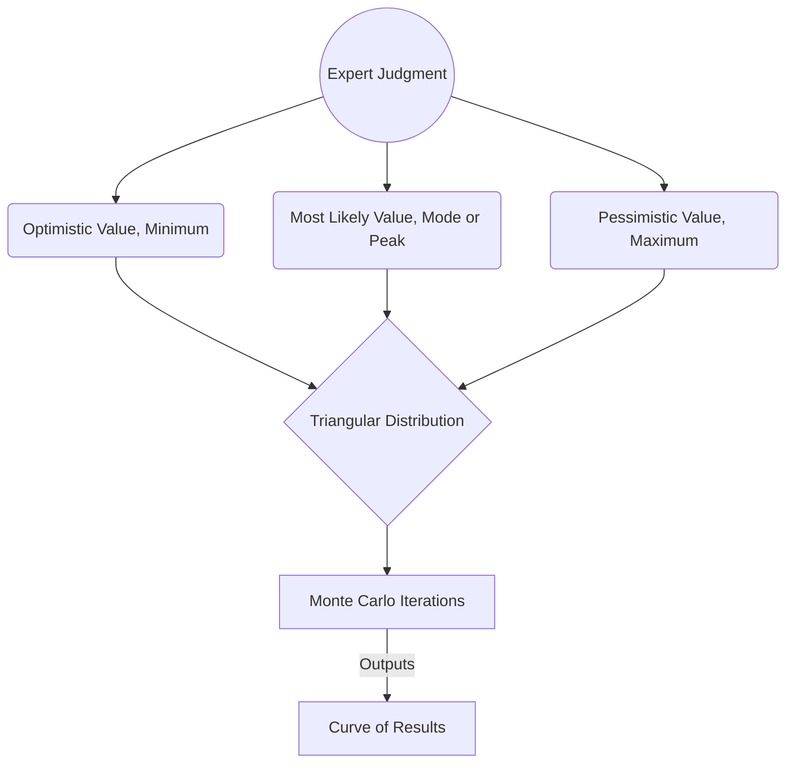

# Module 3: Pre-feasibility and Market Study


**Pre-feasibility** is a phase within the pre-investment stage where the consumption, technical, financial, institutional, administrative, and environmental aspects of a project are refined and analyzed in greater detail. Its objective is to contrast the initial hypotheses to make an informed decision: abandon the project, postpone it, or advance to the feasibility and final design phase.


The **market study** is the pillar that defines the overall feasibility of any project. It consists of the collection, discussion, analysis, and interpretation of information regarding supply and demand, in order to make correct commercial decisions. Every market study has three main research objects: the **product** (or service), the **consumer**, and the **market**.



## Demand, Supply, Pricing, and Commercialization Strategies

* **Demand Analysis:** Demand represents the relationship between different prices and the quantities consumers are willing to purchase. This function depends on multiple variables, such as income level, consumer spending patterns, population growth, and the behavior of prices of substitute and complementary goods. To study it, it is imperative to analyze the historical evolution of demand (using statistics from secondary or primary sources) to project its future behavior and the real magnitude of the need.
* **Supply Analysis:** Its purpose is to identify how the community's needs have been met and will be met in the future. To evaluate it, a list of competitors and suppliers must be drawn up (analyzing their installed capacity, location, and prices), and the market regime must be established (monopoly, oligopoly, or free competition). The most crucial step is the contrast between effective demand and projected supply; the difference between the two determines the **unsatisfied demand** (or deficit), which justifies the insertion of the project into the market and defines its size.



* **Pricing Analysis:** Price is the exchange ratio of a good for money and serves as an indicator of value in the market. Pricing can occur under different modalities:
  1. _Cost-based:_ Calculated by adding a markup percentage or marketing margin to the total production costs.
  2. _Market-driven:_ Depends on the intensity of demand; if demand is high, prices rise, and vice versa.
  3. _Competition-based:_ An average of competitors' prices is applied.
  4. _Political prices:_ Prices intervened by authorities through subsidies or taxes to protect or stimulate sectors.
* **Commercialization (Marketing) Strategies:** This is the process that spans from the conception of the product to placing it in the hands of the final consumer. It includes defining the **distribution channels** (the path from producer to consumer, passing through wholesalers and retailers), storage, transportation, and advertising and promotion campaigns. Strategies can be intensive growth, such as market penetration (growing with existing products), product development (launching new products), or the development of new markets. It is essential to analyze the **commercialization margin**, which is the added cost to the product due to its distribution, measured as the difference between the price the consumer pays and the price the producer receives.



***

## Sales Forecasting Simulation and Statistical Tools

To forecast demand and sales, sources suggest various statistical and qualitative methods:

1. **Historical trend extrapolation:** Uses linear regression equations (simple or multiple) where demand depends on independent variables (such as GDP or time).
2. **Econometric models:** Express the relationships between variables like prices, income, and demographic indices in mathematical formulas.
3. **Delphi Method or Scenarios:** Systematic consultation with groups of experts to estimate future predictions considering multiple social and economic factors.


Since any sales projection is subject to uncertainty and risk, texts strongly recommend using **Monte Carlo Simulation**.


This method evaluates the probability of occurrence of different sales flows by assigning to each critical variable (e.g., costs, prices, sales volume) a _probability distribution_ (such as standard normal or triangular distribution) and generating thousands of random scenarios to observe the final result of the project.




**Important Note regarding Python (Information external to the sources):**

It is important to clarify that the provided sources do not mention or contain manuals on the use of the **Python** programming language. The texts base their statistical simulation examples on software and Excel add-ins like **@Risk**, **Crystal Ball**, **TopRank**, and **BestFit**.


However, as an expert, below is an **independent conceptual example (outside the sources)** of how a Monte Carlo Simulation would be performed to forecast sales using statistical tools in Python (`numpy` and `matplotlib` libraries):


```python
import numpy as np
import matplotlib.pyplot as plt

# Parameters based on your Market Study
iterations = 10000  # Number of scenarios to simulate

# 1. Simulate Expected Demand (Normal Distribution)
# Suppose your study projects selling 5000 units on average, with a standard deviation of 500
simulated_demand = np.random.normal(loc=5000, scale=500, size=iterations)

# 2. Simulate Selling Price (Triangular Distribution)
# Suppose your pricing analysis indicates: minimum $18, most likely $20, maximum $25
simulated_price = np.random.triangular(left=18, mode=20, right=25, size=iterations)

# 3. Calculate Sales Revenue for the 10,000 scenarios
simulated_sales = simulated_demand * simulated_price

# 4. Statistical Analysis of the Results
average_sales = np.mean(simulated_sales)
percentile_5 = np.percentile(simulated_sales, 5) # Pessimistic scenario (95% confidence of exceeding this value)
percentile_95 = np.percentile(simulated_sales, 95) # Optimistic scenario

print(f"Average Sales Forecast: ${average_sales:,.2f}")
print(f"Pessimistic Scenario (P5): ${percentile_5:,.2f}")
print(f"Optimistic Scenario (P95): ${percentile_95:,.2f}")

# Visualization
plt.hist(simulated_sales, bins=50, color='skyblue', edgecolor='black')
plt.axvline(average_sales, color='red', linestyle='dashed', linewidth=2, label='Average')
plt.title('Monte Carlo Simulation: Sales Forecast')
plt.xlabel('Sales Revenue ($)')
plt.ylabel('Frequency (Scenarios)')
plt.legend()
plt.show()
```


<figure><figcaption></figcaption></figure>

***

## Market Analysis vs. Pre-feasibility Phase

The main difference between market analysis and pre-feasibility lies in their **scope** and **the place they occupy** within the formulation of a project.

While pre-feasibility is an **integral phase** of evaluation within the project life cycle, market analysis is a **specific study** that is part of that and other phases to provide vital information.

Below, each concept and its differences are detailed:

### 1. Pre-feasibility as an integral evaluation phase.

Pre-feasibility is one of the phases of the pre-investment stage (located between the "profile" phase and the "feasibility" phase). Its main characteristics are:

* **Global scope:** In this stage, multiple aspects of a project are refined and analyzed in greater detail: technical, financial, institutional, administrative, environmental, and also market aspects.
* **Decision objective:** Its purpose is to evaluate different project alternatives or variants to discard those that are not viable. At the end of this phase, a decision must be made: abandon the idea, postpone it, or select the best alternative to move to a deeper study (feasibility) or final design.
* **Uncertainty:** It seeks to reduce initial uncertainty by proposing approximations to investments, costs, and revenues to apply profitability criteria.

### 2. Market Analysis or Study, An information component

The market study is a specific technical research conducted to obtain and process information about the environment surrounding the company or project. Its characteristics are:

* **Specific focus:** It focuses exclusively on investigating three main objects: the product or service, the consumer, and the market.
* **Study variables:** Its objective is to analyze the historical, current, and future behavior of supply and demand, as well as to determine prices and commercialization channels.
* **Purpose:** It seeks to determine if there is an unsatisfied demand that justifies the creation of the project, calculating the quantity of goods or services that the community would be willing to acquire (in private projects) or the magnitude of the collective need (in social projects).


**Summary of the difference and their relationship**

The market analysis is a mandatory input to be able to carry out the pre-feasibility phase. The results obtained in the market study (such as the amount of unsatisfied demand) are what allow pre-feasibility to determine technical elements like the **optimal size of the project** and calculate the **expected revenues** to build cash flows and financially evaluate the proposal.

In conclusion, you cannot conduct a pre-feasibility study without having performed a market analysis, since the latter is the pillar that demonstrates whether the product or service has real potential among consumers.




***

## How to Use the Triangular Distribution

The triangular distribution is a continuous probabilistic tool widely used in Monte Carlo simulation, which is especially valuable when there is not enough historical statistical information about the behavior of a variable.

In the absence of historical data, this distribution is built relying on the opinion or judgment of experts, who must estimate three fundamental parameters for the uncertain variable (such as a cost, a sale, or the duration of an activity):



### Optimistic value (minimum)

The lower limit or the best possible scenario.



### Most likely value (mode)

The intermediate value that experts consider will occur with the highest probability.



### Pessimistic value (maximum)

The upper limit or the worst possible scenario.



When graphing these three points, a triangle is drawn where the peak (the point of highest probability) corresponds to the most likely value. Depending on the distance between the most likely value and the extremes, the distribution may show a skew. For example, if the pessimistic value is very far from the most likely value compared to the optimistic one, the distribution will be skewed or inclined towards the scenario of higher risk or cost.



### Practical Use in Monte Carlo Simulation

When performing a risk analysis with the Monte Carlo method, mathematical models are built (usually supported by software like @Risk or Crystal Ball). The use of the triangular distribution follows this dynamic:



### Definition of variables

The analyst identifies the critical variables and assigns them their respective triangular distribution with the three estimated values.



### Random iterations

During the simulation, the computer program "runs" thousands of scenarios (for example, 10,000 iterations). In each iteration, the software selects a random value for the variable based on the shape of the triangular distribution. The random sampling reproduces the shape of the curve, so it will more frequently select numbers close to the "most likely value" and rarely select the values at the extremes.



### Results

In the end, the accumulation of all these randomly generated scenarios yields a probability distribution over the final result of the project, allowing one to calculate, for example, if there is an 80% or 90% probability of meeting an objective.



### Documented Examples in the Sources:

* **To forecast Profitability (Costs):** In a model to predict the Net Present Value (NPV), experts determine that there is no data on the future behavior of "variable costs". They estimate that in the optimistic scenario it will be $10, most likely $12, and in the pessimistic $16. The triangular distribution processes these three numbers over thousands of combinations to observe how this fluctuating cost affects final profitability.
* **To forecast Schedule Risks (Times):** When planning a schedule, the director estimates that a task called "Market study" will ideally take 20 days, most likely 30 days, but in the worst case 60 days. Entering this triangular distribution for multiple tasks, Monte Carlo will simulate all combined delays and tell exactly what the real probability is that the entire project will be delayed.


_Comparative Note: It is common to confuse this with the PERT method, since PERT also requires the same three time scenarios —optimistic, probable, and pessimistic—. However, PERT traditionally adjusts these three points using a different statistical distribution called the Beta distribution (which has a curved bell shape), instead of the straight lines of the triangular model._

