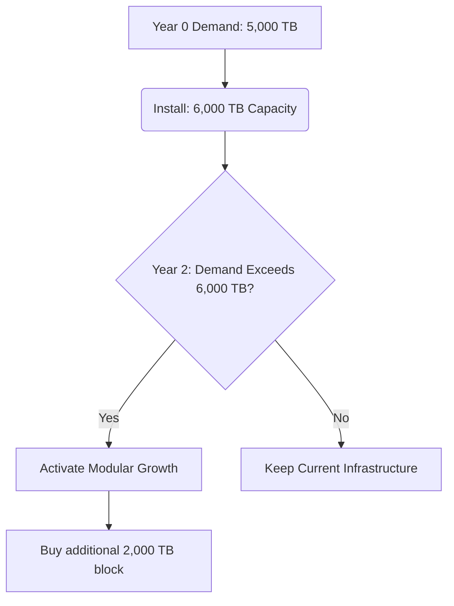

# exercises\_module4


**Class Objective:** Apply theoretical concepts of Project Size, Optimal Location, and Organizational Structure to practical, real-world business scenarios.


***



### 🟢 Exercise 1: Optimal Location using Qualitative Point Method (Basic Level)

**Context:** A renewable energy company, "Solaris", wants to open a new solar panel manufacturing plant. They have narrowed the options down to three cities: **City A, City B, and City C**. To make the decision objectively, the technical committee has defined four locational factors and assigned them a specific weight (importance percentage):

| Factor                                     | Weight (%) |
| ------------------------------------------ | ---------- |
| **Proximity to Raw Materials**             | 35%        |
| **Cost of Qualified Labor**                | 25%        |
| **Logistics and Transport Infrastructure** | 25%        |
| **Tax Incentives (Regional Development)**  | 15%        |

The technical team visited the three cities and scored them from 1 to 10 on each factor (10 being perfect):

| Factor                         | City A | City B | City C |
| ------------------------------ | ------ | ------ | ------ |
| **Proximity to Raw Materials** | 9      | 6      | 8      |
| **Cost of Qualified Labor**    | 5      | 8      | 7      |
| **Infrastructure**             | 8      | 9      | 6      |
| **Tax Incentives**             | 4      | 7      | 10     |

**The Challenge:**

* Calculate the weighted score for each city. Which city is the optimal location for the plant?
* If the Government removes the Tax Incentives for City C (Score drops to 1), does the final decision change?



#### Teacher's Solution Notes (provided)

City A Total Score: 7.00\
City B Total Score: 7.40\
City C Total Score: 7.55 --> **City C Wins.**

(If C loses incentives, its score drops to 6.20, making City B the winner).



***



### 🟡 Exercise 2: Sizing the Project & Modular Growth (Intermediate Level)

**Context:** A tech startup is building a data center to offer cloud storage services. Installing servers is highly expensive.

* Total Market Demand (Unsatisfied): Currently 5,000 Terabytes, but growing 20% annually for the next 5 years.
* Minimum Economic Size (Technology restriction): You cannot buy servers smaller than blocks of 2,000 Terabytes.
* Current Financing Capacity: Enough to purchase a maximum of 6,000 Terabytes of infrastructure right now.

**The Challenge:**

* Year 0: How much installed capacity should the project buy on day 1 to meet demand without keeping massive unused servers (idle capacity)? Prove why buying 10,000 Terabytes right now is a bad financial idea.
* Formulate a modular growth plan.



#### Provided Plan (diagram)




***



### 🔴 Exercise 3: Organizational Design & Legal Framework (Advanced Level)

**Context:** Three engineering students have designed a revolutionary drone for agricultural fumigation. They want to start selling it commercially and flying it over large crop fields. They need to structure their project administratively and legally.

**The Challenge:**

* Legal Solution: Should they register as a sole proprietorship, a general partnership, or a Limited Liability Company (Corporation)? Justify the answer focusing on isolating investor risk from company risk.
* Organizational Structure: Based on the business needs (building drones, selling drones, complying with the law), design a functional organizational chart indicating the minimal necessary departments (e.g., Production, R\&D, Sales, Finance, Legal). Draw it!
* Legal Framework (Regulations): List at least 3 specific, highly critical areas of law or regulation they must research and comply with before flying drones that drop chemicals over commercial crops.



#### Hint for the Legal Framework (provided)

Think about civil aviation authority regulations, environmental protection laws (handling toxic pesticides), and occupational risk laws for drone pilots and farm workers.



***


You can use these exercises as in-class activities or assignments. Each exercise contains context and clear challenges — use the steppers above to guide students step-by-step.

