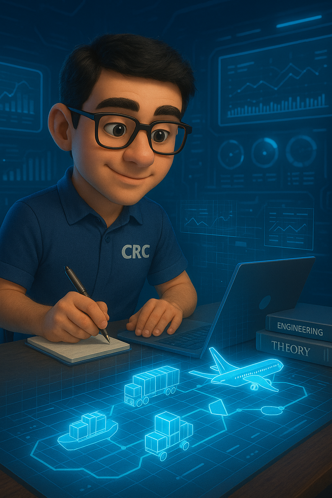

# Simulación Discreta para Ingeniería Industrial: Un Enfoque Práctico

<figure><figcaption></figcaption></figure>

## Bienvenida al Curso de Simulación para Ingenieros Industriales

¡Bienvenidos a todos al apasionante mundo de la simulación en la ingeniería industrial! Nos embarcamos en un viaje donde exploraremos conceptos transformadores que tienen el poder de generar un inmenso valor. Durante este módulo, desentrañaremos las herramientas de simulación que permiten a los ingenieros tomar decisiones informadas y estratégicas.

A través de este curso, desarrollaremos una comprensión profunda de cómo los modelos de simulación nos conectan con la realidad, permitiéndonos explorar escenarios complejos y anticipar resultados en un ambiente controlado. Las herramientas que abordaremos no solo son esenciales para optimizar procesos y recursos, sino que también son fundamentales para liderar en la industria moderna, donde la eficiencia y la innovación son claves.

Prepárense para una experiencia enriquecedora que potenciará sus capacidades y ampliará su perspectiva sobre el impacto de la ingeniería en un mundo en constante evolución. ¡Empecemos esta aventura juntos!
