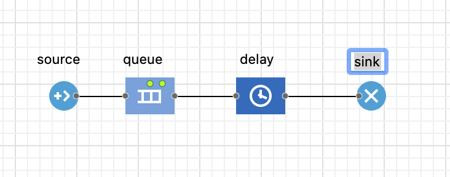
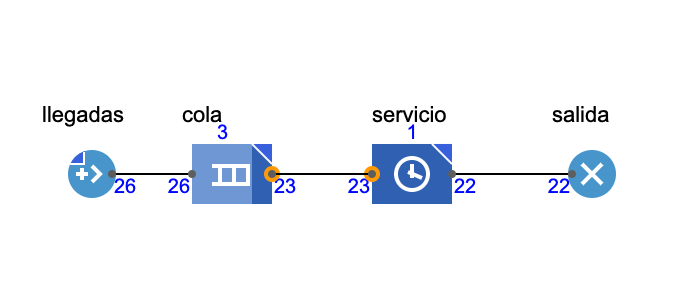

# Anylogic Model 1 M/M/1

## Cola bancaria o modelo M/M/1

Vamos a crear un modelo de simulación sencillo para una sucursal bancaria, con un solo cajero automático.&#x20;

Objetivo de este paso:

Desarrollar un modelo de simulación que permita evaluar el nivel de servicio (tamaño de la cola) y la utilización del recurso (cajero automático), considerando una tasa de llegada de clientes específica y un tiempo promedio de uso del cajero.

Dado que:

* La tasa promedio de llegada de clientes es de **2.0 clientes por minuto**, con intervalos de tiempo entre llegadas que siguen una distribución exponencial;
* Por lo general, los clientes pasan **0.4 minutos** usando el cajero automático, con los tiempos de transacción siguiendo una

empezamos por crear la hoja en Anulogic.

<figure><figcaption>
Hoja de anylogic en blanco
</figcaption></figure>

<figure><figcaption>
Nombre del modelo
</figcaption></figure>

### creamos el flujo del problema

Para el software anylogic seria algo asi.

<figure><figcaption></figcaption></figure>


**Importante**: Viene predeterminado que las colas AnyLogic nunca se crean con capacidad infinita, sino siempre con una capacidad limitada en 100 agentes. Si su valor no se cambia a la capacidad máxima y la cola excede su capacidad durante la simulación, AnyLogic presentará un mensaje de error.


una vez que se cree el modelo con los parametros indicados, se debe compilar para corroborar que no tega errores el sistena de ahi luego simular.

<figure><figcaption></figcaption></figure>

si bien esta es una pequeña mustra de las capacidades del programa y de la interpretacion de los sitemas a con el uso de la simulacion a lo largo del curso iremos abordando otros conceptos que nos conduciran a diferentes instancias, pero la base es la misma:

1. comprender el sistema y sus variantes
2. modelar de forma logica el sistema con los componentes
3. realizar el modelo matematico
4. usar una de las tecnicas de simulacion seleccionadas
5. generar conclusiones de los hallazgos.


Si simula durante mucho tiempo, en algún momento el **límite de 50,000 agentes de la versión PLE** se rompe y AnyLogic presentará una pantalla en blanco, informando el error. para evitar este tipo de error (no es que suceda mucho, ya que 50,000 agentes son muchos), podemos configurar mejor nuestro **Experimento de simulación**.


## ¿Qué es un experimento?

Cada **experimento** almacena la configuración que se utilizará en una simulación y puede crear, para el mismo modelo, tantos experimentos como desee. Al crear un experimento, el usuario puede crear una pantalla de bienvenida para el usuario y definir valores para parámetros importantes de la simulación, tales como:

* La duración de la simulación;
* El número de repeticiones;
* La semilla de números aleatorios;
* El tipo de experimento, explicado a continuación.


para ayuda con el sotware por favro visitar --->[HELP](https://anylogic.help/)<---

