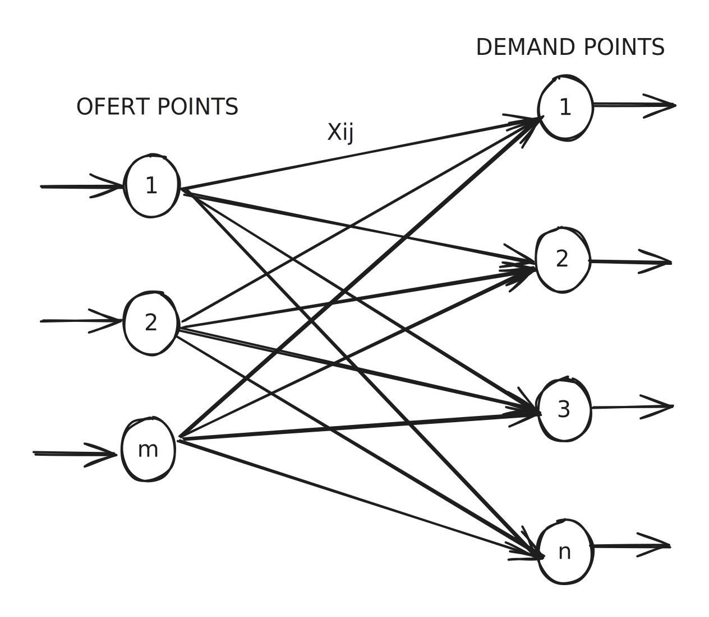

# Teoria de colas


El proceso basico supuesto por la mayoria de los modelos, es que **Los clientes quieren un servicio**


### Teoria de colas.

**¿Qué es la Teoría de Colas?**

En su esencia, la Teoría de Colas es el **estudio matemático de las líneas de espera**. Su objetivo es analizar, modelar y predecir el comportamiento de sistemas donde las "entidades" (como clientes, productos, llamadas o datos) llegan en busca de un servicio, pero deben esperar si los "servidores" (recursos como cajeros, máquinas, operadores o procesadores) están ocupados.

El núcleo de cualquier sistema de colas se puede descomponer en:

* **Entidades**: Los elementos que fluyen a través del sistema y demandan servicio.
* **La Cola**: El lugar donde las entidades esperan.
* **La Estación de Servicio**: La combinación de la cola y los servidores que prestan el servicio.

### **El Enfoque Analítico y sus Limitaciones**

La Teoría de Colas nos proporciona un poderoso conjunto de **fórmulas matemáticas (soluciones analíticas)** para calcular indicadores de rendimiento clave:

* **Lq**: El número promedio de entidades en la cola.
* **Wq**: El tiempo promedio de espera en la cola.
* **L**: El número promedio de entidades en todo el sistema (en cola + en servicio).
* **W**: El tiempo promedio total en el sistema.

Para que estas fórmulas funcionen, el sistema debe ser clasificado usando una notación estándar, como la **notación de Kendall (A/B/C/D/E)**, que describe las características del sistema (ej. tipo de llegadas, tipo de servicio, número de servidores).

Notación de Kendall

La notación de Kendall es una manera estandarizada de describir colas en sistemas de espera y es vital para clasificar los modelos dentro de la teoría de colas. La notación típicamente tiene la forma de A/B/C/D/E, donde:

* **A**: Distribución del tiempo entre llegadas (ej. M para Poisson).
* **B**: Distribución del tiempo de servicio (ej. M para Exponencial).
* **C**: Número de servidores (por ejemplo, 1 para un solo servidor).
* **D**: Capacidad total del sistema (puede ser ∞ para ilimitada).
* **E**: Tamaño de la población fuente de clientes (puede ser ∞ para ilimitada).

Utilizar correctamente esta notación ayuda a identificar rápidamente las características del sistema y a aplicar las fórmulas analíticas adecuadas.

Sin embargo, aquí es donde encontramos la gran limitación de la teoría pura: **estas fórmulas solo son válidas bajo supuestos muy estrictos y simplificados**.&#x20;

* Por ejemplo, las fórmulas clásicas asumen que las llegadas siguen una distribución de Poisson y los tiempos de servicio una distribución Exponencial (el sistema M/M/1, por ejemplo).

¿Qué sucede cuando el sistema real es más complejo?

* ¿Si los tiempos de servicio siguen una distribución Normal o Triangular?
* ¿Si hay múltiples pasos en el proceso con diferentes tipos de recursos?
* ¿Si los clientes pueden abandonar la cola (renegar)?
* ¿Si hay prioridades (clientes VIP)?

En estos casos, las soluciones matemáticas se vuelven extremadamente complejas o, la mayoría de las veces, **simplemente no existen**.\
\
Un factor de utilización por debajo de 1 indica que el sistema tiene capacidad suficiente para atender a los clientes.

### **La Teoría de Colas en la Práctica con AnyLogic**

Los conceptos de la Teoría de Colas se mapean directamente a los bloques de la **Process Modeling Library (PML)** de AnyLogic:

* Las **llegadas de entidades** se modelan con el bloque `Source`.
* La **cola** se modela con el bloque `Queue` (o la cola interna del bloque `Service`).
* Los **servidores** se modelan como `Resources` en un `ResourcePool`.
* La **estación de servicio** se modela con un bloque `Service` (que combina `Seize`, `Delay` y `Release`).

### que es una ENTRADA en el sistema:

la entrada se dentoa como el ingreso de los agentes al sistema, la primera caracteristica que encontramos es el _Tamaño, el cual._ es el número total de clientes que pueden requerir el servicio ofrecido por el sistema en un momento específico, en otras palabras los **clientes potenciales**

esta poblacion es la **poblacion de entrada** esta puede ser de tamaño Finito o Infinito, tambien alfgunos autores le llaman de naturaleza _limtadad o ilimitada._

se debe especificar el **patron estadistico mediante el cual se generan los clientes en el tiempo, el** supuesto mas Normal es que se generan  por una distribucion de _poisson\*_,&#x20;

La <strong>distribución de Poisson</strong>

Es una distribución de probabilidad discreta que expresa la probabilidad de que un número determinado de eventos ocurra en un intervalo fijo de tiempo o espacio. Estos eventos deben suceder con una tasa promedio constante y ser independientes entre sí. La fórmula de probabilidad para que ocurran exactamente ( k ) eventos es:

$$P(X = k) = \frac{\lambda^k e^{-\lambda}}{k!}$$

donde $$\lambda$$  es la tasa promedio de ocurrencia de eventos y ( e ) es la base del logaritmo natural. Esta distribución es comúnmente utilizada para modelar la llegada de entidades en sistemas como colas o procesos de servicio.

### Disciplina de la cola

La _orden_ mencionada se refiere al procedimiento mediante el cual se escoge qué miembros recibirán el servicio específico en cuestión. Este proceso de selección puede estructurarse de diversas maneras, incluyendo pero no limitándose a las siguientes:

1. **Primero en llegar, primero en ser atendido:** Esta metodología asigna servicios siguiendo la secuencia de llegada de los miembros, atendiendo a quienes primero soliciten el servicio antes que a los demás.
2. **Prioridad por niveles de membresía:** En esta modalidad, se da preferencia a aquellos miembros con un nivel de membresía más alto, pudiendo así acceder al servicio antes que otros con niveles inferiores.
3. **Asignación aleatoria:** Los miembros son seleccionados a través de un sistema aleatorio, proporcionando igualdad de oportunidades a todos, sin importar el momento de la solicitud o el nivel de membresía.
4. **Por cita previa:** Los servicios se asignan a los miembros que hayan programado previamente su solicitud, evitando así largas esperas y organizando un flujo más ordenado de atención.

Dependiendo de las necesidades específicas del servicio y de los requisitos organizacionales, se puede optar por uno u otro mecanismo, o incluso por una combinación de varios para optimizar la eficiencia y satisfacción de los miembros.

### Mecanismos de Servidores o de Estaciones de Servicio

los diferentes tipos de mecanismos y cómo pueden ser implementados.







En este sistema, un único servidor gestiona todas las solicitudes de los usuarios. Este método es sumamente simple de implementar y administrar, lo que lo hace muy atractivo para proyectos pequeños o medianos debido a su bajo costo inicial y económico. Sin embargo, presenta ciertas limitaciones significativas si no se maneja adecuadamente el tráfico de solicitudes. A medida que el volumen de tráfico y solicitudes aumenta, el servidor puede fácilmente convertirse en un cuello de botella, afectando negativamente el rendimiento general del sistema. Esto se debe a que la capacidad de procesamiento de un solo servidor es finita y puede llevar a tiempos de respuesta más lentos, especialmente durante períodos de alta demanda. Además, el riesgo de tiempo de inactividad es mayor, ya que si el servidor falla, no hay copias de seguridad inmediatas que tomen su lugar. Es vital evaluar cuidadosamente estas consideraciones antes de optar por un enfoque de servidor único para aplicaciones críticas o de



En este sistema, un único servidor gestiona todas las solicitudes. Este método es simple de implementar y gestionar, pero puede generar cuellos de botella si el volumen de solicitudes es alto.



####

####

**Servidores Paralelos**

Varios servidores trabajan de manera simultánea para repartir la carga de trabajo. Es ideal para servicios con alta demanda, reduciendo tiempos de espera significativamente.

**Servidores en Serie**

Las solicitudes pasan de un servidor a otro en una secuencia predefinida. Este enfoque es útil para procesos que requieren múltiples etapas de atención.

#### Sistemas Distribuidos

Esta estrategia combina múltiples servidores ubicados en diferentes lugares, permitiendo gestionar solicitudes en una amplia área geográfica. Es útil para organizaciones que operan en varias ubicaciones.

