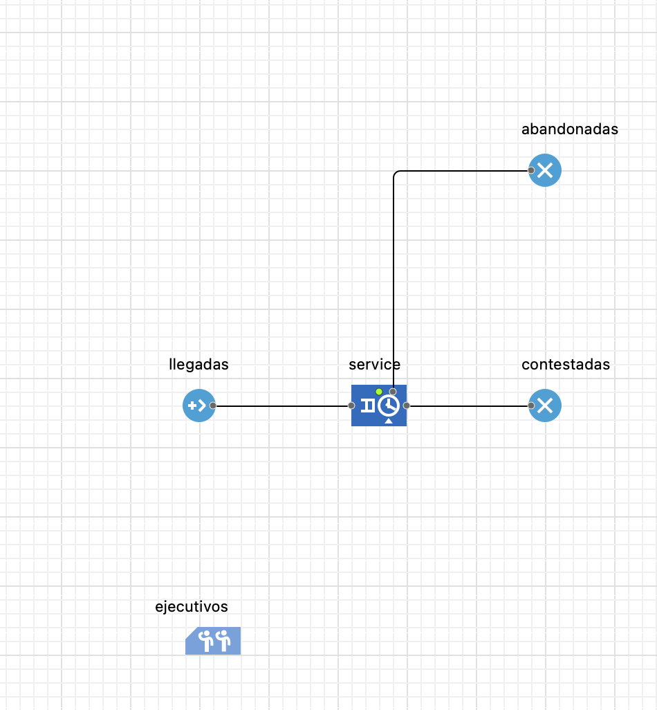
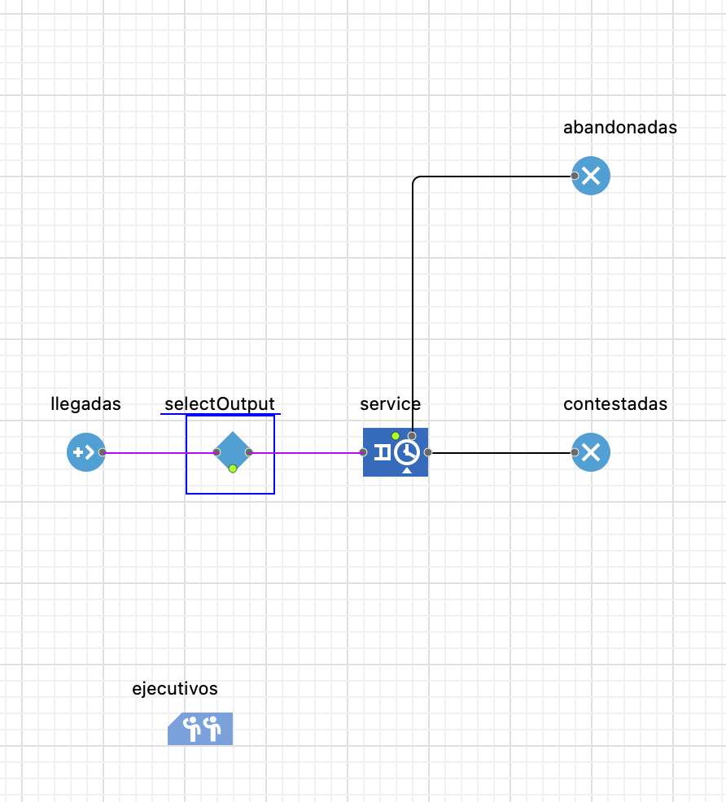
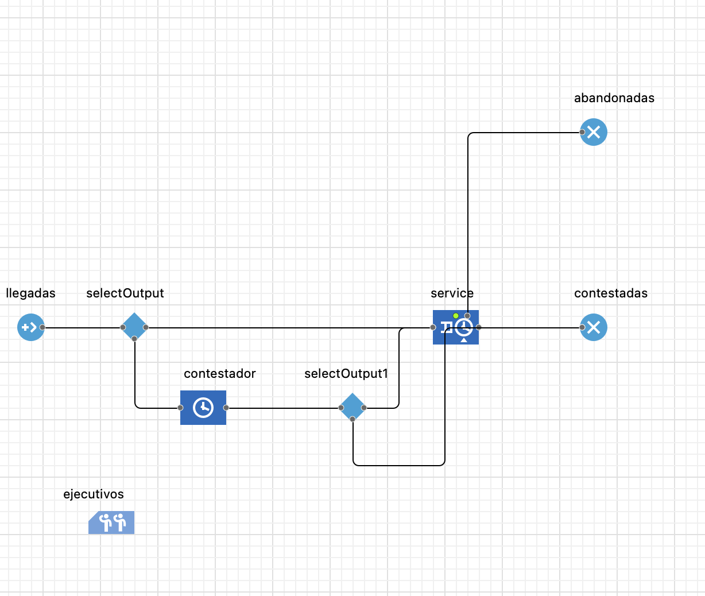
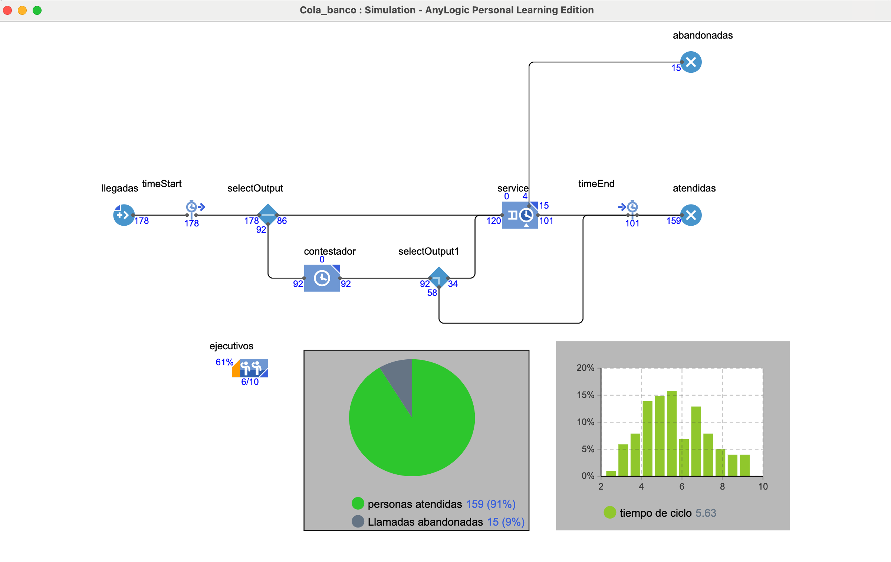

# Call center

#### **Paso 1: Configuración Inicial del Modelo**

1. **Crear un Nuevo Modelo**: Inicie AnyLogic y cree un nuevo modelo. En el asistente, asigne un nombre al modelo, por ejemplo, `CallCenterModel`. Establezca las **unidades de tiempo del modelo** en `minutes`, ya que las duraciones de las llamadas y los tiempos de espera se miden comúnmente en esta unidad.
2. **Definir los Recursos (Agentes)**: Los operadores del centro de llamadas son los recursos del sistema.
   * Desde la paleta **Process Modeling Library**, arrastre un bloque **ResourcePool** al editor gráfico.
   * En las propiedades del bloque, cambie su nombre a `Agents`.
   * En el campo `Capacity`, defina el número de agentes disponibles en el centro de llamadas, por ejemplo, `10`.

#### **Paso 2: Modelar el Flujo del Proceso**

El flujo del proceso describe el ciclo de vida de una llamada desde que llega hasta que finaliza.

1. **Generar Llegadas de Llamadas**:
   * Arrastre un bloque **Source** al editor para que actúe como el generador de llamadas entrantes. Nómbrelo `CallArrivals`.
   * El volumen de llamadas típicamente varía a lo largo del día. Para modelar esto, se utiliza un **Schedule**. Arrastre un objeto **Schedule** desde la paleta **Agent** al editor.
   * Configure el `Schedule`:
     * **Type**: Seleccione `Rate`.
     * **Schedule defines**: `Intervals (Start, End)`.
     * Defina los intervalos horarios y las tasas de llegada correspondientes. Por ejemplo, para un turno de 8 horas (480 minutos), la configuración podría ser similar a la Tabla 3-7 del ejemplo de la pizzería, pero con tasas de llamadas por minuto.
   * En las propiedades del bloque `CallArrivals` (`Source`), establezca `Arrivals defined by` en **Rate Schedule** y seleccione el `Schedule` que acaba de crear.
2. **Modelar la Cola y el Servicio**:
   * Utilice un bloque **Service** para representar el manejo de la llamada por parte de un agente. Este bloque encapsula la cola de espera, la toma del recurso (`Seize`) y el tiempo de servicio (`Delay`).
   * Nómbrelo `CallHandling`.
   * En sus propiedades, vincule este bloque al `ResourcePool` creado anteriormente seleccionando `Agents` en la lista desplegable de `Resource sets`.
   * Defina el `Service time` (tiempo de servicio). Para reflejar la variabilidad en la duración de las llamadas, es recomendable usar una distribución de probabilidad, por ejemplo, `triangular(2, 5, 10)` minutos.
3. **Modelar el Abandono de Llamadas (Renege)**: Una métrica crucial en los centros de llamadas es la tasa de abandono. Esto ocurre cuando un cliente cuelga después de esperar demasiado tiempo.
   * En las propiedades del bloque `CallHandling` (`Service`), expanda la sección **Advanced**.
   * Marque la casilla `Enable exit on timeout`. Esto activará un puerto de salida adicional (`outTimeout`) en el bloque.
   * En el campo `Timeout`, especifique el tiempo máximo que un cliente está dispuesto a esperar, por ejemplo, `uniform(1, 3)` minutos.
4. **Finalizar el Flujo**:
   * Arrastre un bloque **Sink** y conéctelo al puerto de salida principal del bloque `CallHandling`. Nómbrelo `CompletedCalls`. Las llamadas atendidas terminarán aquí.
   * Arrastre un segundo bloque **Sink** y conéctelo al puerto `outTimeout` del bloque `CallHandling`. Nómbrelo `AbandonedCalls`. Las llamadas abandonadas terminarán en este punto.

El diagrama de flujo resultante debería verse similar a la Figura 01 (adaptada), mostrando el flujo de llamadas, el servicio y las dos posibles salidas.

<figure><figcaption>
Figura 001
</figcaption></figure>

#### **Paso 3: Medición y Recopilación de Estadísticas**

Para evaluar el rendimiento del sistema, es necesario definir y recopilar las métricas clave (KPIs).

1. **Utilización de Agentes**:
   * Desde la paleta **Analysis**, arrastre un objeto **Output**. Nómbrelo `AgentUtilization`.
   * En el campo `Value`, escriba la expresión `Agents.utilization()`. Este valor se actualizará dinámicamente. Para obtener un valor final, puede configurar que se registre al final de la simulación.
2. **Tasa de Abandono**:
   * Agregue otro objeto **Output** llamado `AbandonedRate`.
   * En el campo `Value`, escriba la expresión `AbandonedCalls.count() / (double)CallArrivals.count()` para calcular el porcentaje de llamadas abandonadas. La conversión a `double` es para asegurar una división de punto flotante.
3. **Tiempo Promedio de Espera (AWT)**:
   * Para medir el tiempo que una llamada pasa en la cola, utilice los bloques `TimeMeasureStart` y `TimeMeasureEnd`.
   * Inserte un bloque **TimeMeasureStart** justo después del `Source` y antes del bloque `Service`.
   * Inserte un bloque **TimeMeasureEnd** justo después del puerto de salida principal del bloque `Service` (antes del `Sink` de llamadas completadas).
   * Vincule el `TimeMeasureEnd` al `TimeMeasureStart` en sus propiedades.
   * Agregue un objeto **Output** llamado `AverageWaitTime` y en su campo `Value` escriba `<nombre_TimeMeasureEnd>.dataset.mean()`. Esto calculará el promedio de todos los tiempos de ciclo registrados.

#### **Paso 4: Ejecutar el Modelo y Analizar Resultados**

1. **Configurar el Experimento**: En la configuración del experimento (`Simulation`), establezca un tiempo de finalización en el campo `Stop time`, por ejemplo, `480` minutos para simular un turno de 8 horas.
2. **Ejecutar**: Inicie la simulación. Puede ejecutarla en modo virtual (`as fast as possible`) para obtener resultados rápidamente.
3. **Analizar**: Observe los valores en los objetos `Output`. Estos le darán una instantánea del rendimiento del centro de llamadas bajo las condiciones definidas. Puede ejecutar el modelo varias veces para observar la variabilidad en los resultados debido a la naturaleza estocástica del sistema.

#### **Pasos Siguientes y Mejoras**

Una vez que este modelo base esté funcional, se puede expandir para incluir complejidades adicionales, como:

* **Diferentes tipos de llamadas y prioridades**: Utilizar bloques `SelectOutput` para enrutar diferentes tipos de llamadas a diferentes colas o bloques de servicio con distintas prioridades de tarea, como se describe en la Técnica 4 de Mahdavi (s.f., p. 179).
* **Habilidades de los agentes (Skills-based routing)**: Modelar agentes con diferentes habilidades (p. ej., ventas, soporte técnico) utilizando conjuntos de recursos alternativos en el bloque `Seize`, similar a cómo en el ejemplo de la pizzería los cocineros podían ayudar a tomar pedidos.
* **Optimización**: Crear un experimento de **Optimization** para determinar el número óptimo de agentes necesarios para cumplir con un nivel de servicio (p. ej., minimizar la tasa de abandono) con el menor costo posible, siguiendo la metodología del ejemplo de la clínica.

***

### Agreguemos un contestador automatico

1. debemos usar una desicion, un rombo azul el icono de desicion `select output`&#x20;
   1. aqui tomaremos la desicion si el cliente desea ser atendido por un ser humano o por e contrario desea ser atendido por un contestador automatico,

Estas decisiones se implementan en el flujo del modelo utilizando el bloque de decisión `SelectOutput`. Aquí se evalúa la preferencia del cliente y se direcciona la llamada al agente humano o al contestador automático, según la elección. Este enfoque es similar a cómo se establecen `rutas basadas en prioridades` o habilidades en otras secciones del modelo. (Ver Figura 002)

<figure><figcaption>
Figura 002
</figcaption></figure>

en esta desicion habra un chace de que el cliente pueda ser atendido por un contestador automatico, con una posibilidad de del 50% (esta puede ser ajustada) de ahi esta persona debera ir a un servidos que se llamara `contestador automatico`  donde de igual forma habra un chande de que o decida seratendido por un humano y regresar a la cola inicial, o en su defecto abandonar el sistema, este proceso para efectos academicos lo representaremos con un 50% de posibilidades. y sera representado como lo muestra la figura 003

<figure><figcaption>
Figura 003
</figcaption></figure>

Una vez parametrizado procedemos a `compilar para verificacion de errores`  y le damos ejecutar.

al final el proceso se veria de esta forma:

<figure><figcaption>
Figura 004
</figcaption></figure>

Ahora vamos a graficar los datos del sistema:

1. usaremos un `piechart`&#x20;
   1. donde en las propiedades le especificaremos que reuna los datos de los `sink` aue se llaman `"abandonadas" y "contestadas" o "atendidas"`
   2. una ves se tenga claridad con la logica de la medicion procedemos a escribir la recoleccion e datos en la casilla `valor` del menú `datos`  del piechart de la siguiente forma
      1. `abandonadas.count()` ---> para el dato uno del piechart
      2. `contestadas.count()`--> para el dato dos del piechart
   3. el piechart lo puedes modificar y ajustar a tu medida, sientete libre de hacerlo.

***

### Mediciones de tiempo.

usaremos los elementos del panel de procesmianto principal que tiene forma de cronometro, para indicar al software de donde a donde deseamos medir.

1.  Time measure strart - Time measure Ends

    1. debemos parametrizar o linkear los dos medidores para esto, ve al menu del TME (time measure ends) y selecciona el TMS (time measure start)
    2. de ahi, podras conocer y verificar de primera mano el concepto de `tiempo de ciclo`&#x20;

    <figure><figcaption>
Figura 005
</figcaption></figure>

    prueba ahora colocando otro indicadores al sistema

### Indicadores de un Sistema de Atención a Usuarios

#### **Indicadores de Rendimiento Clave (KPIs) para el Sistema**

#### **1. Indicadores de Flujo y Volumen**

Estos indicadores cuantifican el número de entidades (clientes) que se mueven a través de las diferentes rutas del sistema.

* **Clientes Atendidos (Throughtput)**
  * **Qué Mide**: El número total de clientes que completan exitosamente el servicio, ya sea por un agente o por el sistema computarizado.
  * **Cómo se Calcula en AnyLogic**:
    1. Asegúrese de que las rutas que finalizan con un servicio exitoso terminen en bloques **Sink**. Se debe tener un `Sink` para los atendidos por computadora y otro para los atendidos por agentes.
    2. El cálculo es una cuenta directa de las entidades que ingresan a estos bloques. Se utiliza la función `.count()` sobre cada bloque `Sink`.
    3. **Atendidos por Agentes**: `[NombreDelSinkDeAgentes].count()`
    4. **Atendidos por Computadora**: `[NombreDelSinkDeComputadora].count()`
* **Tasa de Abandono (Abandonment Rate)**
  * **Qué Mide**: El porcentaje de clientes que ingresan al sistema pero lo abandonan antes de ser atendidos, debido a largos tiempos de espera.
  * **Cómo se Calcula en AnyLogic**:
    1. El modelo ya debe tener una ruta de abandono. Esta ruta se origina en el puerto `outTimeout` del bloque **Service** (o **Queue**) y debe terminar en su propio bloque **Sink**, por ejemplo, `AbandonedCalls_Sink`.
    2. Se cuentan las entidades que abandonaron y se dividen por el total de entidades que ingresaron al sistema (generadas por el bloque **Source**).
    3. La fórmula sería: `(double)AbandonedCalls_Sink.count() / (double)CallArrivals_Source.count()` _La conversión a `(double)` es para asegurar que el resultado sea un decimal y no un entero._

#### **2. Indicadores de Tiempo**

Estos indicadores miden la eficiencia del proceso y la experiencia del cliente en términos de duración. La implementación estándar en AnyLogic utiliza los bloques `TimeMeasureStart` y `TimeMeasureEnd`.

* **Tiempo Promedio de Espera en Cola (Average Wait Time - AWT)**
  * **Qué Mide**: El tiempo promedio que un cliente pasa en la cola antes de ser atendido por un agente humano.
  * **Cómo se Calcula en AnyLogic**:
    1. Coloque un bloque **TimeMeasureStart** justo antes del bloque `Queue` o `Service` donde los clientes esperan por un agente. Nómbrelo, por ejemplo, `WaitTime_Start`.
    2. Coloque un bloque **TimeMeasureEnd** justo después de que el cliente es tomado por el recurso (es decir, a la salida del `Seize` o `Service`). Nómbrelo `WaitTime_End` y vincúlelo a `WaitTime_Start` en sus propiedades.
    3. El bloque `WaitTime_End` almacena internamente cada medición. El promedio se obtiene con la función `.dataset.mean()`.
    4. Para visualizarlo, se puede usar un objeto **Output** con el valor: `WaitTime_End.dataset.mean()`
* **Tiempo Total Promedio en el Sistema (Average System Time)**
  * **Qué Mide**: El tiempo promedio total que un cliente pasa en el sistema, desde que entra hasta que es atendido exitosamente.
  * **Cómo se Calcula en AnyLogic**:
    1. El método es idéntico al anterior, pero los bloques se colocan en diferentes puntos.
    2. Coloque un **TimeMeasureStart** justo después del bloque `Source` inicial.
    3. Coloque bloques **TimeMeasureEnd** justo antes de los `Sink` que representan a los clientes atendidos (tanto por agentes como por computadora). Todos estos `TimeMeasureEnd` deben estar vinculados al mismo `TimeMeasureStart`.
    4. El promedio se puede calcular de manera similar, usando la función `.dataset.mean()` del `TimeMeasureEnd` correspondiente.

#### **3. Indicadores de Utilización y Carga**

Estos indicadores evalúan qué tan ocupados están los recursos y qué tan cargado está el sistema.

* **Utilización de Agentes**
  * **Qué Mide**: El porcentaje de tiempo que los agentes humanos están ocupados atendiendo clientes, en lugar de estar inactivos.
  * **Cómo se Calcula en AnyLogic**:
    1. Los 10 agentes deben estar definidos en un bloque **ResourcePool**. Nómbrelo `HumanAgents` y establezca su capacidad en 10.
    2. La utilización es una estadística incorporada del `ResourcePool`. No se requiere una configuración adicional compleja.
    3. Se puede visualizar en un gráfico o en un objeto **Output** llamando a la función `.utilization()`. Por ejemplo: `HumanAgents.utilization()`. El resultado es un valor entre 0 y 1 (0% a 100%).
* **Longitud Promedio de la Cola (Average Queue Length)**
  * **Qué Mide**: El número promedio de clientes que se encuentran esperando en la cola de agentes humanos en cualquier momento.
  * **Cómo se Calcula en AnyLogic**: Este es un promedio ponderado en el tiempo. La forma más precisa de calcularlo es usando un objeto **Statistics**.
    1. Cree una **variable** de tipo `int` llamada `queueSize`, con valor inicial 0.
    2. Arrastre un objeto **Statistics** desde la paleta **Analysis**. Nómbrelo `statsQueue` y en sus propiedades, seleccione el tipo **Continuous**.
    3. En el bloque **Queue** (o **Service**), vaya a la sección de **Actions**.
       * En el campo `On enter`, escriba: `queueSize++; statsQueue.add(queueSize);`
       * En el campo `On exit`, escriba: `queueSize--; statsQueue.add(queueSize);`
    4. El valor del indicador se obtiene con la función `.mean()`. Para visualizarlo, use un objeto **Output** con el valor `statsQueue.mean()`. Este método está detallado en "Technique 3" del texto de Mahdavi.
