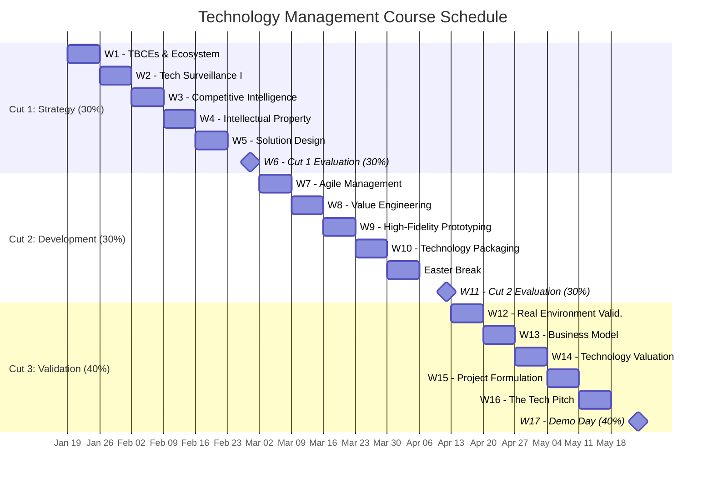
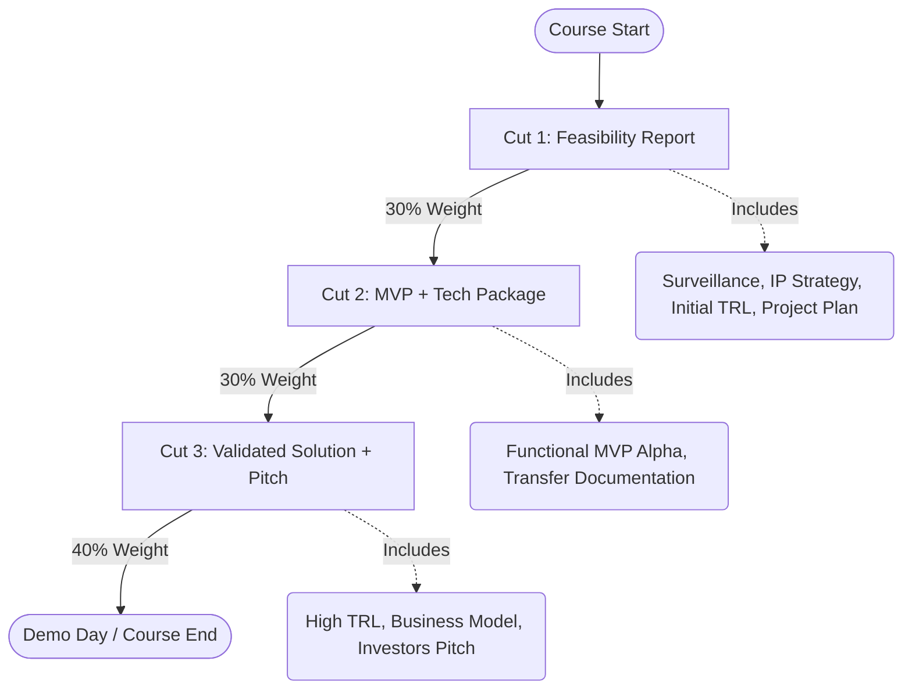

# Course Time Line

### Course Overview

This course is structured into three main phases (Cuts), each with a specific focus and evaluation weight.

#### Evaluation Breakdown

* **Cut 1 (30%)**: Strategy & Surveillance
* **Cut 2 (30%)**: Development & Packaging
* **Cut 3 (40%)**: Validation & Business

### Course Schedule & Milestones

#### Evaluation Roadmap

***

### Detailed Sessions Table

#### Cut 1: Strategy and Surveillance (30%)

**Dates**: Jan 19 - Feb 28 | **Focus**: Market Opportunity & Intellectual Property

| Week  | Dates           | Thematic Axis                  | Theoretical Content & Tools                                                                     | Activity / Deliverable (Evaluation)                                                                            | Assignments                                                                 |
| ----- | --------------- | ------------------------------ | ----------------------------------------------------------------------------------------------- | -------------------------------------------------------------------------------------------------------------- | --------------------------------------------------------------------------- |
| **1** | Jan 19 - 25     | **TBCEs & Ecosystem**          | Minciencias project types. What is a TBCE? TRL (Technology Readiness Level) concept.            | **Activity**: Business Challenge Diagnosis. Initial TRL definition.                                            |                                                                             |
| **2** | Jan 26 - Feb 01 | **Tech Surveillance I**        | Technology S-curves. Life cycle. Patent Search (Lens.org, Patentscope).                         | **Workshop**: Patent mapping. Does the solution already exist? Is it patentable or free to operate?            | 1- Investigate IP in Colombia - Tech - Lens - Patentscope - Google Patents. |
| **3** | Feb 02 - 08     | **Competitive Intelligence**   | Tech market analysis. Competitor benchmarking. Web Scraping with Python for market data.        | **Partial Deliverable**: Technology Surveillance (TS) and Competitive Intelligence (CI) Report.                |                                                                             |
| **4** | Feb 09 - 15     | **Intellectual Property (IP)** | Protection strategies: Patent vs. Trade Secret vs. Software (Copyright). Colombian regulations. | **Activity**: Solution protection strategy definition.                                                         |                                                                             |
| **5** | Feb 16 - 22     | **Solution Design**            | Technical functional specifications (QFD - Quality Function Deployment).                        | **Assignment**: Technical requirements vs. Client requirements matrix.                                         |                                                                             |
| **6** | Feb 23 - Mar 01 | **Cut 1 Closing**              | Feasibility Evaluation                                                                          | **EVALUATION CUT 1 (30%)**: Tech Feasibility Report (Surveillance + IP Strategy + Initial TRL + Project Plan). |                                                                             |

***

#### Cut 2: Development and Packaging (30%)

**Dates**: Mar 02 - Apr 12 | **Focus**: Technological Asset Construction

| Week       | Dates        | Thematic Axis                       | Theoretical Content & Tools                                                                        | Activity / Deliverable (Evaluation)                                                           | Assignments |
| ---------- | ------------ | ----------------------------------- | -------------------------------------------------------------------------------------------------- | --------------------------------------------------------------------------------------------- | ----------- |
| **7**      | Mar 02 - 08  | **Agile Management (Scrum/Kanban)** | Product development under uncertainty. Jira/Trello usage. Rapid iterations.                        | **Activity**: Sprint planning. Backlog definition.                                            |             |
| **8**      | Mar 09 - 15  | **Value Engineering**               | Functional analysis. Cost reduction without sacrificing quality. Materials/processes optimization. | **Workshop**: Technology unit cost analysis.                                                  |             |
| **9**      | Mar 16 - 22  | **High-Fidelity Prototyping**       | MVP (Minimum Viable Product) development. Controlled lab tests (TRL 4-5).                          | **Partial Deliverable**: Functional MVP Alpha version. Technical demonstration.               |             |
| **10**     | Mar 23 - 29  | **Technology Packaging**            | How to deliver the tech? Manuals, as-built plans, commented code, security datasheets.             | **Activity**: "Tech Package" structuring (Transfer documentation).                            |             |
| **Easter** | Semana Santa | **Academic Recess**                 | Final MVP adjustments                                                                              | **No classes**                                                                                |             |
| **11**     | Apr 06 - 12  | **Cut 2 Closing**                   | Technical Evaluation                                                                               | **EVALUATION CUT 2 (30%)**: Functional MVP + Preliminary Tech Package (Technology must work). |             |

***

#### Cut 3: Validation and Business (40%)

**Dates**: Apr 13 - Jun 07 | **Focus**: Real Validation & Business Model (TBCE)

| Week   | Dates           | Thematic Axis                   | Theoretical Content & Tools                                                                    | Activity / Deliverable (Evaluation)                                                                   | Assignments |
| ------ | --------------- | ------------------------------- | ---------------------------------------------------------------------------------------------- | ----------------------------------------------------------------------------------------------------- | ----------- |
| **12** | Apr 13 - 19     | **Real Environment Validation** | Pilot tests in client company or relevant environment (TRL 6-7). Tech & op metrics collection. | **Activity**: Pilot test execution. Technical & operational KPIs registration.                        |             |
| **13** | Apr 20 - 26     | **Business Model (TBCE)**       | Technology-focused Lean Canvas. B2B value proposition. Revenue streams.                        | **Workshop**: Business model design to exploit the technology.                                        |             |
| **14** | Apr 27 - May 03 | **Technology Valuation**        | How much is the tech worth? Valuation methods (Costs, Market, Income - NPV).                   | **Partial Deliverable**: Projected cash flow and project financial valuation.                         |             |
| **15** | May 04 - 10     | **Project Formulation**         | MGA structure or Minciencias format for funding.                                               | **Activity**: Project technical datasheet for fundraising (Seed capital/Angel investors).             |             |
| **16** | May 11 - 17     | **The Tech Pitch**              | How to sell technology to investors or managers. Innovation storytelling.                      | **Simulation**: Business Matchmaking Simulation.                                                      |             |
| **17** | May 18 - 24     | **Final Closing**               | Demo Day                                                                                       | **EVALUATION CUT 3 (40%)**: Validated Solution (High TRL) + Business Model + Pitch to Jury/Investors. |             |
