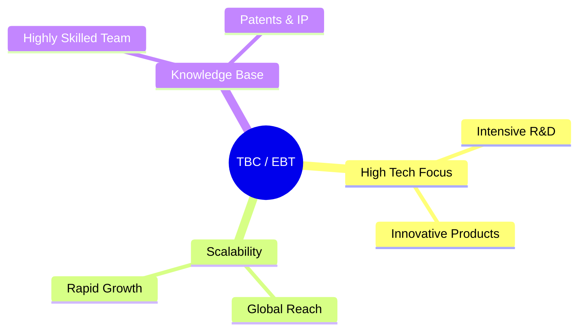
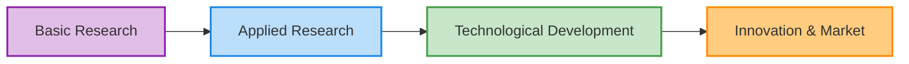
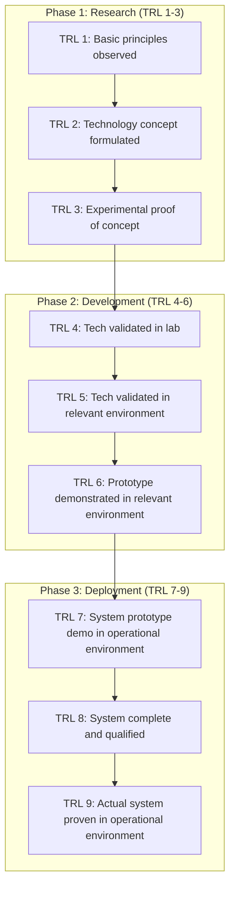

# 01\_Week\_1\_TBCEs\_Ecosystem


### 🎯 Session Objectives

* **Understand** the concept of a Technology-Based Company (TBC / EBT).
* **Identify** the Minciencias (Colombian Ministry of Science) project typologies.
* **Learn** and apply the Technology Readiness Level (TRL) scale.


***

### 🧠 Theoretical Content

#### 1. What is a Technology-Based Company (TBC)?

A TBC is an organization whose core business model revolves around exploiting scientific and technological capabilities. They transform research and development (R\&D) results into innovative products, processes, or services with high value-added.

#### 2. Minciencias Project Typologies

Minciencias classifies research and innovation projects to allocate funding and measure impact:

#### 3. Technology Readiness Level (TRL)

The TRL scale (developed by NASA) measures the maturity of a technology from ideological concept to market-ready product.

***

### 🛠️ Class Activity: Business Challenge Diagnosis

**Goal**: Define the starting point of your technology project.



#### Company/Challenge Selection

Identify a company or specific industrial problem.



#### Initial TRL Definition

Where does the solution start? Are you starting from TRL 1 (just an idea) or TRL 3-4 (some basic proof of concept exists)?



#### Justification

Write a technical paragraph justifying the chosen starting TRL.



***

### 📚 Assignments

* Formulate the initial work teams (3-4 members).
* Document the Industrial Problem and the Initial TRL for the next session.
