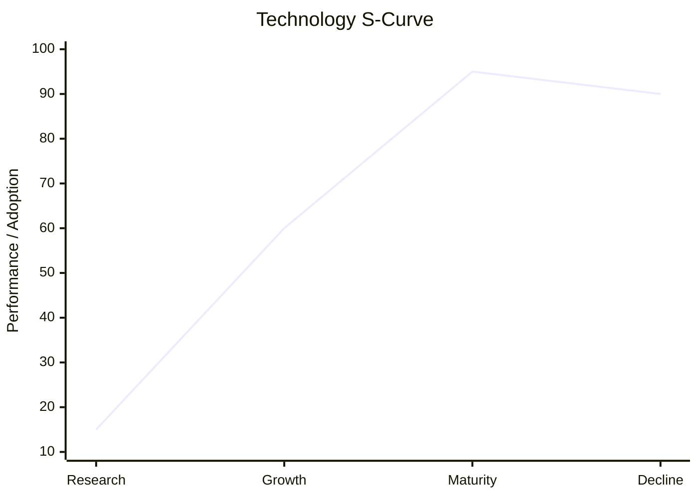
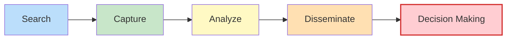

# 02\_Week\_2\_Tech\_Surveillance\_I


### 🎯 Session Objectives

* **Understand** Technology Life Cycles and S-Curves.
* **Learn** how to map existing technologies using Patent Search databases.
* **Execute** an initial patent search for your team's project.


***

## 🧠 Theoretical Content

### 1. Technology Life Cycle (S-Curve)

Every technology follows a lifecycle: Inception, Growth, Maturity, and Decline. Surveillance helps us understand where a specific technology currently sits before investing R\&D resources.

_(Performance increases slowly at first, rapidly during growth, and plateaus at maturity)._

### 2. What is Technology Surveillance?

It's the organized, selective, and permanent process of capturing information from the exterior (and interior) about science and technology, selecting it, analyzing it, and turning it into knowledge for decision-making with low risk.

### 3. Patent Searching

Patents are the best source of technological information globally (more than 80% of technical knowledge is published ONLY in patents).

* **Free to Operate (FTO)**: Ensuring your technology doesn't infringe on existing active patents in your target country.
* **Key Databases**: [Lens.org](https://www.lens.org/), [Patentscope (WIPO)](https://patentscope.wipo.int/), Google Patents.

***

## 🛠️ Workshop: Patent Mapping

**Goal**: Verify if your proposed solution already exists, who owns it, and if it's legally protected.



### Keywords & Boolean Logic

Define English keywords related to your project (e.g., `water AND purification AND solar`).



### Database Search

Run the query on **Lens.org** or **Google Patents**.



### Analysis

* How many patents exist?
* Who are the top assignees (companies/universities)?
* Are there active patents in Colombia?



***

## 📚 Assignments

1. **Investigate IP in Colombia**: Read about how the Superintendence of Industry and Commerce (SIC) handles patents.
2. **Execute Searches**: Use Lens, Patentscope, and Google Patents to find at least 3 patents closely related to your project. Bring the PDF summaries to the next class.
