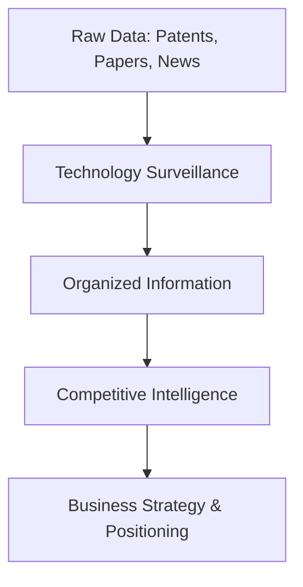
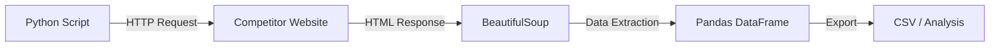

# 03\_Week\_3\_Competitive\_Intelligence

## 🎯 Session Objectives

* **Differentiate** between Technology Surveillance and Competitive Intelligence.
* **Conduct** a technological market analysis and competitor benchmarking.
* **Apply** basic Web Scraping tools in Python to extract market data.

***

## 🧠 Theoretical Content

### 1. Surveillance vs. Intelligence

While Surveillance is about gathering and filtering data, **Intelligence** focuses on positioning the company strategically based on that data.

### 2. Competitor Benchmarking

Benchmarking involves comparing your proposed technology or product against the best existing solutions in the market to identify performance gaps.

| Feature | Our Solution | Competitor A | Competitor B |
| ------- | ------------ | ------------ | ------------ |
| Cost    | Low          | High         | Medium       |
| Speed   | High         | Medium       | Low          |
| TRL     | 4            | 9            | 8            |

### 3. Web Scraping with Python (Introduction)

In the modern landscape, acquiring data from competitors' websites or marketplaces is critical. Python provides powerful libraries (`BeautifulSoup`, `requests`, `pandas`) to automate data extraction.

***

## 🛠️ Class Activity: Preparing the Deliverable



### Goal

Synthesize data into actionable intelligence.



### Market Mapping

Identify 3 direct competitors solving the same industrial problem.



### Data Scraping (Optional/Guided)

Use a basic Python script or browser extension to extract pricing or feature data from the competitors.



### Structure the Report

Begin drafting the TS & CI Partial Deliverable.



***

## 🚀 Deliverable (Partial)

**Report due this week**: Technology Surveillance (TS) and Competitive Intelligence (CI) Report.

Must include:

* S-Curve analysis.
* Relevant patents found (Lens/Google Patents).
* Competitor benchmark table.
* Conclusions on market opportunity.
