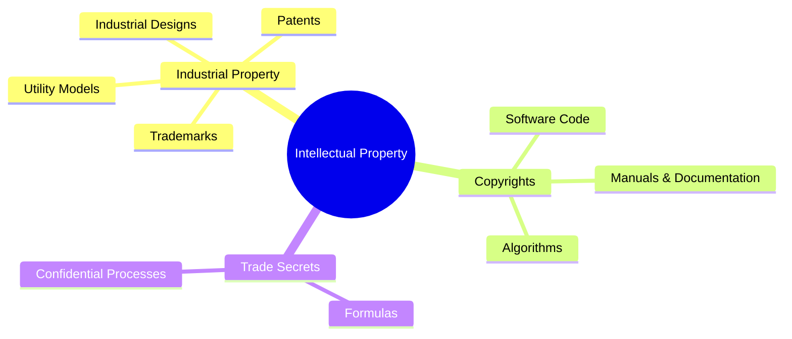
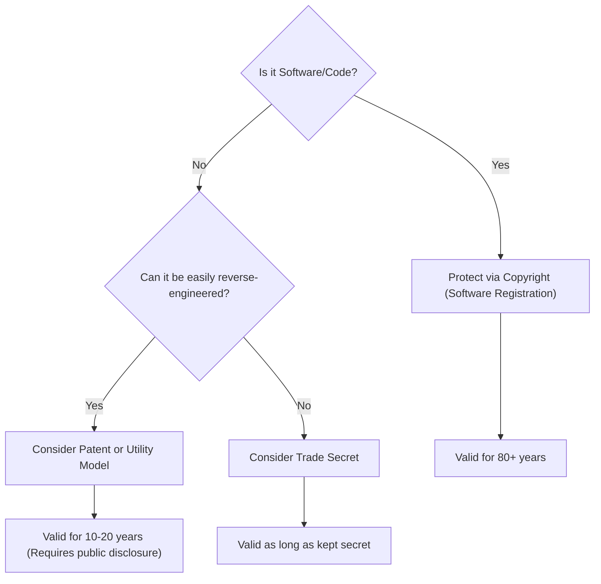

# 04\_Week\_4\_Intellectual\_Property

## 🎯 Session Objectives

* **Understand** the different types of Intellectual Property (IP) protection strategies.
* **Learn** how to protect physical inventions vs. software products.
* **Define** the IP protection strategy for your team's technological solution.

***

## 🧠 Theoretical Content

### 1. The Global & Colombian IP Landscape

Intellectual Property is divided into two main categories: **Industrial Property** (inventions, trademarks, industrial designs) and **Copyright** (literary and artistic works, including software code).

### 2. Protection Strategies: Patent vs. Trade Secret vs. Copyright

Choosing the right protection mechanism is vital for a Technology-Based Company (EBT).

#### A. Patents

* **Duration**: 20 years.
* **Requirements**: Novelty, Inventive Step, Industrial Application.
* **Trade-off**: You must publicly disclose how the invention works.

#### B. Trade Secrets (Know-How)

* **Duration**: Indefinite (as long as it remains secret).
* **Requirements**: Valuable _because_ it is secret, reasonable steps taken to protect it (NDAs, encrypted servers).
* **Example**: The Coca-Cola formula, Google's search algorithm weighting.

#### C. Software Protection (Copyrights in Colombia)

* In Colombia (and most of the world), software is protected by **Copyright** (Derecho de Autor), _not_ patents. You register the source code with the National Copyright Directorate (DNDA).
* Structural methodologies or hardware tied to the software _might_ be patentable, but the code itself is copyrighted.

***

## 🛠️ Class Activity: IP Strategy Definition

**Goal**: Decide how your group will protect your future technology project.



### Category Analysis

Analyze your proposed solution. Are you building hardware, software, or a new industrial process?



### Strategy Matrix

* Which parts of your solution will be patented/registered?
* Which parts will be kept as a trade secret?
* What will be your brand name (Trademark)?



***

## 📚 Assignments

* Draft a 1-page IP Strategy Document for your project.
* Familiarize yourself with the Colombian DNDA (Dirección Nacional de Derecho de Autor) if your project involves software development with Python or block-coding.
