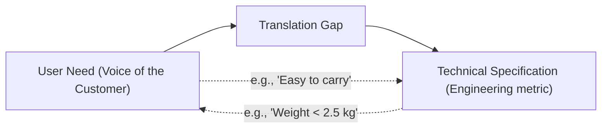
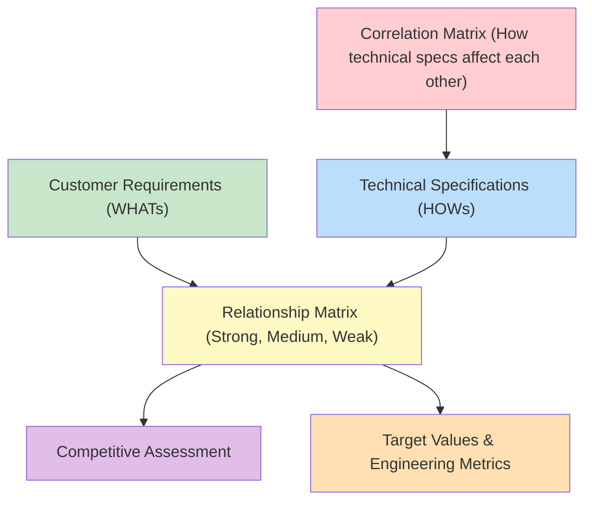

# 05\_Week\_5\_Solution\_Design

## 🎯 Session Objectives

* **Translate** customer needs into technical specifications.
* **Learn** and apply Quality Function Deployment (QFD) and the House of Quality.
* **Establish** the technical requirements for your MVP.

***

## 🧠 Theoretical Content

### 1. The Gap Between User Needs and Engineering

Often, what the customer asks for ("I want it fast and cheap") is not an engineering specification. Innovation Management requires bridging this gap.

### 2. Quality Function Deployment (QFD)

QFD is a structured approach to defining customer needs or requirements and translating them into specific plans to produce products to meet those needs.

The primary tool of QFD is the **House of Quality**.

### 3. Creating Functional Specifications

Before writing any code (Arduino, Python) or building physical prototypes, the team must define:

* **Functional Requirements**: What the system _must do_ (e.g., "Must read temperature every 5 seconds").
* **Non-Functional Requirements**: How the system _should behave_ (e.g., "Must have 99% uptime", "Must weigh under 500g").

***

## 🛠️ Class Activity: Technical Requirements Matrix

**Goal**: Map your chosen client's requirements to engineering variables.



### 1. Voice of the Customer (VOC)

List 5 key things the company expects your solution to achieve.



### 2. Translation

For each VOC item, create at least one measurable Technical Specification.



### 3. Relationship Mapping

Does improving Specification A negatively affect Specification B (e.g., increasing battery life usually increases weight)?



Example partial matrix:

| Customer Requirement (WHAT) | Technical Spec (HOW)  | Target Value        |
| --------------------------- | --------------------- | ------------------- |
| "Needs to be portable"      | Total unit weight     | Less than 1.5 kg    |
| "Must run all day"          | Battery capacity      | 10,000 mAh minimum  |
| "Easy to monitor"           | Web Dashboard latency | < 2 seconds refresh |

***

## 📚 Assignments

* **Matrix Delivery**: Complete the Requirements vs. Client Needs matrix.
* **Preparation**: Review your TS/CI report, IP strategy, and Technical matrix. Next week is the Cut 1 Evaluation presentation!
