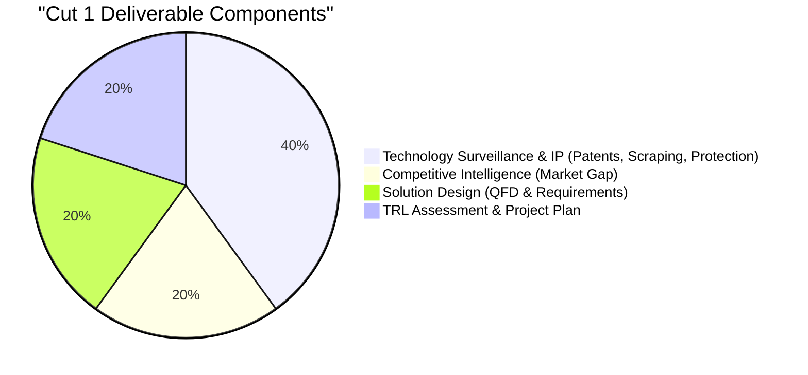
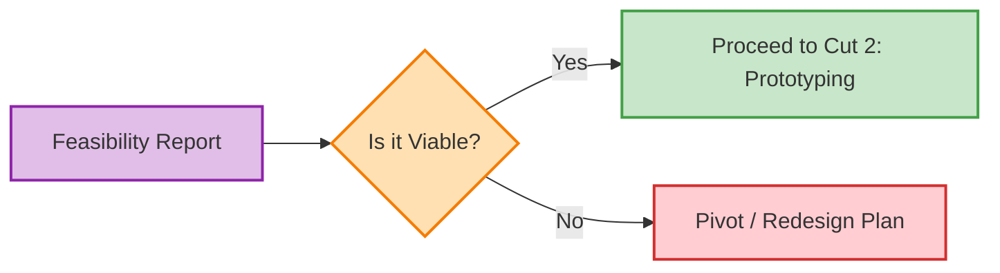

# 06\_Week\_6\_Cut\_1\_Closing

## 🎯 Session Objectives


* **Consolidate** all strategic inputs into a single coherent document.
* **Present** the Technological Feasibility of the proposed solution.
* **Receive** the official Cut 1 grade (30% of the final course mark).


***

## 📝 Evaluation Structure

The evaluation for this cut is based on the **Technology Feasibility Report**, which acts as the strategic foundation before any development (Coding/Arduino/Prototyping) begins in Cut 2.

### Weighting within the Course: 30%

***

## 📋 Technology Feasibility Report (Checklist)

Your team's document and presentation must include the following sections. Each numbered section has substantial content and has been converted into a stepper for clarity and sequencing.



### Context & The Challenge

* The real-world company or industrial scenario you are working with.
* The specific problem being solved.
* Initial TRL definition (where are you starting from, with justification).



### Surveillance & Intelligence

* **S-Curve Positioning**: Where is this technology globally?
* **Patent Search**: Main referents from Lens/Patentscope. Are you free to operate?
* **Competitor Benchmarking**: Who else does this and why is your proposal different?



### Intellectual Property Strategy

* How will the technology be protected? (Trade secret, Copyright for software, Patent for hardware, etc.).



### Technical Feasibility (Design)

* The functional and non-functional requirements (QFD / House of Quality summary).
* What exact tools will be required moving forward? (e.g., Python for data scraping, Arduino for sensor reading, AnyLogic for simulation).



***

## 🛠️ Class Activity: Presentations & Feedback

**Goal**: Pitch the feasibility of your project to the class and instructor.

* **Format**: 10-15 minute presentation per team.
* **Q\&A Session**: Defend the scalability, real-world utility, and technical realism of your proposal.
* **Feedback**: Instructor will provide critical feedback to adjust the scope before development sprints begin in Week 7.

***

## 🚀 Moving Forward to Cut 2

Starting next week (Week 7), the course changes its focus from **Strategy** to **Execution**. We will introduce Agile methodologies (Scrum/Kanban) and begin the physical and digital construction of the Minimum Viable Product (MVP). Get ready to code and prototype!
