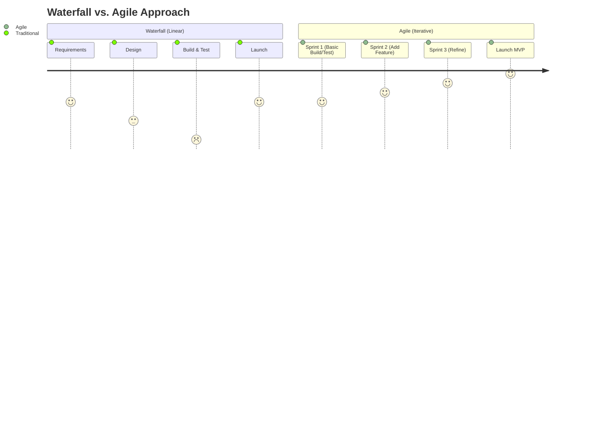
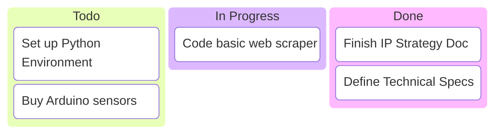

# 07\_Week\_7\_Agile\_Management

## 🎯 Session Objectives

* **Understand** Agile methodologies (Scrum/Kanban) versus Traditional (PMI Waterfall) management.
* **Learn** how to execute product development under extreme uncertainty.
* **Plan** the first development _Sprint_ for the MVP.

***

## 🧠 Theoretical Content

### 1. Traditional vs. Agile

While traditional PMI structures project phases linearly (Waterfall), Agile focuses on rapid iterations and adaptability. In technology development, you rarely know the final shape of the product at the beginning.



### 2. Scrum Framework Basics

Scrum is the most popular Agile framework for product development.

```mermaid
flowchart LR
    PB[Product Backlog\n(Wishlist)] -->|Sprint Planning| SB[Sprint Backlog\n(What we build now)]
    SB --> Sprint((SPRINT\n1-4 Weeks))
    Sprint --> Standup[Daily Standup]
    Sprint --> Review[Sprint Review\n& Retrospective]
    Review --> Product[Potentially Shippable\nIncrement (MVP)]
    
    style PB fill:#bbdefb
    style SB fill:#ffcc80
    style Sprint fill:#c8e6c9,stroke:#43a047,stroke-width:2px
    style Product fill:#e1bee7,stroke:#8e24aa,stroke-width:2px
```

* **Product Owner**: Defines _what_ needs to be built (The business value).
* **Scrum Master**: Ensures the team works smoothly and removes blockers.
* **Development Team**: Decides _how_ to build it and does the work (Coding, CAD, Arduino).

### 3. Kanban & Digital Tools

Kanban focuses on continuous flow rather than fixed sprints. It limits Work in Progress (WIP).

* Tools like **Jira**, **Trello**, or **Asana** are industry standards for both Scrum and Kanban.



***

## 🛠️ Class Activity: Sprint Planning & Backlog

**Goal**: Organize the workload for Cut 2 Development.



### Create the Product Backlog

Break down your "Solution Design" (from Week 5) into smaller, actionable User Stories or Tasks.

* Example: "As a plant operator, I need to see the real-time temperature on a screen."



### Setup a Board

Create a free Trello or Jira board for your team.



### Sprint 1 Commitment

Move the most critical items from the Backlog to "Sprint 1". Decide what you will realistically build over the next 2 weeks.



***

## 📚 Assignments

* **Digital Board**: Invite your instructor to your Trello/Jira board.
* **Start Execution**: Begin development (coding, wiring, prototyping) based on Sprint 1 commitments.
