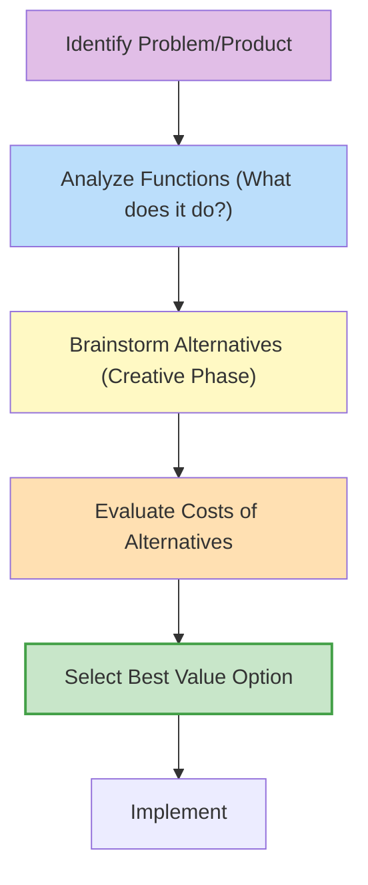
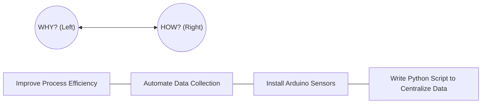

# 08\_Week\_8\_Value\_Engineering


Session Objectives

* **Apply** Value Engineering principles to technology design.
* **Analyze** the functions of the prototype vs. its cost.
* **Optimize** materials and processes to reduce costs without sacrificing quality.


***

## 🧠 Theoretical Content

### 1. What is Value Engineering (VE)?

Value Engineering is a systematic method to improve the "value" of goods or products and services by examining their function.

* **Value = Function / Cost**
* You can increase Value by improving the Function or reducing the Cost.

```mermaid
math
  Value = \frac{Function}{Cost}
```



### 2. Functional Analysis (FAST Diagram)

The Function Analysis System Technique (FAST) asks "How?" and "Why?" for every component of your technology.



If a component costs $100 but does not directly support the primary function (the "Why"), _it must be redesign or eliminated._

### 3. Cost Optimization Strategies

* **Component Standardization**: Using standard off-the-shelf parts (like an ESP32 instead of a custom PCB) during prototyping.
* **Software vs. Hardware**: Can a physical button ($2) be replaced by a software interface on a touchscreen ($0 marginal cost)?
* **Open Source Leverage**: Using Python libraries instead of paying for licensed analytical software.

***

## 🛠️ Class Activity: Technology Unit Cost Analysis

Goal: Calculate and optimize the Bill of Materials (BOM) or Software Stack cost for your MVP.



### Current Cost Calculation

List every expected component (sensors, cloud servers API calls, motors, 3D printing filament).



### Function Mapping

What specific function does each cost line item serve?



### Value Optimization

Identify the top 2 most expensive items. Force your team to brainstorm a cheaper alternative for those items without altering the core function.



| Item                    | Cost   | Function         | Alternative                    | Reduced Cost |
| ----------------------- | ------ | ---------------- | ------------------------------ | ------------ |
| Cloud Database (AWS DB) | $50/mo | Store data       | Local SQLite / Free Tier Cloud | $0           |
| Metal Enclosure         | $30    | Protect circuits | 3D Printed PETG                | $5           |

***

## 📚 Assignments

* **Refine the BOM**: Finalize your optimized Bill of Materials.
* **Sprint Continuation**: Proceed with the physical/digital construction of the prototype using the selected and optimized components.
