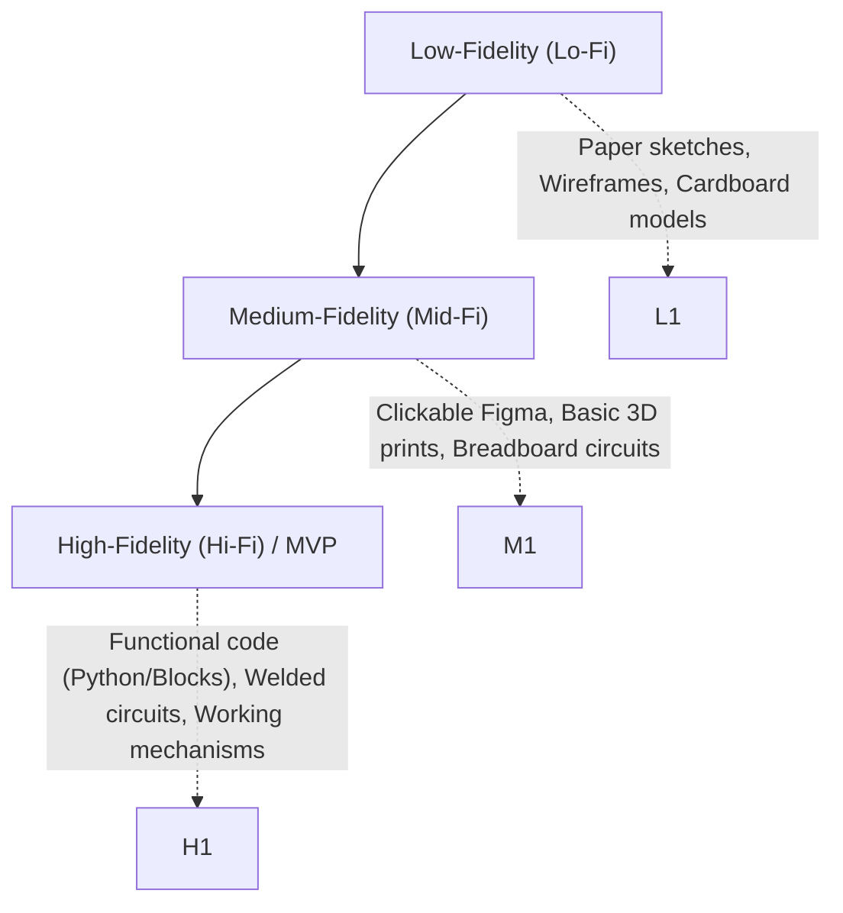
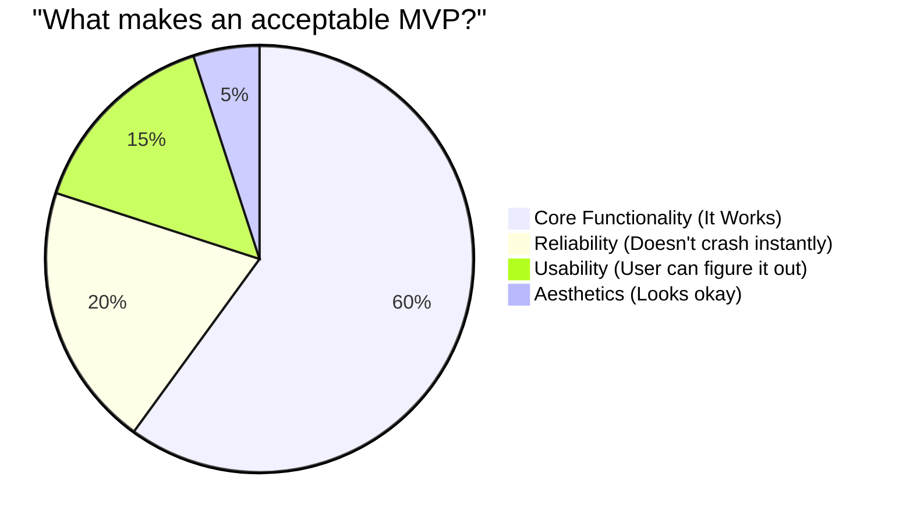

# 09\_Week\_9\_Prototyping

## 🎯 Session Objectives

* **Understand** the difference between low, medium, and high-fidelity prototypes.
* **Integrate** hardware, software, and logic into a Minimum Viable Product (MVP).
* **Run** controlled laboratory or simulated tests (reaching TRL 4-5).

***

## 🧠 Theoretical Content

### 1. Prototype Fidelities

A prototype is an early sample built to test a concept or process.

### 2. The Minimum Viable Product (MVP)

An MVP is a version of a product with just enough features strictly necessary to be usable by early customers who can then provide feedback for future product development.

* **It is not** a broken product. It is a complete, but minimal, product.

### 3. Reaching TRL 4-5 (Lab Validation)

At this stage in the course, your technology must transition from theory (TRL 3) to lab reality (TRL 4) and relevant environment simulation (TRL 5).

* **TRL 4**: Components integrated in the lab (Arduino sends data to Python script successfully).
* **TRL 5**: Integrated components tested in a simulated "real" environment (e.g., using a hairdryer to simulate an industrial furnace for a temperature sensor).

***

## 🛠️ Class Activity: Technical Demonstration (Alpha Version)

Goal: Prove that the core technical assumption of your project actually works.



### Setup

Teams bring laptops, Arduinos, sensors, or Anylogic models to class.



### Live Test

Execute the core function of your solution in front of the instructor.

* If Software: Does the code run without throwing an error? Does the scraper fetch data?
* If Hardware: Does the sensor read? Does the motor turn? Does it connect to Wi-Fi?



### Debugging Session

Analyze any failures and define the fix for Sprint 2.



***

## 📚 Assignments

* **Fix Bugs**: Correct the issues found during the Alpha demonstration.
* **Advance towards Beta**: Prepare the MVP to be fully functional for the upcoming Cut 2 Evaluation.
