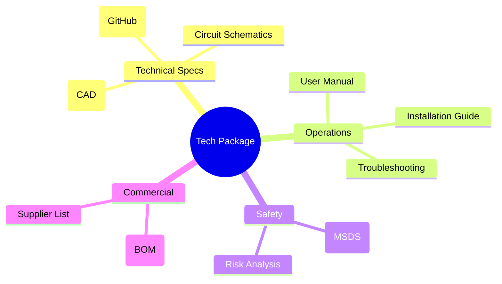
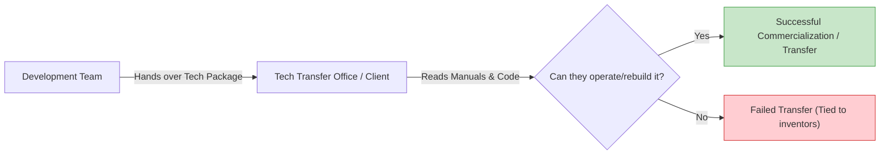

# 10\_Week\_10\_Technology\_Packaging

## 🎯 Session Objectives

* **Understand** what constitutes a "Technology Package".
* **Learn** how to prepare technology for transfer or commercialization.
* **Create** the essential documentation for your MVP.

***

## 🧠 Theoretical Content

### 1. What is Technology Packaging?

Having a working prototype (MVP) is not enough. For a technology to be transferred, sold, or scaled industrially, it must be "packaged". This means documenting _how_ it was built, _how_ it works, and _how_ to maintain it.

### 2. Code Comments and Repository Management

If your project includes software (Python, Block-code, Arduino C++), the code itself must be part of the package.

* **Version Control**: Use Git/GitHub to track changes.
* **Documentation**: A `README.md` explaining how to install dependencies (e.g., `pip install pandas`) and run the script.
* **Inline Comments**: Explaining complex algorithms within the code.

### 3. The "Transferability" Test

If your team disappeared tomorrow, could another group of engineers safely take your Technology Package and recreate/operate your solution? If yes, your packaging was successful.

***

## 🛠️ Class Activity: Structuring the Transfer Documentation

**Goal**: Draft the core components of your technological package.



### Repository / Folder Structure

Create a centralized Google Drive / GitHub repository containing:

* `01_Design_Files` (CAD, Schematics)
* `02_Source_Code` (Python scripts, Arduino sketches)
* `03_Manuals` (Text documents)



### Drafting the User Manual

Write a 1-page quick start guide. "How to turn on and use our MVP".



### BOM Verification

Ensure your final Bill of Materials (from Week 8) is accurate and included in the folder.



***

## 📚 Assignments

* **Finalize the Package**: Complete the necessary documents (Manuals, commented code, schematics).
* **Prepare MVP**: Ensure your prototype is fully functional, debugged, and ready for the Cut 2 Evaluation (Week 11).
