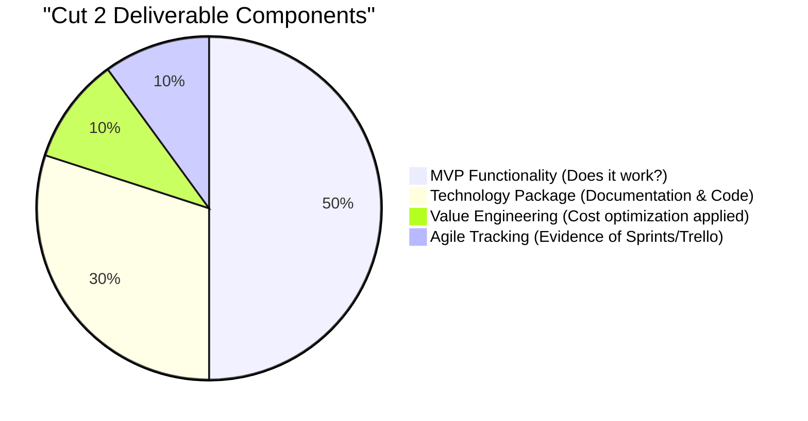
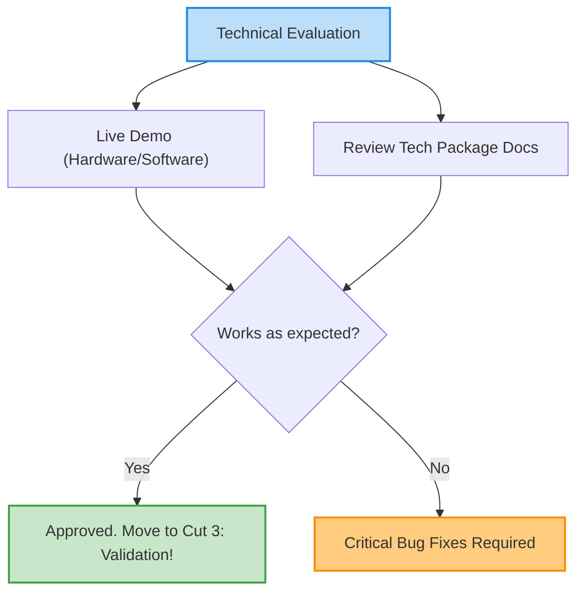

# 11\_Week\_11\_Cut\_2\_Closing

## 🎯 Session Objectives

* **Demonstrate** a fully functional Minimum Viable Product (MVP).
* **Deliver** the Preliminary Technology Package (Documentation).
* **Receive** the official Cut 2 grade (30% of the final course mark).

***

## 📝 Evaluation Structure

The evaluation for this cut is hands-on and technical. It proves that the team can execute their strategy and actually build functional technology reaching at least TRL 4-5.

### Weighting within the Course: 30%

***

## 📋 Technical Evaluation (Checklist)

Your team must present the following during the evaluation slot:



### 1. Functional MVP Demonstration (Live)

* **The "Show, Don't Tell" Rule**: PowerPoint is secondary today. The focus is on the hardware/software.
* The prototype must execute its primary function without critical failure during the demonstration.
* Expected level: TRL 4 (Lab validation) or TRL 5 (Simulated relevant environment).



### 2. The Technology Package Delivery

A folder (USB or Cloud Link) containing:

* Clean, commented Source Code (Python, Arduino, AnyLogic models).
* Schematics or system architecture diagrams.
* User/Operation Manual (Quick Start Guide).
* Final Optimized Bill of Materials (BOM) & Costs.



### 3. Process Evidence

* Evidence of your Agile workflow (Show the Trello/Jira board used over the past weeks).
* Explanation of how Value Engineering reduced the final MVP cost compared to initial estimates.



***

## 🚀 Moving Forward to Cut 3

Congratulations on building a working technology! Starting in Week 12, the focus shifts to **Real-World Validation and Business**. We will take the MVP out of the lab and test it in a real operational environment (TRL 6+), while simultaneously structuring the Business Model (Lean Canvas) to understand how this technology becomes an economically viable Technology-Based Company (EBT).
