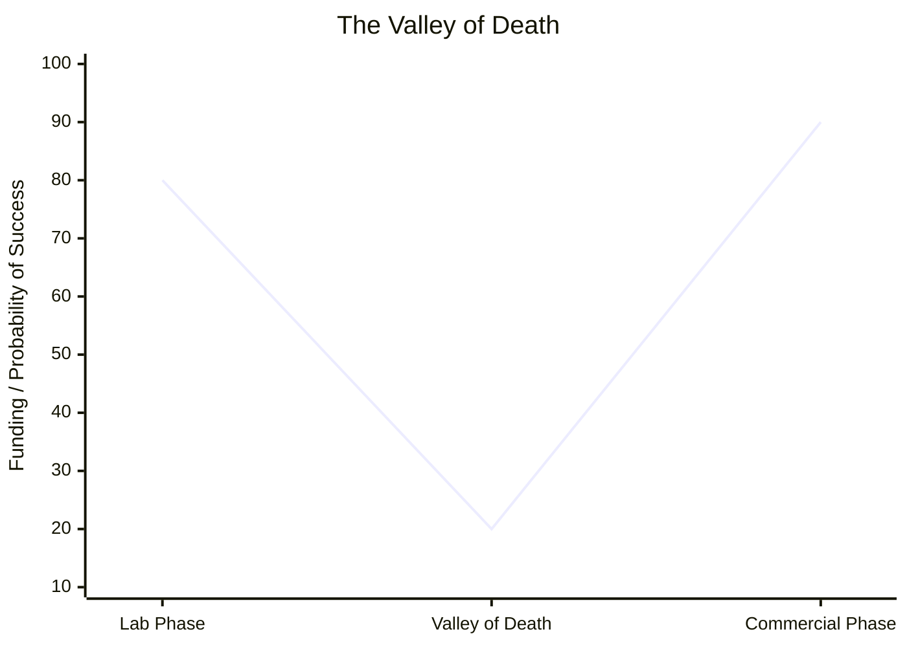

# 12\_Week\_12\_Real\_Environment\_Validation

## 🎯 Session Objectives

* **Understand** how to transition a prototype from the lab to a real operational environment (TRL 6-7).
* **Design** a validation protocol to collect technical and operational KPIs.
* **Execute** pilot tests with the collaborating company or in a representative environment.

***

## 🧠 Theoretical Content

### 1. The "Valley of Death" in Innovation

The transition between a working lab prototype (TRL 4-5) and a fully commercialized technology (TRL 8-9) is known as the "Valley of Death." Many projects fail here because a prototype that works perfectly on an engineer's desk often fails under real-world conditions (dust, heat, untrained users).

### 2. TRL 6 & 7: Crossing the Chasm

* **TRL 6**: System/subsystem model or prototype demonstration in a relevant environment. (e.g., Testing the water sensor in a nearby river, instead of a bucket in the lab).
* **TRL 7**: System prototype demonstration in an _operational_ environment. (e.g., Installing the sensor at the client's actual industrial water treatment plant for 48 hours).

### 3. Key Performance Indicators (KPIs)

Validation is useless without data. You must measure the success of your pilot test using objective metrics.

* **Technical KPIs**: Accuracy, latency, battery drain rate, error frequency.
* **Operational KPIs**: Setup time required, ease of use (user feedback), cost per operation.

***

## 🛠️ Class Activity: Validation Protocol Design

**Goal**: Plan exactly what you will measure during your real-world pilot test.



### Identify the Environment

Where will the test take place? (Client's factory, an open field, a specific university laboratory).



### Define 3 KPIs

Choose at least 3 metrics you will record during the test.



### Select the Tester

Who will operate the technology? (Ideally, not the engineer who built it, but the actual end-user).



| KPI Name          | Measurement Method                               | Target Value  | Actual Result (To be filled) |
| ----------------- | ------------------------------------------------ | ------------- | ---------------------------- |
| Sensor Accuracy   | Compare Python output vs. commercial thermometer | +/- 0.5 °C    |                              |
| Setup Time        | Stopwatch from unboxing to first data point      | < 5 minutes   |                              |
| User Satisfaction | 1-5 scale survey after use                       | > 4.0 average |                              |

***

## 📚 Assignments

* **Execute the Pilot Test**: Run your MVP in the designed real-world environment this week.
* **Collect Data**: Record all KPIs and video/photo evidence of the test for your final presentation.
