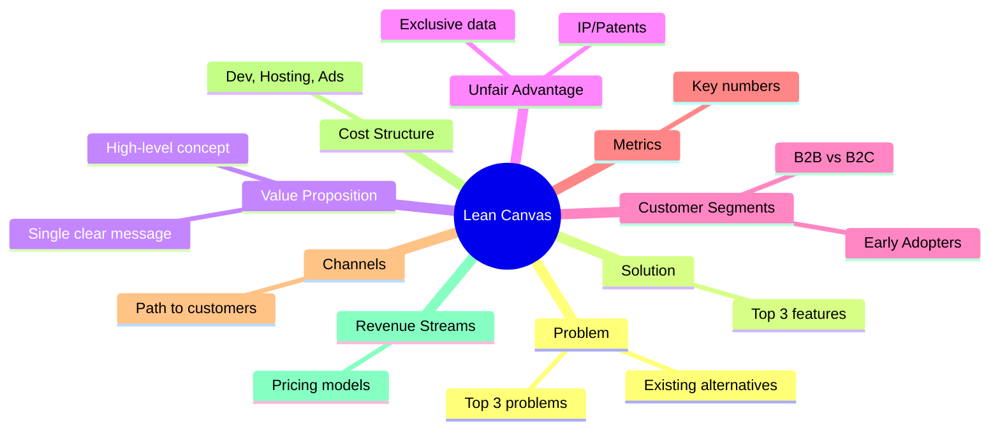

# 13\_Week\_13\_Business\_Model

## 🎯 Session Objectives

* **Transform** a technical solution into a viable business proposition.
* **Understand** the Lean Canvas methodology tailored for Technology-Based Companies (EBT).
* **Define** the B2B value proposition and target customers.

***

## 🧠 Theoretical Content

### 1. The Business of Technology

A great invention is not an innovation until it reaches the market and generates value (financial or social). As Industrial Engineers, you must package the technology within a profitable Business Model.

### 2. The Lean Canvas

The Lean Canvas is an adaptation of the Business Model Canvas designed specifically for startups and high-uncertainty technology projects.

### 3. B2B vs. B2C Technology Pricing

* **B2C (Business to Consumer)**: High volume, low margin (e.g., a $2 app on the App Store).
* **B2B (Business to Business)**: Low volume, high margin (e.g., a $10,000 industrial software license).\
  As most industrial engineering technology projects solve corporate problems, the B2B model is preferred.

**Common Tech Revenue Models**:

* **SaaS (Software as a Service)**: Monthly subscription for cloud access.
* **Asset Sale**: Selling the physical Arduino/hardware unit.
* **RaaS (Robotics as a Service)**: Leasing the hardware while charging a monthly fee for the data analysis.

***

## 🛠️ Class Activity: Lean Canvas Workshop

**Goal**: Draft the business foundation for your technology.



### Draw the Canvas

Use a digital whiteboard (Miro/Mural) or a physical A3 paper.



### Fill the 9 Blocks

Focus heavily on the **Problem** and the **Customer Segments**.\
(Hint: "Everyone" is not a customer segment. "Mid-sized logistics companies in Colombia" is a segment).



### Define Unfair Advantage

What prevents a massive company from copying your Python/Arduino code tomorrow? (This links back to your Week 4 IP Strategy).



***

## 📚 Assignments

* **Finalize Lean Canvas**: Complete the digital version of your Lean Canvas.
* **Pricing Hypothesis**: Brainstorm how much you will charge for your technology (Asset sale vs. SaaS) for next week's valuation class.
