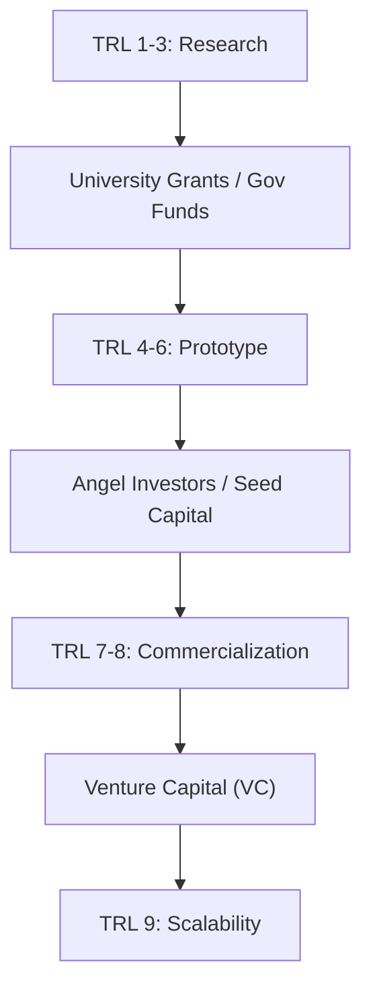
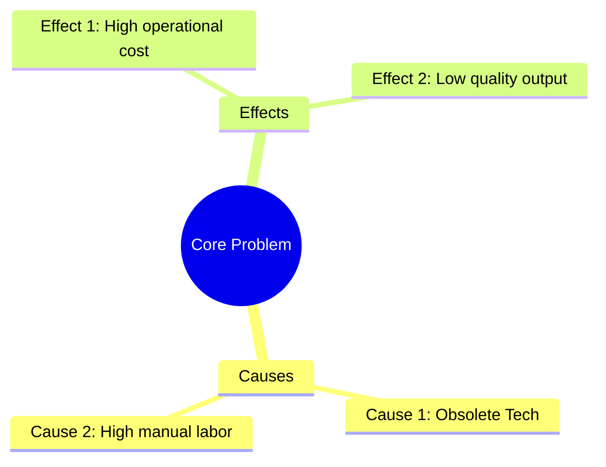

# 15\_Week\_15\_Project\_Formulation

## 🎯 Session Objectives

* **Structure** a technology project using standard funding frameworks.
* **Understand** the logic behind public funding formats (MGA, Minciencias).
* **Consolidate** technical, strategic, and financial data into a single Technical Datasheet.

***

## 🧠 Theoretical Content

### 1. Securing Funding for TBCs

A great idea with a working prototype (TRL 5-6) still needs capital to scale. Sources include:

* **Seed Capital**: Bootstrapping, Friends & Family.
* **Angel Investors**: High net-worth individuals funding early-stage startups.
* **Public Funds**: In Colombia, institutions like Minciencias, iNNpulsa, and SENA (Fondo Emprender) provide grants or competitive funding.

### 2. Problem Tree & Objective Tree (Logical Framework)

Many public funding applications (like the MGA - Metodología General Ajustada) require organizing your project logically.

* **Problem Tree**: Identifies the core problem, its root causes, and its effects on society/industry.
* **Objective Tree**: Transforms the negative states of the problem tree into positive, achievable goals.

### 3. The Project Datasheet (One-Pager)

Investors and review panels don't read 50-page documents initially. They read a 1-page summary. It must be dense but readable.

***

## 🛠️ Class Activity: The 1-Page Summary

**Goal**: Create a compelling, professional "One-Pager" for your technology project to share with prospective mentors or investors.

**Structure of the One-Pager**:

1. **The Problem**: 2 sentences describing the industrial pain point.
2. **The Solution**: 2 sentences explaining your tech (Python/Arduino/Anylogic).
3. **Current Status**: Your current TRL and pilot test results.
4. **Market & Business Model**: Who pays for it and how? (Lean Canvas summary).
5. **The Ask (Financial)**: How much money/resources do you need to reach the next milestone? (Based on Week 14 Valuation).

***

## 📚 Assignments



### Finalize One-Pager

Polish the design and wording of your Tech Datasheet.



### Prepare the Pitch Deck

Start designing the slides for your upcoming Tech Pitch presentation.


