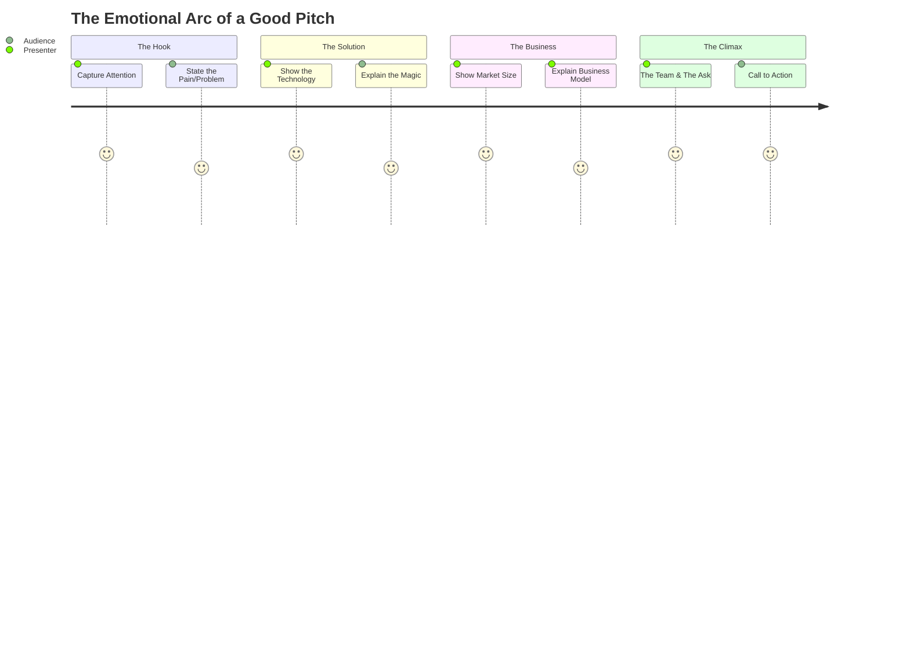

# 16\_Week\_16\_The\_Tech\_Pitch


## 🎯 Session Objectives

* **Master** the art of storytelling for technological innovation.
* **Learn** how to structure a compelling 5-minute Pitch Deck.
* **Practice** defending technological and financial choices in a simulated environment.


***

### 🧠 Theoretical Content

#### 1. What is a Pitch?

A Pitch is a short, concise presentation designed to persuade an audience (investors, clients, managers) to buy into your vision, invest money, or grant approval.

#### 2. Anatomy of a Tech Pitch Deck (10 presentation slides)

Keep text to a minimum; use high-impact visuals.

1. **Title Slide**: Project Name, Logo, 1-sentence value proposition.
2. **The Problem**: Show the reality of the industrial pain.
3. **The Solution**: How does your tech solve the pain?
4. **The "Secret Sauce"**: The tech behind it (Arduino architecture, Python algorithms).
5. **Pilot Results/Validation**: Proof that it works in the real world (TRL 6+ data).
6. **Market Size**: Who is the target B2B client?
7. **Business Model**: How will it make money?
8. **Competitive Landscape**: Why are you better than alternatives?
9. **The Team**: Why are you the right engineers to do this?
10. **The Ask / Call to Action**: What do you need right now?

#### 3. Investor Language vs. Engineering Language

You must translate "Features" into "Benefits."

* Engineering Language: "The device uses an ESP32 micro-controller to send serial data via Wi-Fi to a Flask API every 200ms."
* Investor Language: "Our system provides real-time, wireless monitoring, reducing industrial downtime by 15%."

***

### 🛠️ Class Activity: Pitch Simulation (Business Matchmaking)

**Goal**: Test your pitch under pressure.



### 1. Simulated Rueda de Negocios

Teams pair up. One acts as the Tech Startup, the other acts as the Venture Capital firm.



### 2. 5-Minute Rule

Deliver your pitch using your draft slides strictly within 5 minutes.



### 3. Q\&A Interrogation

The "investors" must ask 3 difficult questions:

* "Why couldn't Company X just copy your code?"
* "Your valuation seems high, what are the margins?"
* "Did the pilot test run into any physical failures?"



***

### 📚 Assignments

* **Refine the Presentation**: Adjust your slides and script based on the weak points discovered during the simulation.
* **Prepare for Demo Day**: Ensure the physical/digital prototype is polished and ready for the final evaluation (Cut 3) next week.
