# 17\_Week\_17\_Demo\_Day


## 🎯 Session Objectives

* **Present** the completely validated technological solution to the jury.
* **Deliver** a professional Tech Pitch integrating Strategy, Development, and Business.
* **Receive** the official Cut 3 grade (40% of the final course mark) and conclude the course.


***

### 📝 Evaluation Structure: The Demo Day

The final evaluation (Cut 3) is comprehensive. It evaluates not just the technical build (which was verified in Cut 2), but its integration into a viable business operation with real-world validation.

#### Weighting within the Course: 40%

***

### 📋 Demo Day Instructions



### 1. The Tech Stand (The Demo)

* Teams will set up a physical or virtual stand for their project.
* **The Prototype**: The MVP must be on display. If physical (Arduino), it must be powered on. If software (Python/Anylogic modeling), a laptop must be running the live demo.
* **Real-World Evidence**: You must display the video/data gathered during your Week 12 Pilot Test in the real industrial environment.



### 2. The Pitch Presentation

* **Time limit**: Strict 7-minute pitch in front of the jury (Instructors, SILOGÉ representatives, external guests).
* **Format**: Using the polished 10-slide Tech Deck from Week 16.
* **Defense**: A 5-minute Q\&A session where the jury will aggressively question the technology's scalability, IP strategy, and business robustness.

```mermaid
flowchart TD
    Pitch["7-Minute Startup Pitch"] --> Demo["Live MVP Demonstration"]
    Demo --> QA["Jury Q&A Defense"]
    QA --> Grade{"Final Assessment"}
    
    Grade -- Approved --> Success["SILOGÉ Project Pool / High Grade"]
    Grade -- Needs Work --> Feedback["Final Constructive Feedback"]

    style Pitch fill:#bbdefb,stroke:#1e88e5,stroke-width:2px
    style Demo fill:#c8e6c9,stroke:#43a047,stroke-width:2px
    style QA fill:#ffe0b2,stroke:#fb8c00,stroke-width:2px
    style Success fill:#e1bee7,stroke:#8e24aa,stroke-width:2px
```




### 3. Deliverables Checklist

Before leaving, the team leader must submit:

* The updated 1-Page Project Datasheet (PDF).
* The final Lean Canvas & Excel Financial Projection.
* A ZIP file or Git Link with the final version of the Technology Package (Code, Schematics, Manuals).



***

### 🎉 Course Conclusion: The Industrial Innovator

Congratulations! By surviving the Technology Management cycle, you have practically applied:

1. **Surveillance & Strategy**: To find gaps in the market.
2. **Agile Engineering**: To rapidly prototype complex hardware/software systems.
3. **Business Valuation**: To turn an engineering toy into an economic asset.

As a member of the **SILOGÉ** community, you are now prepared to act as an agent of change, capable of diagnosing industrial problems and formulating robust, technology-based solutions.
