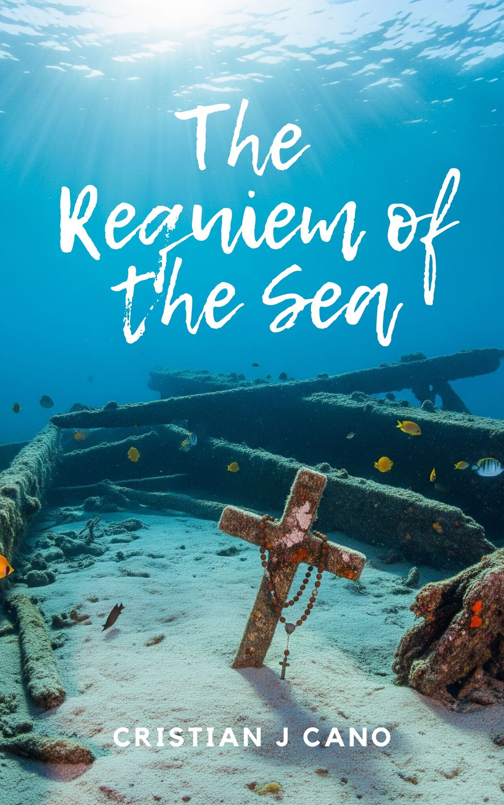

# Bookshelf

Welcome to the bookshelf, a space created especially for you! Here you can discover a variety of works by the author. Our collection includes completely free books, as well as others at very affordable prices, all with the aim of making knowledge easier to access. We invite you to explore, learn, and enjoy, while contributing to the sustainability of this page, which seeks to spread wisdom and experiences to all its visitors. Immerse yourself in the world of reading and find the perfect title for you.

***

### Short stories for sale.

<strong>The Requiem of the Sea</strong>

We invite you to be part of the launch of a unique literary work: **"The Requiem of the Sea"**. This isn't just a short story; it's an immersive, poetic, and deeply emotional experience based on the legendary tragedy of the San José galleon. This product has been created with exceptional quality, from the narrative to the visual materials, to ensure that both you and your customers will be captivated.

Buy now---> [here](https://go.hotmart.com/Q100177044E)

Ecos del San josé.

Chaos roars. Cannons thunder. The sea claims the most powerful ship of its time. But amidst the shipwreck, a man doesn't seek to save himself, he seeks to find her. Her face reveals itself "as my death, but also as my life." A love story that defies time and tragedy.

#### Special Promotion: **Echoes of San José**

Discover a story where love defies storms and time. **"Echoes of San José"** is not just a short story; it's an epic experience steeped in history and emotion. Perfect for those seeking a narrative that transports them to bygone eras, where romance and destiny intertwine in a sea of ​​uncertainty and discovery. Purchase this title today and feel every lap of the ocean and every heartbeat of eternal love. Don't miss out! Get your copy. ---> [AQUI!](https://go.hotmart.com/C100167402Y)

